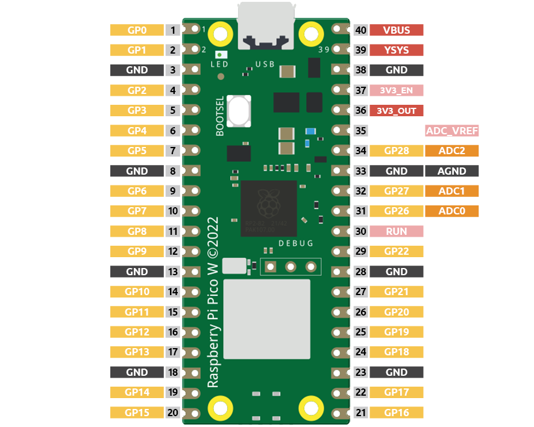

1.11 Potentiometer Control
===========================
So far, we've used **digital inputs** - simple ON/OFF signals like button presses. Now let's explore **analog inputs** - signals that can vary smoothly between minimum and maximum values, like a dimmer switch!

Analog inputs let us read real-world measurements: brightness levels, temperature, sound volume, position of a knob, and much more. The Pico W has a built-in **ADC (Analog-to-Digital Converter)** that transforms these smooth analog signals into digital numbers our code can understand.

The Pico W features three GPIO pins capable of analog input: GP26, GP27, and GP28, 
corresponding to analog channels 0, 1, and 2. Additionally, there is a fourth analog 
channel connected to an internal temperature sensor, which we won't cover here.

In this project, we will focus on reading the analog value from a potentiometer.
    
Component List
^^^^^^^^^^^^^^^
- Raspberry Pi Pico W x1
- MicroUSB cable x1
- 830 Tie-Points Breadboard x1
- Jumper Wire Several
- Resistor 220Ω x1
- LED x1
- Potentiometer x1

Component knowledge
^^^^^^^^^^^^^^^^^^^^
:ref:`Potentiometer <cpn_potentiometer>`
"""""""""""""""""""""""""""""""""""""""""

How our analog brightness control works:
- **Potentiometer**: Acts like a variable voltage divider - turn the knob to change voltage from 0V to 3.3V
- **ADC conversion**: Pico W reads this voltage and converts it to numbers (0-1023 in Arduino)
- **PWM output**: We map these numbers to LED brightness values (0-255)

**Turn knob left** → Lower voltage → Dimmer LED  
**Turn knob right** → Higher voltage → Brighter LED

This creates smooth, real-time brightness control!

Connect
^^^^^^^^^
.. image:: img/3.connect/1.11.png

Code
^^^^^^^
.. note::

    * Open the ``1.11_potentiometer_control.ino`` file under the path of ``Ultimate-Starter-Kit-for-Pico-W\Arduino\1.Project`` or copy this code into Thonny, then click "Run Current Script" or simply press F5 to run it.

    * Or copy this code into Arduino IDE.

    * Don’t forget to select the board(Raspberry Pi Pico) and the correct port before clicking the Upload button. 

After running the code, turn the potentiometer knob and watch the magic! The serial monitor shows real-time readings, PWM values, brightness percentages, and even a visual brightness bar. The LED brightness changes smoothly as you turn the knob - perfect analog control!

The following is the program code:

.. code-block:: c++

    /*
      LED Brightness Controller

      Controls LED brightness using a potentiometer input.
      Shows real-time values and provides smooth brightness control.
    */

    // Pin definitions and constants
    const int POTENTIOMETER_PIN = A2;   // potentiometer connected to analog pin A2
    const int LED_PIN = 15;             // LED connected to pin 15
    const int READING_DELAY = 100;      // delay between readings in milliseconds
    const int MIN_ANALOG_VALUE = 0;     // minimum analog reading
    const int MAX_ANALOG_VALUE = 1023;  // maximum analog reading
    const int MIN_PWM_VALUE = 0;        // minimum PWM output
    const int MAX_PWM_VALUE = 255;      // maximum PWM output

    // Variables for brightness control
    int currentReading = 0;             // current potentiometer reading
    int ledBrightness = 0;              // calculated LED brightness
    int lastReading = -1;               // previous reading for change detection

    void setup() {
      // Configure LED pin as output
      pinMode(LED_PIN, OUTPUT);
      
      // Initialize serial communication
      Serial.begin(115200);
      
      // Display control information
      showControlInfo();
    }

    void loop() {
      // Read potentiometer and update LED
      updateBrightnessControl();
      
      // Wait before next reading
      delay(READING_DELAY);
    }

    // Function to display control information at startup
    void showControlInfo() {
      Serial.println("=== LED Brightness Controller ===");
      Serial.println("Turn potentiometer to adjust brightness");
      Serial.println("Range: 0% to 100% brightness");
      Serial.println("================================");
      Serial.println();
    }

    // Function to read potentiometer and control LED brightness
    void updateBrightnessControl() {
      // Read current potentiometer value
      currentReading = analogRead(POTENTIOMETER_PIN);
      
      // Convert analog reading to PWM value for LED brightness
      ledBrightness = map(currentReading, MIN_ANALOG_VALUE, MAX_ANALOG_VALUE, 
                         MIN_PWM_VALUE, MAX_PWM_VALUE);
      
      // Apply brightness to LED
      analogWrite(LED_PIN, ledBrightness);
      
      // Only display info when value changes significantly (reduce serial spam)
      if (abs(currentReading - lastReading) > 10) {
        displayCurrentStatus();
        lastReading = currentReading;
      }
    }

    // Function to display current brightness status
    void displayCurrentStatus() {
      // Calculate percentage for user-friendly display
      int brightnessPercent = map(ledBrightness, MIN_PWM_VALUE, MAX_PWM_VALUE, 0, 100);
      
      Serial.print("Potentiometer: ");
      Serial.print(currentReading);
      Serial.print(" | LED Brightness: ");
      Serial.print(ledBrightness);
      Serial.print("/255 (");
      Serial.print(brightnessPercent);
      Serial.println("%)");
      
      // Show visual brightness indicator
      Serial.print("Brightness: [");
      int barLength = brightnessPercent / 10;  // scale to 0-10 for visual bar
      for (int i = 0; i < 10; i++) {
        if (i < barLength) {
          Serial.print("█");
        } else {
          Serial.print("░");
        }
      }
      Serial.println("]");
      Serial.println();
    }

Phenomenon
^^^^^^^^^^^
.. video:: img/5.phenomenon/1.11.mp4
    :width: 100%