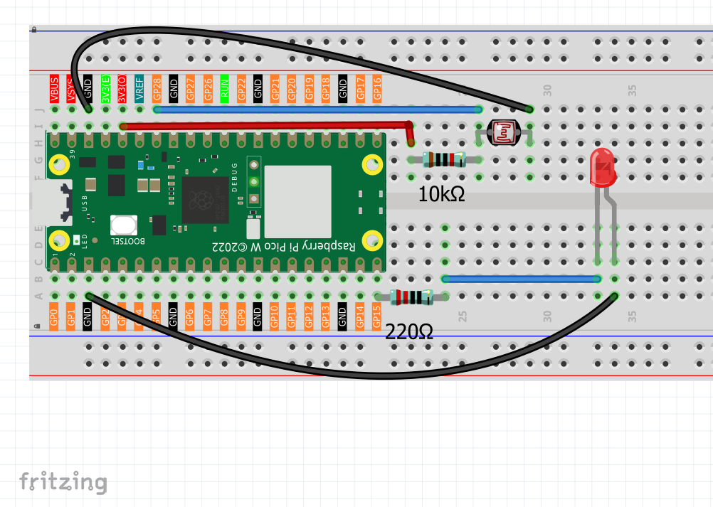

1.12 Photoresistor & LED
=========================
A photoresistor (also called LDR - Light Dependent Resistor) is like an "electronic eye" that changes its electrical resistance based on light levels! In bright light, it has low resistance. In darkness, it has high resistance.

We'll use this to create an **automatic night light** - the darker it gets, the brighter our LED shines. It's like the automatic headlights on cars or streetlights that turn on at dusk!

Component List
^^^^^^^^^^^^^^^
- Raspberry Pi Pico W x1
- MicroUSB cable x1
- 830 Tie-Points Breadboard x1
- Jumper Wire Several
- Resistor 10KΩ x1
- Photoresistor x1

Component knowledge
^^^^^^^^^^^^^^^^^^^^
:ref:`Photoresistor <cpn_photoresistor>`
"""""""""""""""""""""""""""""""""""""""""""

How our automatic night light works:

**Voltage Divider Circuit:**
- Photoresistor and 10KΩ resistor create a voltage divider
- GP28 reads the voltage between them

**Light Response:**
- **Bright light**: Photoresistor resistance LOW → GP28 reads LOW values → LED dims
- **Dark environment**: Photoresistor resistance HIGH → GP28 reads HIGH values → LED brightens

**Smart Logic:** Our code maps light sensor readings directly to LED brightness - the darker your environment, the brighter the LED becomes automatically!

Connect
^^^^^^^^^

Code
^^^^^^^
.. note::

    * Open the ``1.12_photoresistor_led.ino`` file under the path of ``Ultimate-Starter-Kit-for-Pico-W\Arduino\1.Project`` or copy this code into Thonny, then click "Run Current Script" or simply press F5 to run it.

    * Or copy this code into Arduino IDE.

    * Don’t forget to select the board(Raspberry Pi Pico) and the correct port before clicking the Upload button. 

After running the code, try covering the photoresistor with your hand or shining a flashlight on it. Watch how the LED automatically adjusts its brightness! The serial monitor shows real-time light readings and LED brightness levels, plus helpful status messages like "Dark - LED bright" or "Bright - LED dim".

The following is the program code:

.. code-block:: c++

    /*
      Automatic Night Light

      Uses a photoresistor to control LED brightness automatically.
      Bright environment = dim LED, dark environment = bright LED.
    */

    // Pin connections
    const int LIGHT_SENSOR_PIN = A2;    // photoresistor on analog pin A2
    const int LED_PIN = 15;             // LED on digital pin 15

    // Settings
    const int UPDATE_DELAY = 200;       // how often to check sensor (milliseconds)

    void setup() {
      // Set up pins
      pinMode(LED_PIN, OUTPUT);
      
      // Start serial for monitoring
      Serial.begin(115200);
      Serial.println("Automatic Night Light Started!");
      Serial.println("Cover sensor = LED gets brighter");
      Serial.println("Expose sensor to light = LED gets dimmer");
      Serial.println();
    }

    void loop() {
      // Read light sensor (0-1023)
      int lightReading = analogRead(LIGHT_SENSOR_PIN);
      
      // Convert to LED brightness (0-255)
      // Note: our sensor gives HIGH values in dark, LOW values in bright light
      int ledBrightness = map(lightReading, 0, 1023, 0, 255);
      
      // Set LED brightness
      analogWrite(LED_PIN, ledBrightness);
      
      // Show current values
      Serial.print("Light sensor: ");
      Serial.print(lightReading);
      Serial.print(" -> LED brightness: ");
      Serial.print(ledBrightness);
      Serial.print("/255");
      
      // Show simple status
      if (lightReading > 700) {
        Serial.println(" (Dark - LED bright)");
      } else if (lightReading > 400) {
        Serial.println(" (Medium - LED medium)");
      } else {
        Serial.println(" (Bright - LED dim)");
      }
      
      delay(UPDATE_DELAY);
    }

Phenomenon
^^^^^^^^^^^
.. video:: img/5.phenomenon/1.12.mp4
    :width: 100%