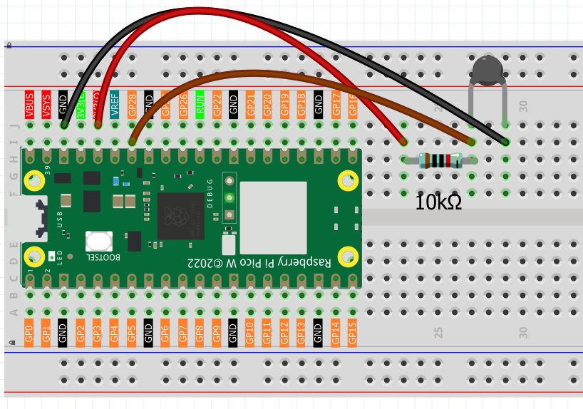
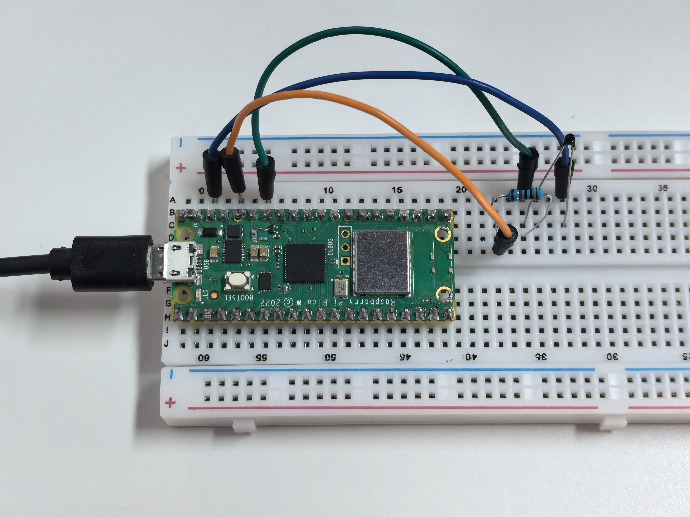

1.13 Thermometer
=========================
Let's build a digital thermometer using a **thermistor** - a special resistor that changes its resistance based on temperature! Think of it as a temperature-sensitive resistor.

We're using an **NTC (Negative Temperature Coefficient) thermistor**:
- **Hotter temperature** = **Lower resistance**
- **Cooler temperature** = **Higher resistance**

By measuring these resistance changes, we can calculate the exact temperature and display it in both Celsius and Fahrenheit - just like a real digital thermometer!

Component List
^^^^^^^^^^^^^^^
- Raspberry Pi Pico W x1
- MicroUSB cable x1
- 830 Tie-Points Breadboard x1
- Jumper Wire Several
- Resistor 10KΩ x1
- Thermistor x1

Component knowledge
^^^^^^^^^^^^^^^^^^^^
:ref:`Thermistor <cpn_thermistor>`
"""""""""""""""""""""""""""""""""""""

How our digital thermometer works:

**Temperature Sensing Circuit:**
- Thermistor + 10KΩ resistor form a voltage divider
- GP28 reads the voltage that changes with temperature

**Temperature Response:**
- **Warmer**: Thermistor resistance decreases → GP28 reads lower values
- **Cooler**: Thermistor resistance increases → GP28 reads higher values

**Smart Calculation:** Our code uses the **Beta equation** to convert these voltage readings into precise temperature values, automatically displaying results in both °C and °F with helpful temperature categories (Cold/Cool/Comfortable/Warm).

Connect
^^^^^^^^^

.. note:: 
        
    The thermistor is black and marked 103.
    The color ring of the 10K ohm resistor is red, black, black, red and brown.

Code
^^^^^^^
.. note::

    * Open the ``1.13_thermometer.ino`` file under the path of ``Ultimate-Starter-Kit-for-Pico-W\Arduino\1.Project`` or copy this code into Thonny, then click "Run Current Script" or simply press F5 to run it.

    * Or copy this code into Arduino IDE.

    * Don’t forget to select the board(Raspberry Pi Pico) and the correct port before clicking the Upload button. 

.. 1.13.png

After running the code, watch your digital thermometer in action! The serial monitor continuously displays the current temperature in both Celsius and Fahrenheit, plus helpful descriptions like "Cold", "Comfortable", or "Warm". Try touching the thermistor with your finger to see the temperature rise!

The following is the program code:

.. code-block:: c++

    /*
      Digital Thermometer

      Reads temperature from a thermistor and displays 
      the temperature in both Celsius and Fahrenheit.
    */

    // Pin and sensor constants
    const int THERMISTOR_PIN = A2;      // thermistor connected to analog pin A2
    const int BETA_VALUE = 3950;        // beta coefficient of the thermistor
    const int PULLUP_RESISTANCE = 10;   // pull-up resistor value in kOhms
    const int UPDATE_INTERVAL = 1000;   // reading interval in milliseconds

    // Temperature calculation constants
    const float ROOM_TEMP_KELVIN = 298.0;  // room temperature in Kelvin (25°C)
    const float KELVIN_OFFSET = 273.0;     // conversion offset from Celsius to Kelvin

    void setup() {
      // Initialize serial communication
      Serial.begin(115200);
      Serial.println("=== Digital Thermometer ===");
      Serial.println("Reading temperature from thermistor...");
      Serial.println();
    }

    void loop() {
      // Read temperature and display results
      readAndDisplayTemperature();
      
      // Wait before next reading
      delay(UPDATE_INTERVAL);
    }

    // Function to read thermistor and calculate temperature
    void readAndDisplayTemperature() {
      // Read raw analog value from thermistor
      int analogValue = analogRead(THERMISTOR_PIN);
      
      // Calculate temperature using the same logic as reference code
      // Convert ADC reading to voltage (Arduino: 0-1023 maps to 0-3.3V)
      float voltage = (float)analogValue / 1023.0 * 3.3;
      
      // Calculate thermistor resistance using voltage divider formula
      float thermistorResistance = PULLUP_RESISTANCE * voltage / (3.3 - voltage);
      
      // Calculate temperature using Beta equation (same as reference)
      float tempKelvin = 1.0 / (1.0 / (273.15 + 25) + log(thermistorResistance / PULLUP_RESISTANCE) / BETA_VALUE);
      float tempCelsius = tempKelvin - 273.15;
      
      // Convert to Fahrenheit
      float tempFahrenheit = (tempCelsius * 1.8) + 32.0;
      
      // Display temperature readings
      Serial.print("Temperature: ");
      Serial.print(tempCelsius, 1);  // 1 decimal place
      Serial.print("°C (");
      Serial.print(tempFahrenheit, 1);
      Serial.print("°F)");
      
      // Show temperature category
      if (tempCelsius < 15) {
        Serial.println(" - Cold");
      } else if (tempCelsius < 25) {
        Serial.println(" - Cool");
      } else if (tempCelsius < 30) {
        Serial.println(" - Comfortable");
      } else {
        Serial.println(" - Warm");
      }
    }

