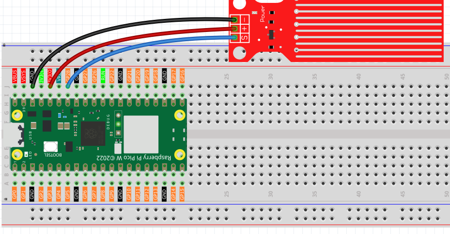
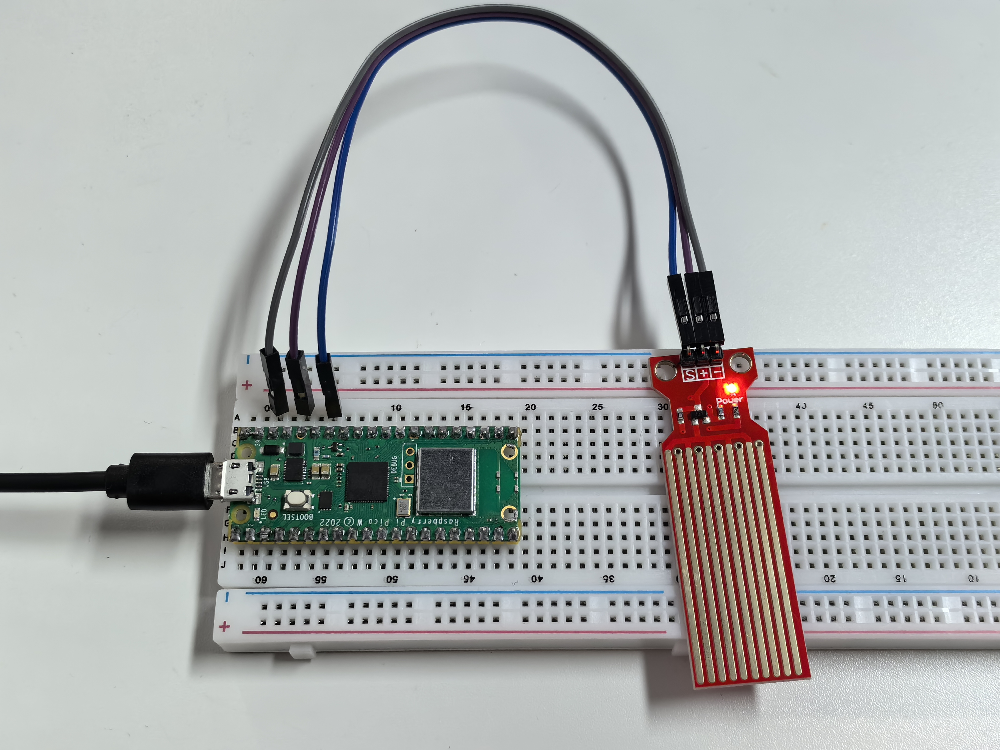

1.14 Water Sensor
====================
The water sensor is specifically designed to detect the presence of water and is 
commonly used to sense rainfall, monitor water levels, and detect liquid leaks. 
It works by using a set of exposed parallel wire traces that measure the size of 
water droplets or the volume of water. The water volume is then easily converted 
into an analog signal, which can be directly read by the main control board to 
trigger a water level alarm.

.. warning:: 

    The sensor cannot be fully submerged in water, please only leave the part 
    where the ten Traces are located in contact with water. Also, energizing the 
    sensor in a humid environment will accelerate the corrosion of the probe and 
    reduce the life of the sensor, so it is recommended that you only supply power 
    when taking readings.

Component List
^^^^^^^^^^^^^^^
- Raspberry Pi Pico W x1
- MicroUSB cable x1
- 830 Tie-Points Breadboard x1
- Jumper Wire Several
- Water Level Sensor Module x1

Component knowledge
^^^^^^^^^^^^^^^^^^^^
:ref:`Water Level Module <cpn_water_level_module>`
""""""""""""""""""""""""""""""""""""""""""""""""""""

Connect
^^^^^^^^^

Code
^^^^^^^
.. note::

    * Open the ``1.14_water_sensor.ino`` file under the path of ``Ultimate-Starter-Kit-for-Pico-W\Arduino\1.Project`` or copy this code into Thonny, then click "Run Current Script" or simply press F5 to run it.

    * Or copy this code into Arduino IDE.

    * Don’t forget to select the board(Raspberry Pi Pico) and the correct port before clicking the Upload button. 

.. 1.14.png

After the program is run, submerge the Water Sensor module slowly into the water, 
and as the depth increases, the Shell will print a larger value.

The following is the program code:

.. code-block:: c++

    const int sensorPin = A2;

    void setup() {
    Serial.begin(9600);
    }

    void loop() {
    int sensorValue = analogRead(sensorPin);
    Serial.println(sensorValue);
    delay(100);
    }

Phenomenon
^^^^^^^^^^^
