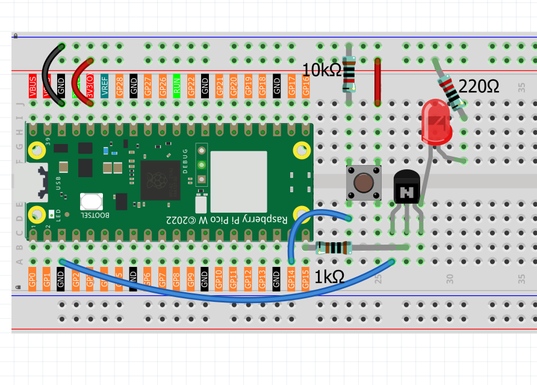

1.15 NPN Transistor Switch
==============================
Now let's explore transistors - the fundamental building blocks of all digital electronics! A transistor acts like an **electronic switch** that can be controlled by a small signal to switch much larger currents.

We're using an **S8050 NPN transistor**. Think of it as a water valve: a small control signal at the "base" can turn on/off a much larger current flow between "collector" and "emitter". This lets our tiny Pico control bigger devices like motors, lights, or fans!

Component List
^^^^^^^^^^^^^^^
- Raspberry Pi Pico W x1
- MicroUSB cable x1
- 830 Tie-Points Breadboard x1
- Jumper Wire Several
- Resistor 220Ω, 1KΩ, 10KΩ x1
- LED x1
- Transistor S8050 x1

Component knowledge
^^^^^^^^^^^^^^^^^^^^
:ref:`Transistor <cpn_transistor>`
"""""""""""""""""""""""""""""""""""

How our transistor switch works:

**Control Logic:**
- Button pressed → GP14 reads HIGH → GP15 outputs HIGH → Transistor turns ON → LED lights up
- Button released → GP14 reads LOW → GP15 outputs LOW → Transistor turns OFF → LED goes dark

**Why use a transistor?** Instead of connecting the LED directly to the Pico, the transistor acts as a "relay" that can handle higher currents safely, protecting our microcontroller.

Connect
^^^^^^^^^

Code
^^^^^^^
.. note::

    * Open the ``1.15_npn_transistor_switch.ino`` file under the path of ``Ultimate-Starter-Kit-for-Pico-W\Arduino\1.Project`` or copy this code into Thonny, then click "Run Current Script" or simply press F5 to run it.

    * Or copy this code into Arduino IDE.

    * Don’t forget to select the board(Raspberry Pi Pico) and the correct port before clicking the Upload button. 

.. 1.15.png

After running the code, press the button to toggle the LED on and off. The serial monitor shows detailed transistor switching status, including press counts and whether the "high current device" (LED) is active or inactive. Perfect for learning transistor switching principles!

The following is the program code:

.. code-block:: c++

    /*
      Transistor Switch Control

      Uses a button to control a transistor switch that can
      drive higher current devices like motors or lights.
    */

    // Pin definitions
    const int BUTTON_PIN = 14;          // button input pin
    const int TRANSISTOR_PIN = 15;      // transistor control pin
    const int CHECK_DELAY = 50;         // button check interval

    // Variables for button state tracking
    bool buttonPressed = false;
    bool lastButtonState = false;
    bool deviceOn = false;
    int pressCount = 0;

    void setup() {
      // Set up pins
      pinMode(BUTTON_PIN, INPUT);
      pinMode(TRANSISTOR_PIN, OUTPUT);
      
      // Initialize serial communication
      Serial.begin(115200);
      Serial.println("=== Transistor Switch Control ===");
      Serial.println("Press button to toggle device ON/OFF");
      Serial.println("Transistor acts as electronic switch");
      Serial.println();
      
      // Ensure device starts OFF
      digitalWrite(TRANSISTOR_PIN, LOW);
      Serial.println("Device: OFF (Ready)");
    }

    void loop() {
      // Check button and control transistor
      handleButtonControl();
      
      // Small delay for stable operation
      delay(CHECK_DELAY);
    }

    // Function to handle button press and transistor control
    void handleButtonControl() {
      // Read current button state
      buttonPressed = digitalRead(BUTTON_PIN);
      
      // Detect button press (transition from LOW to HIGH)
      if (buttonPressed && !lastButtonState) {
        // Toggle device state
        deviceOn = !deviceOn;
        pressCount++;
        
        // Control transistor switch
        digitalWrite(TRANSISTOR_PIN, deviceOn ? HIGH : LOW);
        
        // Display status
        Serial.print("Button pressed (#");
        Serial.print(pressCount);
        Serial.print(") - Device: ");
        Serial.println(deviceOn ? "ON" : "OFF");
        
        if (deviceOn) {
          Serial.println("Transistor conducting - High current device active");
        } else {
          Serial.println("Transistor off - High current device inactive");
        }
        Serial.println();
      }
      
      // Update last button state for next comparison
      lastButtonState = buttonPressed;
    }

Phenomenon
^^^^^^^^^^^
.. video:: img/5.phenomenon/1.15.mp4
    :width: 100%