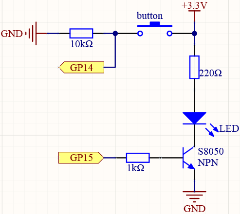
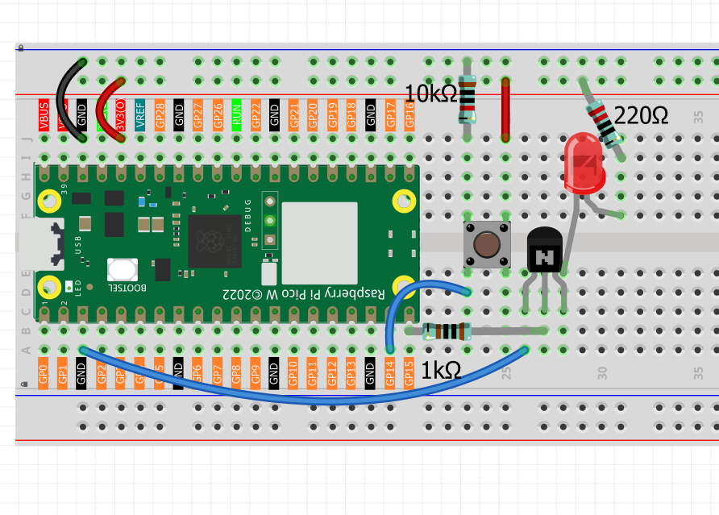
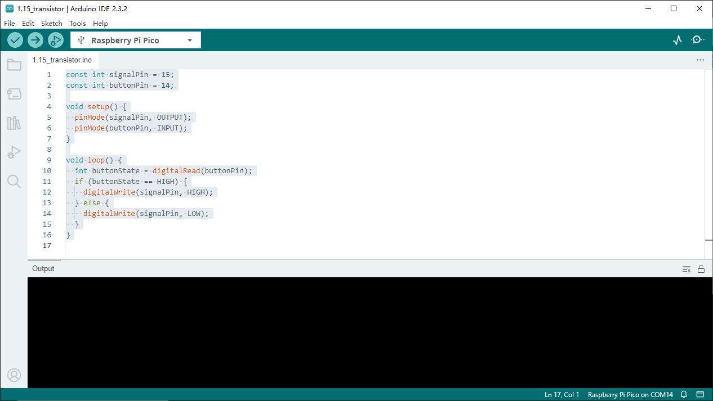

1.15 Transistor
===============================
This kit is equipped with the S8050 transistor, which is an NPN type. When a High 
level signal goes through an NPN transistor like the S8050, it is energized. This 
type of transistor is frequently used for contactless switches, just like in this 
experiment.

Component List
^^^^^^^^^^^^^^^
- Raspberry Pi Pico W x1
- MicroUSB cable x1
- 830 Tie-Points Breadboard x1
- Jumper Wire Several
- Resistor 220Ω, 1KΩ, 10KΩ x1
- LED x1
- Transistor S8050 x1

Component knowledge
^^^^^^^^^^^^^^^^^^^^
:ref:`Transistor <cpn_transistor>`
"""""""""""""""""""""""""""""""""""

Schematic
^^^^^^^^^^

In this circuit, when the button is pressed, GP14 is high.

By programming GP15 to output high, after a 1k current limiting resistor (to 
protect the transistor), the S8050 (NPN transistor) is allowed to conduct, thus 
allowing the LED to light up.

Connect
^^^^^^^^^

Code
^^^^^^^
.. note::

    * Open the ``1.15_two_kinds_of_transistors.ino`` file under the path of ``Ultimate-Starter-Kit-for-Pico-W\Arduino\1.Project`` or copy this code into Thonny, then click "Run Current Script" or simply press F5 to run it.

    * Or copy this code into Arduino IDE.

    * Don’t forget to select the board(Raspberry Pi Pico) and the correct port before clicking the Upload button. 

After the program runs, The circuit using the S8050 (NPN transistor) will light 
up when the button is pressed, which means it is receiving a high-level conduction 
circuit;

The following is the program code:

.. code-block:: c++

    const int signalPin = 15;
    const int buttonPin = 14;

    void setup() {
    pinMode(signalPin, OUTPUT);
    pinMode(buttonPin, INPUT);
    }

    void loop() {
    int buttonState = digitalRead(buttonPin);
    if (buttonState == HIGH) {
        digitalWrite(signalPin, HIGH);
    } else {
        digitalWrite(signalPin, LOW);
    }
    }

Phenomenon
^^^^^^^^^^^
.. video:: img/5.phenomenon/1.15.mp4
    :width: 100%