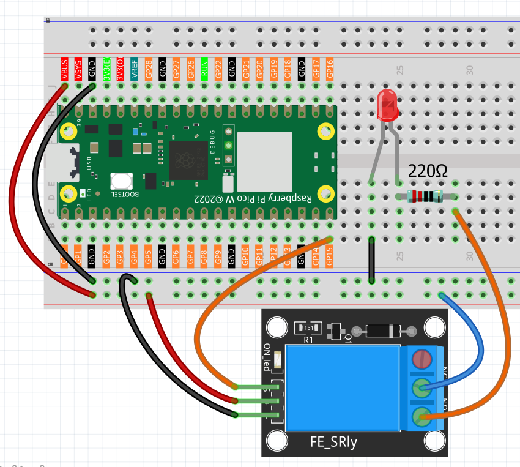

1.16 Relay Module Control
==========================
Imagine controlling a lamp, fan, or motor with your Pico - that's exactly what relay modules do! A relay is like a **remote-controlled switch** that lets low-voltage electronics (like our Pico) safely control high-voltage devices (like household appliances).

Think of it as a "digital hand" that can flip a physical switch. When the Pico sends a signal, the relay clicks and switches the connected device on or off. This is the foundation of **home automation** - smart lights, automatic fans, timed appliances, and IoT devices!

**Safety first**: Our relay module includes protection circuits to ensure safe operation.

.. warning:: 
    
    Modification of electrical appliances comes with great danger, do not try it 
    lightly, please do it under the guidance of professionals.

Here we only use a simple circuit powered by a breadboard power module as an 
example to show how to control it using relay.

Component List
^^^^^^^^^^^^^^^
- Raspberry Pi Pico W x1
- MicroUSB cable x1
- 830 Tie-Points Breadboard x1
- Jumper Wire Several
- Relay Module x1

Component knowledge
^^^^^^^^^^^^^^^^^^^^
:ref:`Relay Module <cpn_relay_module>` 
"""""""""""""""""""""""""""""""""""""""
 
Connect
^^^^^^^^^

Code
^^^^^^^
.. note::

    * Open the ``1.16_relay_module_control.ino`` file under the path of ``Ultimate-Starter-Kit-for-Pico-W\Arduino\1.Project`` or copy this code into Thonny, then click "Run Current Script" or simply press F5 to run it.

    * Or copy this code into Arduino IDE.

    * Don’t forget to select the board(Raspberry Pi Pico) and the correct port before clicking the Upload button. 

.. 1.16.png

After running the code, you'll hear the satisfying "click-clack" sound of the relay switching every few seconds! The serial monitor shows automatic timing cycles with countdowns - "Relay ON for 2s, turning OFF in 1s". This demonstrates how you could control any device with precise timing: auto-shutoff lights, timed watering systems, or scheduled appliances.

The following is the program code:

.. code-block:: c++

    /*
      Automatic Relay Controller

      Controls a relay to automatically switch external circuits
      on and off with timing control and status monitoring.
    */

    // Pin and timing constants
    const int RELAY_PIN = 15;           // relay control pin
    const int ON_TIME = 3000;           // relay on duration (milliseconds)
    const int OFF_TIME = 2000;          // relay off duration (milliseconds)

    // Variables for timing and status
    unsigned long lastSwitchTime = 0;
    bool relayState = false;
    int cycleCount = 0;

    void setup() {
      // Set up relay pin
      pinMode(RELAY_PIN, OUTPUT);
      
      // Initialize serial communication
      Serial.begin(115200);
      Serial.println("=== Automatic Relay Controller ===");
      Serial.println("Relay switches external circuit ON/OFF automatically");
      Serial.println("Can control lights, motors, or other AC/DC devices");
      Serial.println();
      
      // Start with relay OFF
      digitalWrite(RELAY_PIN, LOW);
      lastSwitchTime = millis();
      Serial.println("Starting cycle... Relay: OFF");
    }

    void loop() {
      // Check if it's time to switch relay state
      checkRelayTiming();
      
      // Show continuous status every 5 seconds
      showPeriodicStatus();
    }

    // Function to handle relay timing and switching
    void checkRelayTiming() {
      unsigned long currentTime = millis();
      unsigned long elapsedTime = currentTime - lastSwitchTime;
      
      // Check if it's time to switch state
      bool shouldSwitch = false;
      
      if (relayState && elapsedTime >= ON_TIME) {
        // Relay is ON and ON_TIME has passed - turn OFF
        shouldSwitch = true;
      } else if (!relayState && elapsedTime >= OFF_TIME) {
        // Relay is OFF and OFF_TIME has passed - turn ON
        shouldSwitch = true;
      }
      
      // Switch relay if needed
      if (shouldSwitch) {
        relayState = !relayState;
        digitalWrite(RELAY_PIN, relayState ? HIGH : LOW);
        lastSwitchTime = currentTime;
        
        if (relayState) {
          cycleCount++;
        }
        
        // Display switch event
        Serial.print("Cycle #");
        Serial.print(cycleCount);
        Serial.print(" - Relay switched: ");
        Serial.println(relayState ? "ON" : "OFF");
        
        if (relayState) {
          Serial.println("External circuit powered - Device running");
        } else {
          Serial.println("External circuit off - Device stopped");
        }
        Serial.println();
      }
    }

    // Function to show periodic status updates
    void showPeriodicStatus() {
      static unsigned long lastStatusTime = 0;
      unsigned long currentTime = millis();
      
      // Show status every 5 seconds
      if (currentTime - lastStatusTime >= 5000) {
        unsigned long timeInState = currentTime - lastSwitchTime;
        unsigned long remainingTime;
        
        if (relayState) {
          remainingTime = ON_TIME - timeInState;
          Serial.print("Status: Relay ON for ");
          Serial.print(timeInState / 1000);
          Serial.print("s, turning OFF in ");
          Serial.print(remainingTime / 1000);
          Serial.println("s");
        } else {
          remainingTime = OFF_TIME - timeInState;
          Serial.print("Status: Relay OFF for ");
          Serial.print(timeInState / 1000);
          Serial.print("s, turning ON in ");
          Serial.print(remainingTime / 1000);
          Serial.println("s");
        }
        
        lastStatusTime = currentTime;
      }
    }

Phenomenon
^^^^^^^^^^^
.. video:: img/5.phenomenon/1.16.mp4
    :width: 100%