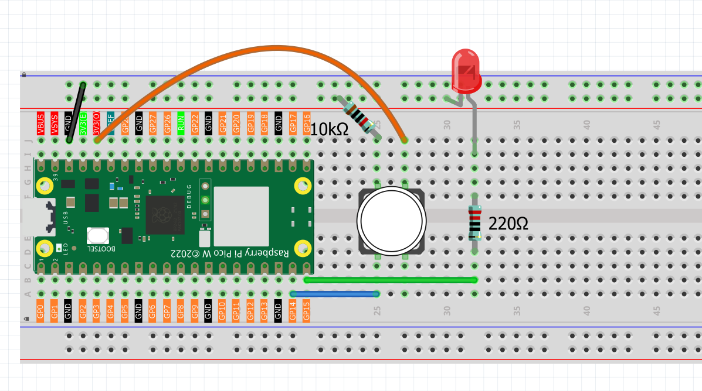

1.2 Button & LED
=========================
In the previous lesson, we made an LED blink automatically. Now we'll learn something new: how to use a button to control an LED. This adds **user interaction** to our project for the first time.

We'll use the Pico's GPIO pins in a new way: as **inputs** to read button presses. In the previous lesson, we used GPIO pins as **outputs** to control the LED. This lesson introduces using GPIO pins as **inputs**.

This project demonstrates a basic control system: **Button (Input) → Pico (Control) → LED (Output)**.

Component List
^^^^^^^^^^^^^^^
- Raspberry Pi Pico W x1
- MicroUSB cable x1
- 830 Tie-Points Breadboard x1
- Resistor 10KΩ x1
- Jumper Wire Several
- Button x1

Component knowledge
^^^^^^^^^^^^^^^^^^^^
:ref:`Button <cpn_button>`
"""""""""""""""""""""""""""

When the button is pressed, it connects 3.3V to GP14, creating a HIGH signal. When not pressed, GP14 becomes "floating" and can read unpredictable values.

To fix this, we use a **pull-down resistor** (10KΩ) that connects GP14 to ground. This ensures GP14 reads LOW when the button is not pressed, and HIGH when pressed. The resistor "pulls" the pin to a stable LOW state, making readings reliable.

Connect
^^^^^^^^^^

Code
^^^^^^^
.. note::

    * Open the ``1.2_button_led.ino`` file under the path of ``Ultimate-Starter-Kit-for-Pico-W\Arduino\1.Project`` or copy this code into Thonny, then click "Run Current Script" or simply press F5 to run it.

    * Or copy this code into Arduino IDE.

    * Don’t forget to select the board(Raspberry Pi Pico) and the correct port before clicking the Upload button.

After running the code, when you press the button, the LED will turn on. When you release the button, the LED will turn off.

The following is the program code:

.. code-block:: c++

    /*
      Button Control LED

      Turns on and off a LED connected to digital pin 15, 
      when pressing a pushbutton attached to pin 14.

    */

    // constants won't change. They're used here to set pin numbers:
    const int buttonPin = 14;    // the number of the pushbutton pin
    const int ledPin = 15;       // the number of the LED pin

    // variables will change:
    int buttonState = 0;         // variable for reading the pushbutton status

    void setup() {
      // initialize the LED pin as an output:
      pinMode(ledPin, OUTPUT);
      // initialize the pushbutton pin as an input:
      pinMode(buttonPin, INPUT);
    }

    void loop() {
      // read the state of the pushbutton value:
      buttonState = digitalRead(buttonPin);

      // check if the pushbutton is pressed. If it is, the buttonState is HIGH:
      if (buttonState == HIGH) {
        // turn LED on:
        digitalWrite(ledPin, HIGH);
      } else {
        // turn LED off:
        digitalWrite(ledPin, LOW);
      }
    }

Phenomenon
^^^^^^^^^^^

.. video:: img/5.phenomenon/1.2.mp4
    :width: 100%