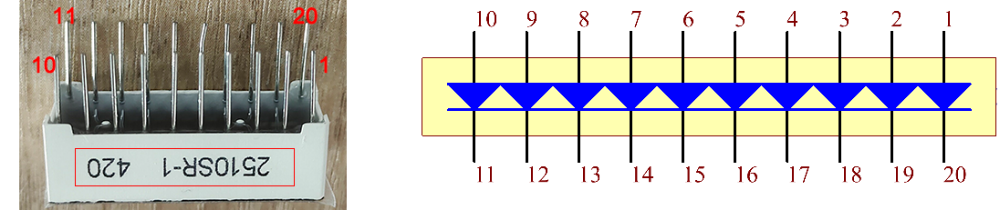

1.3 Chaser Light
====================
Now let's create a fun visual effect using multiple LEDs! We'll use an LED Bar Graph, which contains 10 LEDs in a single package. This creates a "chaser light" effect where LEDs light up one after another, like you see on old TV shows or electronic displays.

.. image:: img/1.detail/1.3.png

Component List
^^^^^^^^^^^^^^^
- Raspberry Pi Pico W x1
- MicroUSB cable x1
- 830 Tie-Points Breadboard x1
- Resistor 220Ω x10
- Jumper Wire Several
- LED Bar Graph x1

Component knowledge
^^^^^^^^^^^^^^^^^^^^
:ref:`LED Bar Graph <cpn_led_bar_graph>`
""""""""""""""""""""""""""""""""""""""""""

In the LED Bar Graph, there are 10 LEDs, each of which can be controlled individually. 
Each LED's anode is connected to GPIO pins 6-15, and its cathode is connected through a 220Ω resistor to GND.

Connect
^^^^^^^^^^
.. image:: img/3.connect/1.3.png

Code
^^^^^^^
.. note::

    * Open the ``1.3_chaser_light.ino`` file under the path of ``Ultimate-Starter-Kit-for-Pico-W\Arduino\1.Project`` or copy this code into Thonny, then click "Run Current Script" or simply press F5 to run it.

    * Or copy this code into Arduino IDE.

    * Don’t forget to select the board(Raspberry Pi Pico) and the correct port before clicking the Upload button.
  
After running the code, you'll see three different light patterns: first odd LEDs (1st, 3rd, 5th...), then even LEDs (2nd, 4th, 6th...), and finally all LEDs lighting up in sequence from left to right.

The following is the program code:

.. code-block:: c++
    
    /*
      Chaser Light

      Controls 10 LEDs in sequence with different animation patterns:
      - Odd positioned LEDs (0, 2, 4, 6, 8)
      - Even positioned LEDs (1, 3, 5, 7, 9)
      - All LEDs in sequence (0 to 9)
    */

    // LED pins array - using pins 6 through 15
    const int ledPins[] = {6, 7, 8, 9, 10, 11, 12, 13, 14, 15};
    const int numLeds = 10;
    const int delayTime = 300;  // delay between LED changes

    void setup() {
      // initialize all LED pins as outputs
      for (int i = 0; i < numLeds; i++) {
        pinMode(ledPins[i], OUTPUT);
        digitalWrite(ledPins[i], LOW);  // turn off all LEDs initially
      }
    }

    void loop() {
      // Pattern 1: Light odd positioned LEDs (0, 2, 4, 6, 8)
      lightOddLeds();
      delay(delayTime);
      
      // Pattern 2: Light even positioned LEDs (1, 3, 5, 7, 9)
      lightEvenLeds();
      delay(delayTime);
      
      // Pattern 3: Light all LEDs in sequence
      lightAllLeds();
      delay(delayTime);
    }

    void lightOddLeds() {
      for (int i = 0; i < numLeds; i += 2) {  // 0, 2, 4, 6, 8
        digitalWrite(ledPins[i], HIGH);   // turn LED on
        delay(delayTime);
        digitalWrite(ledPins[i], LOW);    // turn LED off
      }
    }

    void lightEvenLeds() {
      for (int i = 1; i < numLeds; i += 2) {  // 1, 3, 5, 7, 9
        digitalWrite(ledPins[i], HIGH);   // turn LED on
        delay(delayTime);
        digitalWrite(ledPins[i], LOW);    // turn LED off
      }
    }

    void lightAllLeds() {
      for (int i = 0; i < numLeds; i++) {  // 0 to 9
        digitalWrite(ledPins[i], HIGH);   // turn LED on
        delay(delayTime);
        digitalWrite(ledPins[i], LOW);    // turn LED off
      }
    }

Phenomenon
^^^^^^^^^^^
.. video:: img/5.phenomenon/1.3.mp4
    :width: 100%