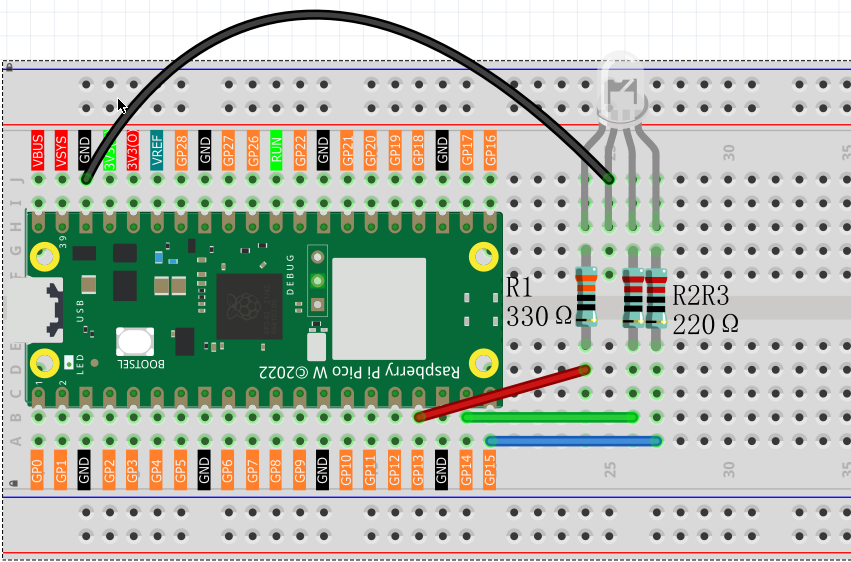

1.5 RGB Light Effects
=========================
Now let's explore RGB LEDs! An RGB LED contains three tiny LEDs (Red, Green, Blue) in one package. By mixing different brightness levels of these three colors, we can create millions of different colors.

Random Color Light
-----------------------
In this project, we'll make an RGB LED automatically change to random colors, creating a colorful light show!

Component List
^^^^^^^^^^^^^^^
- Raspberry Pi Pico W x1
- 830 Tie-Points Breadboard x1
- LED-RGB x1
- Resistor 220Ω x3
- Jumper Wire Several

We use **PWM (Pulse Width Modulation)** to control brightness:
- **GP13** controls the Red LED
- **GP14** controls the Green LED 
- **GP15** controls the Blue LED

By changing the PWM values (0-255), we can mix different amounts of red, green, and blue light to create any color we want!

Component knowledge
^^^^^^^^^^^^^^^^^^^^
:ref:`RGB-LED <cpn_rgb_led>`
"""""""""""""""""""""""""""""""

Connect
^^^^^^^^^

Code
^^^^^^^
.. note::

    * Open the ``1.5_rgb_light_effects.ino`` file under the path of ``Ultimate-Starter-Kit-for-Pico-W\Arduino\1.Project`` or copy this code into Thonny, then click "Run Current Script" or simply press F5 to run it.

    * Or copy this code into Arduino IDE.

    * Don’t forget to select the board(Raspberry Pi Pico) and the correct port before clicking the Upload button. 
  

**RandomColorLight**

After running the code, the RGB LED will continuously change colors randomly, creating a beautiful rainbow effect.

The following is the program code:

.. code-block:: c++

    /*

      Creates a smooth color transition effect using an RGB LED.
      Demonstrates color mixing and fading techniques.
    */

    // RGB LED connections
    int redPin = 13;
    int greenPin = 14; 
    int bluePin = 15;

    // Color values
    int redValue = 0;
    int greenValue = 0;
    int blueValue = 0;

    void setup() {
      pinMode(redPin, OUTPUT);
      pinMode(greenPin, OUTPUT);
      pinMode(bluePin, OUTPUT);
    }

    void loop() {
      // Cycle through color spectrum
      colorSpectrum();
      
      // Flash primary colors
      flashColors();
      
      // Breathing effect with different colors
      breathingEffect();
    }

    void colorSpectrum() {
      // Red to Yellow (increase green)
      for (int i = 0; i <= 255; i += 5) {
        analogWrite(redPin, 255);
        analogWrite(greenPin, i);
        analogWrite(bluePin, 0);
        delay(20);
      }
      
      // Yellow to Green (decrease red)
      for (int i = 255; i >= 0; i -= 5) {
        analogWrite(redPin, i);
        analogWrite(greenPin, 255);
        analogWrite(bluePin, 0);
        delay(20);
      }
      
      // Green to Cyan (increase blue)
      for (int i = 0; i <= 255; i += 5) {
        analogWrite(redPin, 0);
        analogWrite(greenPin, 255);
        analogWrite(bluePin, i);
        delay(20);
      }
      
      // Turn off
      analogWrite(redPin, 0);
      analogWrite(greenPin, 0);
      analogWrite(bluePin, 0);
      delay(500);
    }

    void flashColors() {
      // Quick color flashes
      int colors[][3] = {
        {255, 0, 0},    // Red
        {0, 255, 0},    // Green
        {0, 0, 255},    // Blue
        {255, 255, 0},  // Yellow
        {255, 0, 255},  // Magenta
        {0, 255, 255}   // Cyan
      };
      
      for (int i = 0; i < 6; i++) {
        analogWrite(redPin, colors[i][0]);
        analogWrite(greenPin, colors[i][1]);
        analogWrite(bluePin, colors[i][2]);
        delay(300);
        
        // Brief off
        analogWrite(redPin, 0);
        analogWrite(greenPin, 0);
        analogWrite(bluePin, 0);
        delay(100);
      }
    }

    void breathingEffect() {
      // Purple breathing
      for (int brightness = 0; brightness <= 255; brightness += 3) {
        analogWrite(redPin, brightness);
        analogWrite(greenPin, 0);
        analogWrite(bluePin, brightness);
        delay(10);
      }
      
      for (int brightness = 255; brightness >= 0; brightness -= 3) {
        analogWrite(redPin, brightness);
        analogWrite(greenPin, 0);
        analogWrite(bluePin, brightness);
        delay(10);
      }
      
      delay(300);
    }

Phenomenon
^^^^^^^^^^^
.. video:: img/5.phenomenon/1.5-1.mp4
    :width: 100%

