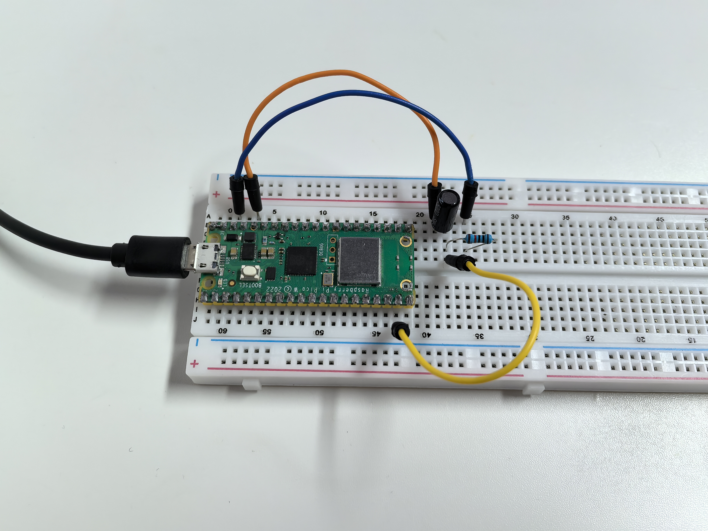

1.6 Tilt Switch
=================
A tilt switch is like a digital "bubble level" - it detects when something is tilted! It contains a small metal ball that rolls around inside. When held upright, the ball connects two metal contacts. When tilted, the ball rolls away and breaks the connection.

This makes it perfect for detecting orientation changes, like in phone screen rotation or gaming controllers.

Component List
^^^^^^^^^^^^^^^
- Raspberry Pi Pico W x1
- MicroUSB cable x1
- 830 Tie-Points Breadboard x1
- Tilt Switch x1
- Resistor 10KΩ x1
- Jumper Wire Several 

Component knowledge
^^^^^^^^^^^^^^^^^^^^
:ref:`Tilt Switch <cpn_tilt_switch>`
"""""""""""""""""""""""""""""""""""""""

How it works with our circuit:
- **Upright position**: Metal ball connects the pins → GP14 reads **HIGH**
- **Tilted position**: Metal ball rolls away → GP14 reads **LOW**

The **10KΩ pull-down resistor** ensures GP14 has a stable LOW signal when tilted, preventing floating voltage issues.

Connect
^^^^^^^^^
.. image:: img/3.connect/1.6.png

Code
^^^^^^^
.. note::

    * Open the ``1.6_tilt_switch.ino`` file under the path of ``Ultimate-Starter-Kit-for-Pico-W\Arduino\1.Project`` or copy this code into Thonny, then click "Run Current Script" or simply press F5 to run it.

    * Or copy this code into Arduino IDE.

    * Don’t forget to select the board(Raspberry Pi Pico) and the correct port before clicking the Upload button.
  
.. 1.6.png

After running the code, tilt your breadboard in different directions. The serial monitor will show real-time messages when the sensor detects position changes, displaying "TILTED" or "LEVEL" with timestamps.

The following is the program code:

.. code-block:: c++

    /*
      Tilt Switch Monitor

      Reads a tilt switch and reports when the orientation changes.
      Shows different messages for tilt and level positions.
    */

    // Pin definition - connect tilt switch to this pin
    const int tiltPin = 14;     // tilt switch connected to pin 14

    // Variables to track switch state
    int currentState = 0;       // current reading from tilt switch
    int lastState = 0;          // previous reading to detect changes
    bool showWelcome = true;    // flag to show welcome message once

    void setup() {
      // Set up the tilt switch pin as input
      pinMode(tiltPin, INPUT);
      
      // Start serial communication
      Serial.begin(115200);
      
      // Read initial state
      lastState = digitalRead(tiltPin);
    }

    void loop() {
      // Show welcome message once at start
      if (showWelcome) {
        Serial.println("=== Tilt Switch Monitor ===");
        Serial.println("Current position: " + String(lastState == LOW ? "TILTED" : "LEVEL"));
        Serial.println("Move the sensor to see changes...");
        showWelcome = false;
      }
      
      // Read current tilt switch state
      currentState = digitalRead(tiltPin);
      
      // Check if state changed (only act on changes, not continuous reading)
      if (currentState != lastState) {
        // Print timestamp for the change
        Serial.print("[");
        Serial.print(millis());
        Serial.print("ms] ");
        
        // Check new position and print appropriate message
        if (currentState == LOW) {
          Serial.println(">>> SENSOR TILTED <<<");
          Serial.println("Position changed to: TILTED");
        } else {
          Serial.println("--- Sensor Level ---");
          Serial.println("Position changed to: LEVEL");
        }
        
        Serial.println(); // blank line for readability
        
        // Remember this state for next comparison
        lastState = currentState;
      }
      
      // Small delay for stability
      delay(100);
    }

Phenomenon
^^^^^^^^^^^
