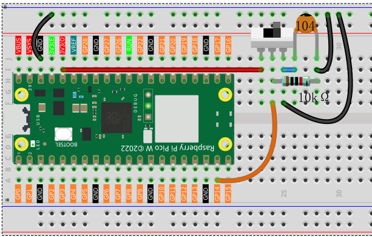
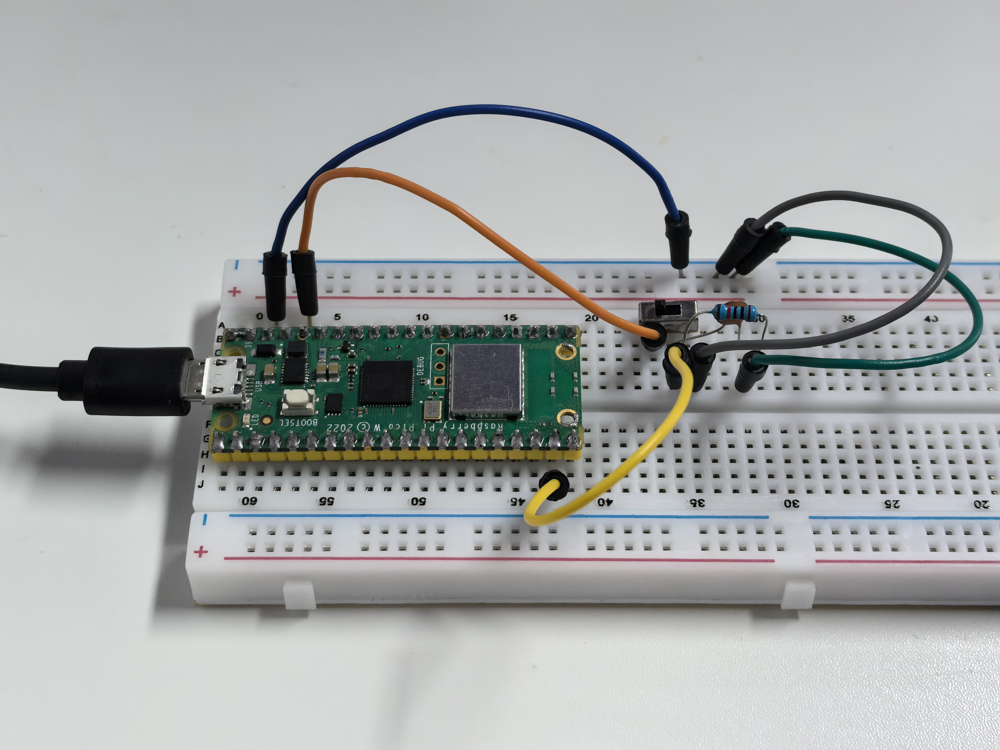

1.7 Slide_Switch
=========================
A slide switch is like a railway switch that directs electrical current to different paths! It has three pins: a common middle pin and two output pins. Slide it left or right to change which path the electricity takes.

This type of switch is commonly used for ON/OFF controls, mode selection, or toggling between two states in electronic devices.

Component List
^^^^^^^^^^^^^^^
- Raspberry Pi Pico W x1
- MicroUSB cable x1
- 830 Tie-Points Breadboard x1
- Jumper Wire Several
- Slide Switch x1
- Resistor 10KΩ x1
- Capacitor 104 x1

Component knowledge
^^^^^^^^^^^^^^^^^^^^
:ref:`Slide Switch <cpn_slide_switch>`
"""""""""""""""""""""""""""""""""""""""

:ref:`Capacitor <cpn_capacitor>`
"""""""""""""""""""""""""""""""""

How the slide switch works in our circuit:
- **Left position**: GP14 reads **LOW** (0V)
- **Right position**: GP14 reads **HIGH** (3.3V)
- **Middle position**: GP14 stays **LOW** thanks to the pull-down resistor

The **10KΩ resistor** provides a stable LOW when the switch isn't connected to HIGH, and the **104 capacitor** smooths out any electrical noise during switching.

Connect
^^^^^^^^^

Code
^^^^^^^
.. note::

    * Open the ``1.7_slide_switch.ino`` file under the path of ``Ultimate-Starter-Kit-for-Pico-W\Arduino\1.Project`` or copy this code into Thonny, then click "Run Current Script" or simply press F5 to run it.

    * Or copy this code into Arduino IDE.

    * Don’t forget to select the board(Raspberry Pi Pico) and the correct port before clicking the Upload button.

.. 1.7.png

After running the code, move the slide switch left and right. The serial monitor will display real-time position updates (HIGH/LOW), toggle counters, and timestamps showing exactly when each switch movement occurred.

The following is the program code:

.. code-block:: c++

    /*
      Digital Toggle Monitor

      Monitors a slide switch and counts the number of toggles
      while providing real-time status updates.
    */

    // Pin definition for the slide switch
    const int TOGGLE_PIN = 14;          // slide switch connected to pin 14

    // Variables to track switch state and statistics
    bool currentPosition = false;       // current switch position (true = HIGH)
    bool previousPosition = false;      // previous position for change detection
    int toggleCount = 0;                // total number of switch toggles
    unsigned long lastToggleTime = 0;   // timestamp of last toggle event

    void setup() {
      // Set up the slide switch pin as input
      pinMode(TOGGLE_PIN, INPUT);
      

      // Start serial communication
      Serial.begin(115200);
      
      // Show welcome message
      displayWelcomeMessage();
      
      // Read initial switch position
      previousPosition = digitalRead(TOGGLE_PIN);
      
      // Show initial status
      reportStatus();
    }

    void loop() {
      // Monitor the switch for changes
      monitorToggleSwitch();
      
      // Small delay for stability
      delay(100);
    }

    // Function to display welcome message and instructions
    void displayWelcomeMessage() {
      Serial.println("=== Digital Toggle Monitor ===");
      Serial.println("Move the switch to see position changes");
      Serial.println("Toggle counter will track all movements");
      Serial.println("--------------------------------");
    }

    // Function to check for switch position changes
    void monitorToggleSwitch() {
      // Read current switch position
      currentPosition = digitalRead(TOGGLE_PIN);
      
      // Check if position has changed
      if (currentPosition != previousPosition) {
        // Increment toggle counter
        toggleCount++;
        
        // Record the time of this toggle
        lastToggleTime = millis();
        
        // Display updated status
        reportStatus();
        
        // Update previous position for next comparison
        previousPosition = currentPosition;
      }
    }

    // Function to display current switch status and statistics
    void reportStatus() {
      // Show digital value (HIGH/LOW)
      Serial.print("Position: ");
      Serial.print(currentPosition ? "HIGH" : "LOW");
      
      // Show logical state (ON/OFF)
      Serial.print(" | State: ");
      Serial.print(currentPosition ? "ON " : "OFF");
      
      // Show total toggle count
      Serial.print(" | Toggles: ");
      Serial.println(toggleCount);
      
      // Show timestamp of last change (if any toggles occurred)
      if (toggleCount > 0) {
        Serial.print("Last change: ");
        Serial.print(lastToggleTime);
        Serial.println(" ms");
      }
      
      // Add separator line for readability
      Serial.println("---");
    }

Phenomenon
^^^^^^^^^^^

