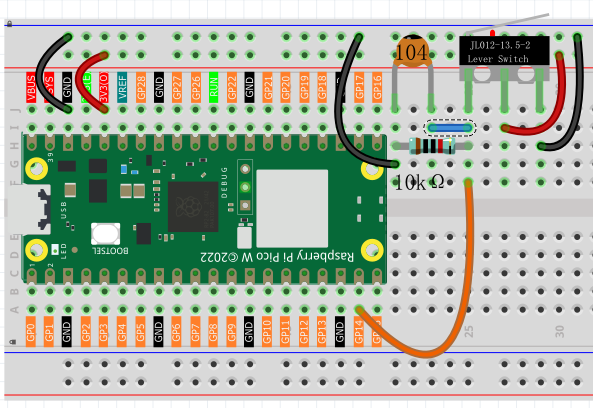
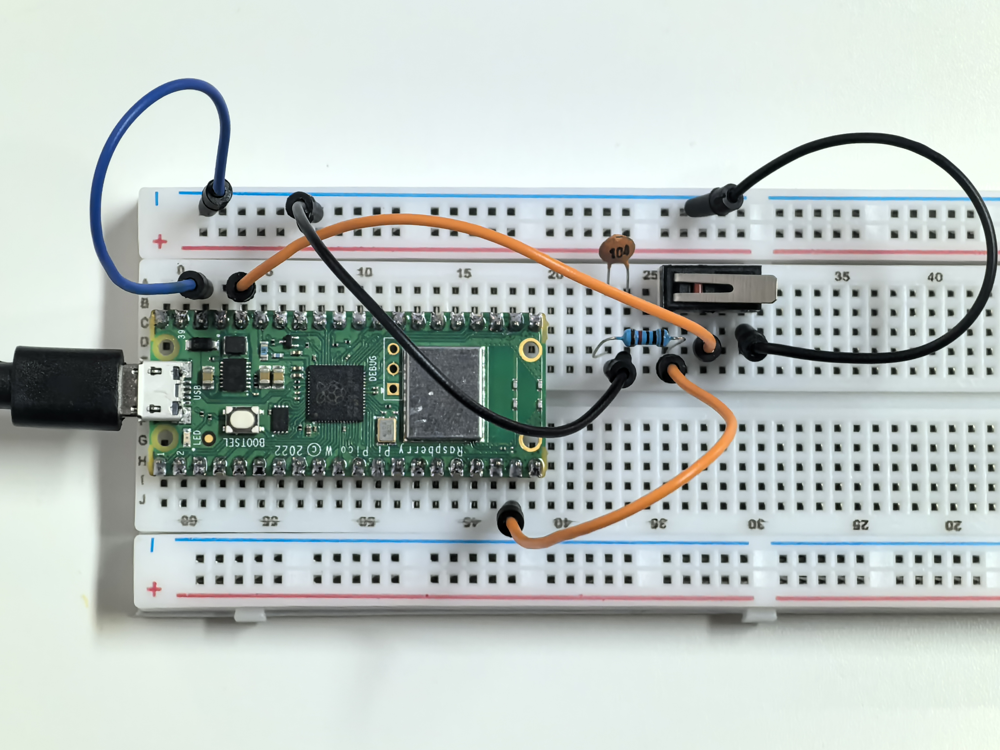

1.8 Gentle Press
===================
A micro switch is a precision button designed for detecting gentle touches! Unlike regular buttons, it has three pins: **C** (Common), **NO** (Normally Open), and **NC** (Normally Closed).

Think of it like a see-saw: when not pressed, C connects to NC. When pressed, C flips to connect to NO instead. This makes it perfect for applications requiring precise, reliable switching.

Component List
^^^^^^^^^^^^^^^
- Raspberry Pi Pico W x1
- MicroUSB cable x1
- 830 Tie-Points Breadboard x1
- Jumper Wire Several
- Resistor 10KΩx1
- Capacitor 104 x1
- Micro Switch x1

Component knowledge
^^^^^^^^^^^^^^^^^^^^
:ref:`Micro Switch <cpn_micro_switch>`
"""""""""""""""""""""""""""""""""""""""""

How our circuit works:
- **Not pressed**: C connects to NC → GP14 reads **LOW** (0V)
- **Pressed**: C connects to NO → GP14 reads **HIGH** (3.3V)

The **10KΩ pull-down resistor** ensures GP14 stays LOW when unpressed, and the **104 capacitor** eliminates button bounce (rapid on/off signals when pressing).

Connect
^^^^^^^^^

Code
^^^^^^^
.. note::

    * Open the ``1.8_gentle_press.ino`` file under the path of ``Ultimate-Starter-Kit-for-Pico-W\Arduino\1.Project`` or copy this code into Thonny, then click "Run Current Script" or simply press F5 to run it.

    * Or copy this code into Arduino IDE.

    * Don’t forget to select the board(Raspberry Pi Pico) and the correct port before clicking the Upload button. 

.. 1.8.png

After running the code, try pressing the micro switch for different durations. The program will measure how long you press and give different responses: "QUICK TAP" for short presses, "MEDIUM PRESS" for moderate holds, and "LONG HOLD" for extended presses, complete with sound effects!

The following is the program code:

.. code-block:: c++

    /*
      Press Duration Counter

      Measures how long a button is pressed and provides
      different responses based on press duration.
      Shows statistics about button usage.
    */

    // Pin definition for the button
    const int BUTTON_PIN = 14;          // button connected to pin 14

    // Variables to track button state
    bool isPressed = false;             // current button state (true = pressed)
    bool wasPressed = false;            // previous button state for comparison
    unsigned long pressStartTime = 0;   // when the button was first pressed
    unsigned long pressDuration = 0;    // how long the button was held
    int totalPresses = 0;               // count of total button presses

    void setup() {
      // Set up the button pin as input
      pinMode(BUTTON_PIN, INPUT);
      
      // Start serial communication
      Serial.begin(115200);
      
      // Show instructions to user
      showInstructions();
    }

    void loop() {
      // Check button state and handle press events
      handleButtonPress();
      
      // Small delay for stability
      delay(10);
    }

    // Function to display instructions at startup
    void showInstructions() {
      Serial.println("*** Press Duration Counter ***");
      Serial.println("Press and hold the button for different durations:");
      Serial.println("- Quick press (< 500ms): Short beep");
      Serial.println("- Medium press (500-2000ms): Medium beep");
      Serial.println("- Long press (> 2000ms): Long beep");
      Serial.println("===============================");
    }

    // Function to monitor button state and detect press/release events
    void handleButtonPress() {
      // Read current button state
      isPressed = digitalRead(BUTTON_PIN);
      
      // Check if button was just pressed (transition from not pressed to pressed)
      if (isPressed && !wasPressed) {
        // Record the time when button was pressed
        pressStartTime = millis();
        Serial.print("Button pressed... ");
      }
      
      // Check if button was just released (transition from pressed to not pressed)
      if (!isPressed && wasPressed) {
        // Calculate how long the button was held
        pressDuration = millis() - pressStartTime;
        totalPresses++;  // increment total press counter
        
        // Show the duration
        Serial.print("Released! Duration: ");
        Serial.print(pressDuration);
        Serial.println("ms");
        
        // Analyze the press type based on duration
        categorizePressType();
        
        // Show current statistics
        showStatistics();
      }
      
      // Remember current state for next loop comparison
      wasPressed = isPressed;
    }

    // Function to categorize press type based on duration
    void categorizePressType() {
      Serial.print("Press type: ");
      
      // Check duration and provide appropriate feedback
      if (pressDuration < 500) {
        Serial.println("QUICK TAP");
        Serial.println("♪ Beep!");           // short sound effect
      } else if (pressDuration < 2000) {
        Serial.println("MEDIUM PRESS");
        Serial.println("♪♪ Beep-Beep!");     // medium sound effect
      } else {
        Serial.println("LONG HOLD");
        Serial.println("♪♪♪ Beep-Beep-Beep!"); // long sound effect
      }
    }

    // Function to display usage statistics
    void showStatistics() {
      Serial.print("Total presses: ");
      Serial.println(totalPresses);
      Serial.println("---");  // separator line for readability
    }
    
Phenomenon
^^^^^^^^^^^
