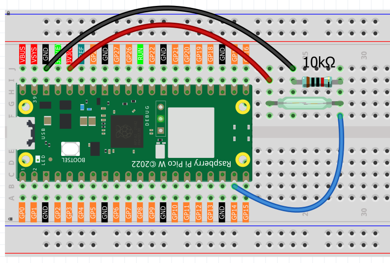
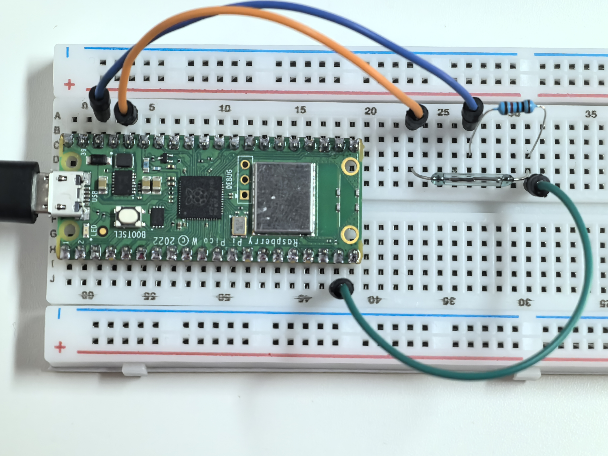

1.9 Magnetic Trigger
=========================
A reed switch is a magical "invisible touch" sensor that responds to magnetism! It contains two thin metal strips (reeds) sealed in a glass tube. When you bring a magnet close, these strips are attracted to each other and touch, completing an electrical circuit.

Remove the magnet, and the strips spring apart, breaking the connection. It's like having a wireless switch that activates through glass, plastic, or wood! You'll find these in door alarms, laptop lid sensors, and bike speedometers.

Component List
^^^^^^^^^^^^^^^
- Raspberry Pi Pico W x1
- MicroUSB cable x1
- 830 Tie-Points Breadboard x1
- Jumper Wire Several
- Resistor 10KΩ x1
- Reed Switch x1

Component knowledge
^^^^^^^^^^^^^^^^^^^^
:ref:`Reed Switch <cpn_reed_switch>`
""""""""""""""""""""""""""""""""""""""""

How magnetic detection works:
- **No magnet nearby**: Reed strips are apart → GP14 reads **LOW** (0V)
- **Magnet approaches**: Reed strips touch → GP14 reads **HIGH** (3.3V)

The **10KΩ pull-down resistor** ensures GP14 stays at a stable LOW when no magnetic field is detected, preventing false readings.

Connect
^^^^^^^^^

Code
^^^^^^^
.. note::

    * Open the ``1.9_magnetic_trigger.ino`` file under the path of ``Ultimate-Starter-Kit-for-Pico-W\Arduino\1.Project`` or copy this code into Thonny, then click "Run Current Script" or simply press F5 to run it.

    * Or copy this code into Arduino IDE.

    * Don’t forget to select the board(Raspberry Pi Pico) and the correct port before clicking the Upload button. 

.. 1.9.png

After running the code, bring a magnet close to the reed switch and move it away. You'll see "MAGNET DETECTED!" messages with detection counters and timestamps, plus continuous monitoring that shows how long the magnet stays near the sensor.

The following is the program code:

.. code-block:: c++

    /*
      Magnetic Presence Detector

      Detects when a magnet is near using a reed switch.
      Provides user-friendly feedback and tracks detection events.
      
      Note: Reed switches detect presence/absence, not magnetic strength.
    */

    // Pin definition for the reed switch
    const int REED_SWITCH = 14;         // reed switch connected to pin 14

    // Variables to track magnetic presence
    bool magnetPresent = false;         // current state (true = magnet detected)
    bool lastMagnetState = false;       // previous state for change detection
    unsigned long detectionTime = 0;    // when magnet was first detected
    unsigned long totalDetections = 0;  // count of total detections

    void setup() {
      // Set up the reed switch pin as input
      pinMode(REED_SWITCH, INPUT);
      
      // Start serial communication
      Serial.begin(115200);
      
      // Initialize the detector with welcome message
      initializeDetector();
    }

    void loop() {
      // Check for magnetic presence
      scanMagneticField();
      
      // Update continuous presence monitoring
      updatePresenceMonitor();
      
      // Small delay for stability
      delay(100);
    }

    // Function to display welcome message and initialize system
    void initializeDetector() {
      Serial.println("=== Magnetic Presence Detector ===");
      Serial.println("Bring a magnet close to the sensor");
      Serial.println("System ready for detection...");
      Serial.println("==================================");
      Serial.println();
    }

    // Function to check for magnetic field presence and detect changes
    void scanMagneticField() {
      // Read current reed switch state
      magnetPresent = digitalRead(REED_SWITCH);
      
      // Check if magnet was just detected (state change from absent to present)
      if (magnetPresent && !lastMagnetState) {
        // Record detection time and increment counter
        detectionTime = millis();
        totalDetections++;
        
        // Announce detection
        triggerDetectionAlert();
      }
      
      // Check if magnet was removed (state change from present to absent)
      if (!magnetPresent && lastMagnetState) {
        Serial.println("--- Magnet removed ---");
        Serial.println("Field cleared");
        Serial.println();
      }
      
      // Remember current state for next comparison
      lastMagnetState = magnetPresent;
    }

    // Function to announce when a magnet is detected
    void triggerDetectionAlert() {
      Serial.println("*** MAGNET DETECTED! ***");
      
      // Show detection details
      Serial.print("Detection #");
      Serial.println(totalDetections);
      
      Serial.print("Time: ");
      Serial.print(detectionTime);
      Serial.println(" ms");
      
      Serial.println("Status: ACTIVE");
      Serial.println();
    }

    // Function to monitor continuous magnetic presence
    void updatePresenceMonitor() {
      // If magnet has been present for more than 5 seconds, show duration
      if (magnetPresent && (millis() - detectionTime > 5000)) {
        // Only show message every 3 seconds to avoid spam
        if ((millis() - detectionTime) % 3000 < 100) {
          Serial.println(">> Magnet still present <<");
          Serial.print("Duration: ");
          Serial.print((millis() - detectionTime) / 1000);
          Serial.println(" seconds");
          Serial.println();
        }
      }
    }

Phenomenon
^^^^^^^^^^^

    

