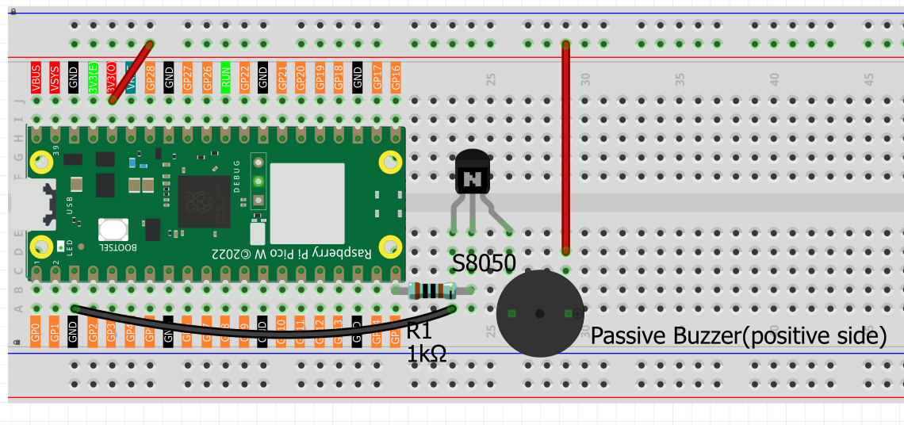
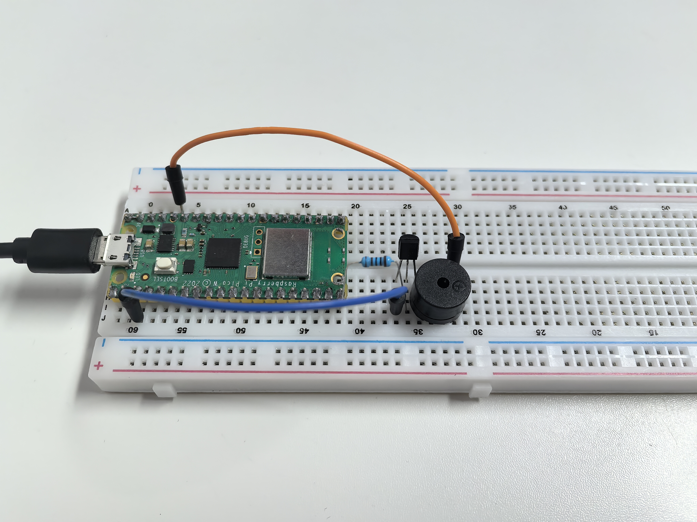

2.2 Musical Melody Player
==========================
Now let's turn our Pico into a **music player**! We'll switch from an active buzzer to a **passive buzzer** - the difference is like switching from a car horn to a piano.

**Active vs Passive Buzzer:**
- **Active buzzer**: Fixed tone, just beeps (like a smoke alarm)
- **Passive buzzer**: Variable frequency, can play **musical notes** (like a speaker)

With a passive buzzer, we can control the frequency to create Do-Re-Mi-Fa-Sol-La-Ti notes and play actual melodies! Time to make some music! ♫

Component List
^^^^^^^^^^^^^^^
- Raspberry Pi Pico W x1
- 830 Tie-Points Breadboard x1
- Transistor S8050 x1
- Resistor 1KΩ x1
- Passive Buzzer x1
- Jumper Wire Several

Component knowledge
^^^^^^^^^^^^^^^^^^^^

:ref:`transistor <cpn_transistor>`
"""""""""""""""""""""""""""""""""""

:ref:`Buzzer <cpn_buzzer>`
"""""""""""""""""""""""""""

How musical tone generation works:

**Frequency Control:** 
- Different frequencies = different musical notes (262Hz = C4, 440Hz = A4, etc.)
- Arduino's `tone()` function generates precise frequencies
- `noteDurations[]` controls how long each note plays

**Power Amplification:** The transistor boosts the signal for clearer, louder music - like adding an amplifier to a guitar!

Connect
^^^^^^^^
Two buzzers are included in the kit, we use a passive buzzer (one with an exposed PCB on the back).

The buzzer needs a transistor to work, here we use S8050.

Code
^^^^^^^
.. note::

    * Open the ``2.2_musical_melody_player.ino`` file under the path of ``Ultimate-Starter-Kit-for-Pico-W\Arduino\1.Project`` or copy this code into Thonny, then click "Run Current Script" or simply press F5 to run it.

    * Or copy this code into Arduino IDE.

    * Don’t forget to select the board(Raspberry Pi Pico) and the correct port before clicking the Upload button. 

.. 2.2.png

After running the code, enjoy the classic "Twinkle Twinkle Little Star" melody! ✨ The serial monitor shows each note being played with its frequency (Hz). The melody repeats every few seconds, and you can see the musical progression: Do-Do-Sol-Sol-La-La-Sol... It's like having a tiny digital music box!

The following is the program code:

.. code-block:: c++

    /*
      Musical Melody Player

      Plays "Twinkle Twinkle Little Star" melody using 
      tone generation on a buzzer or speaker.
    */

    // Musical note frequencies (in Hz)
    const int NOTE_C4 = 262;    // Do
    const int NOTE_D4 = 294;    // Re  
    const int NOTE_E4 = 330;    // Mi
    const int NOTE_F4 = 349;    // Fa
    const int NOTE_G4 = 392;    // Sol
    const int NOTE_A4 = 440;    // La
    const int NOTE_B4 = 494;    // Ti
    const int NOTE_C5 = 523;    // Do (high)

    // Pin and timing constants
    const int BUZZER_PIN = 15;          // buzzer connected to pin 15
    const int MELODY_LENGTH = 14;       // number of notes in melody
    const int REPEAT_DELAY = 2000;      // delay before repeating melody

    // "Twinkle Twinkle Little Star" melody
    int melody[MELODY_LENGTH] = {
      NOTE_C4, NOTE_C4, NOTE_G4, NOTE_G4,  // Twin-kle twin-kle
      NOTE_A4, NOTE_A4, NOTE_G4,           // lit-tle star
      NOTE_F4, NOTE_F4, NOTE_E4, NOTE_E4,  // How I won-der  
      NOTE_D4, NOTE_D4, NOTE_C4            // what you are
    };

    // Note durations (4 = quarter note, 8 = eighth note, 2 = half note)
    int noteDurations[MELODY_LENGTH] = {
      4, 4, 4, 4,  // quarter notes
      4, 4, 2,     // quarter, quarter, half
      4, 4, 4, 4,  // quarter notes  
      4, 4, 2      // quarter, quarter, half
    };

    void setup() {
      // Initialize serial communication
      Serial.begin(115200);
      Serial.println("=== Musical Melody Player ===");
      Serial.println("Playing: Twinkle Twinkle Little Star");
      Serial.println();
      
      // Play the melody once on startup
      playMelody();
    }

    void loop() {
      // Wait and then repeat the melody
      Serial.println("Playing melody again...");
      delay(REPEAT_DELAY);
      playMelody();
    }

    // Function to play the complete melody
    void playMelody() {
      Serial.println("♪ Now playing: Twinkle Twinkle Little Star ♪");
      
      // Play each note in the melody
      for (int noteIndex = 0; noteIndex < MELODY_LENGTH; noteIndex++) {
        // Calculate note duration
        int noteDuration = 1000 / noteDurations[noteIndex];
        
        // Play the note
        tone(BUZZER_PIN, melody[noteIndex], noteDuration);
        
        // Show current note being played
        Serial.print("Note ");
        Serial.print(noteIndex + 1);
        Serial.print("/");
        Serial.print(MELODY_LENGTH);
        Serial.print(": ");
        Serial.print(melody[noteIndex]);
        Serial.println("Hz");
        
        // Pause between notes (note duration + 30% for clear separation)
        int pauseBetweenNotes = noteDuration * 1.30;
        delay(pauseBetweenNotes);
        
        // Stop the tone
        noTone(BUZZER_PIN);
      }
      
      Serial.println("Melody complete!");
      Serial.println();
    }

Phenomenon
^^^^^^^^^^^
