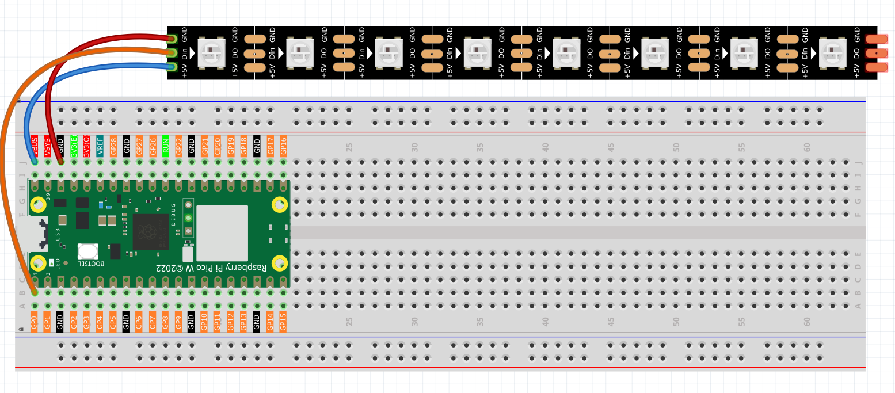
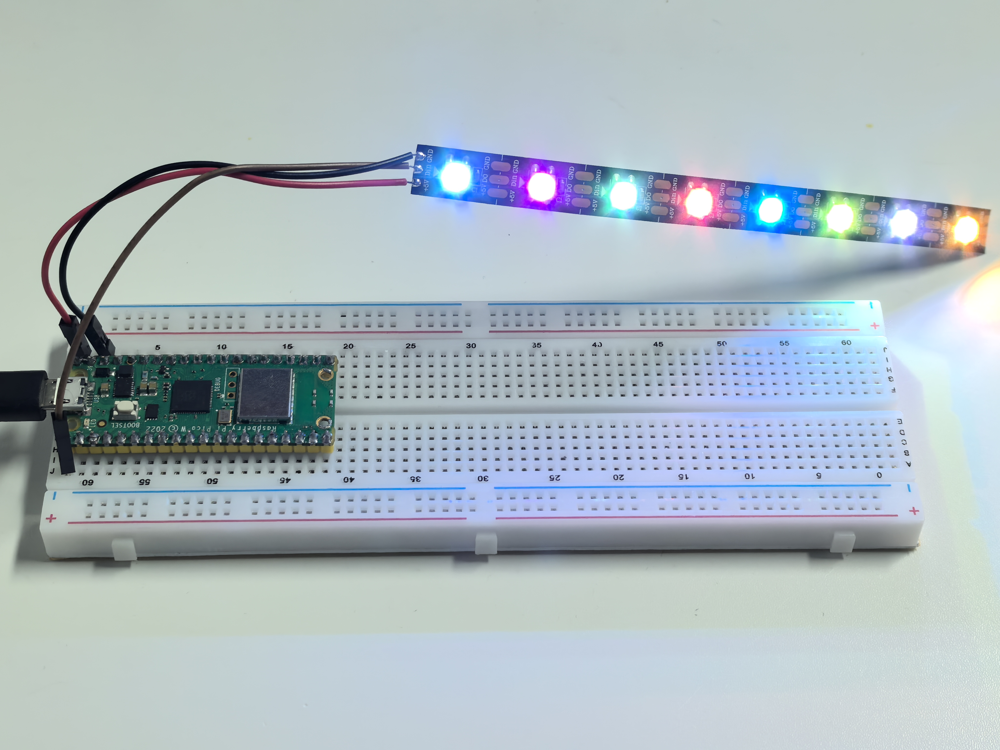

2.3 RGB LED Strip
=========================
Time to create amazing light shows! **WS2812 RGB LED strips** (also called NeoPixels) are like having a string of tiny, smart TVs - each LED can display any color independently and be controlled with just one data wire.

**What makes them special:**
- **Individually addressable**: Control each LED's color separately
- **Chainable**: Connect hundreds in a row with just one signal wire
- **16.7 million colors**: Full RGB color mixing (256 levels × 3 colors)
- **Built-in intelligence**: Each LED has its own tiny computer chip!

We'll explore three different lighting effects: chaotic random colors, interactive flowing lights, and smooth rainbow animations.

Component List
^^^^^^^^^^^^^^^
- Raspberry Pi Pico W x1
- MicroUSB cable x1
- 830 Tie-Points Breadboard x1
- RGB 8 LED Strip x1
- Jumper Wire Several

Component knowledge
^^^^^^^^^^^^^^^^^^^^
:ref:`RGB 8 LED Strip <cpn_rgb_led_strip>`
"""""""""""""""""""""""""""""""""""""""""""

How WS2812 LED strips work:

**Smart Pixel Chain:**
- Each LED receives 24-bit color data (8 bits each for Red, Green, Blue)
- First LED takes its color data, passes remaining data to next LED
- This creates a "daisy chain" where one signal controls hundreds of LEDs

**Single Wire Control:** Unlike regular LEDs that need separate wires for each color, WS2812s use clever timing to send all data through one wire - like sending Morse code at super high speed!

Connect
^^^^^^^^^

.. warning:: 
    One thing you need to pay attention to is current.

    Although the LED Strip with any number of LEDs can be used in Pico W, the power 
    of its VBUS pin is limited. Here, we will use eight LEDs, which are safe. But if 
    you want to use more LEDs, you need to add a separate power supply.

Code
^^^^^^^
.. note::

    * Open the ``2.3.1_rgb_led_strip.ino``  ``2.3.2_rgb_led_strip_flowing.ino``and ``2.3.3_rgb_led_strip_rainbow.ino``file under the path of ``Ultimate-Starter-Kit-for-Pico-W\Arduino\1.Project`` or copy this code into Thonny, then click "Run Current Script" or simply press F5 to run it.

    * Or copy this code into Arduino IDE.

    * Don’t forget to select the board(Raspberry Pi Pico) and the correct port before clicking the Upload button. 

After running each program, you'll see spectacular light effects:

**Program 1**: Chaotic random colors - each LED independently changes to random colors at random times, creating unpredictable light chaos!

**Program 2**: Interactive flowing lights - type numbers (1-6) in the serial monitor to control flowing colors: red, green, blue, yellow, purple, or rainbow. Type 's' to start/stop!

**Program 3**: Smooth rainbow animation - watch a beautiful continuous rainbow cycle through all colors, creating a mesmerizing spectrum effect.

The following is the program code:

.. 2.3-1.png

.. code-block:: c++
    :caption: 2.3.1_rgb_led_strip.ino

    /*
      Chaotic Random LED Strip

      Each LED changes to random colors at random intervals,
      creating a completely unpredictable light display.
    */

    #include <Adafruit_NeoPixel.h>

    // Hardware configuration
    const int PIXEL_PIN = 0;            // NeoPixel strip pin
    const int PIXEL_COUNT = 8;          // Number of LEDs in strip

    // Random timing ranges (milliseconds)
    const int MIN_CHANGE_TIME = 500;    // Minimum time before LED can change color
    const int MAX_CHANGE_TIME = 3000;   // Maximum time before LED can change color

    // LED data structure to track each LED independently
    struct LEDData {
      unsigned long nextChangeTime;     // When this LED should change color next
      uint32_t currentColor;           // Current color of this LED
    };

    // Array to store data for each LED
    LEDData leds[PIXEL_COUNT];

    // Initialize NeoPixel strip
    Adafruit_NeoPixel strip(PIXEL_COUNT, PIXEL_PIN, NEO_GRB + NEO_KHZ800);

    void setup() {
      // Initialize LED strip
      strip.begin();
      strip.show();
      strip.setBrightness(120);  // Set moderate brightness
      
      // Initialize serial communication
      Serial.begin(115200);
      Serial.println("=== Chaotic Random LED Strip ===");
      Serial.println("Each LED changes color independently at random intervals");
      Serial.println("Creating completely unpredictable light patterns");
      Serial.println();
      
      // Initialize random seed using analog noise
      randomSeed(analogRead(A0) + analogRead(A1) + analogRead(A2));
      
      // Initialize each LED with random color and random next change time
      for (int i = 0; i < PIXEL_COUNT; i++) {
        leds[i].currentColor = generateRandomColor();
        leds[i].nextChangeTime = millis() + random(MIN_CHANGE_TIME, MAX_CHANGE_TIME);
        strip.setPixelColor(i, leds[i].currentColor);
        
        // Show initial color info
        Serial.print("LED ");
        Serial.print(i);
        Serial.print(" initialized: ");
        printColorInfo(leds[i].currentColor);
        Serial.print(", next change in ");
        Serial.print((leds[i].nextChangeTime - millis()) / 1000.0, 1);
        Serial.println(" seconds");
      }
      
      // Display initial colors
      strip.show();
      Serial.println();
      Serial.println("Starting chaotic color changes...");
      Serial.println();
    }

    void loop() {
      unsigned long currentTime = millis();
      bool anyLEDChanged = false;
      
      // Check each LED independently
      for (int i = 0; i < PIXEL_COUNT; i++) {
        // Check if this LED should change color now
        if (currentTime >= leds[i].nextChangeTime) {
          // Generate new random color
          leds[i].currentColor = generateRandomColor();
          
          // Set new random time for next change
          leds[i].nextChangeTime = currentTime + random(MIN_CHANGE_TIME, MAX_CHANGE_TIME);
          
          // Update the LED
          strip.setPixelColor(i, leds[i].currentColor);
          
          // Log the change
          Serial.print("LED ");
          Serial.print(i);
          Serial.print(" changed to ");
          printColorInfo(leds[i].currentColor);
          Serial.print(", next change in ");
          Serial.print((leds[i].nextChangeTime - currentTime) / 1000.0, 1);
          Serial.println(" seconds");
          
          anyLEDChanged = true;
        }
      }
      
      // Update strip only if any LED changed (efficiency)
      if (anyLEDChanged) {
        strip.show();
      }
      
      // Small delay to prevent excessive CPU usage
      delay(50);
    }

    // Function to generate a completely random RGB color
    uint32_t generateRandomColor() {
      // Generate random RGB values (0-255 each)
      int red = random(0, 256);
      int green = random(0, 256);
      int blue = random(0, 256);
      
      // Occasionally generate pure colors for variety
      if (random(0, 10) == 0) {  // 10% chance
        switch (random(0, 6)) {
          case 0: return strip.Color(255, 0, 0);     // Pure red
          case 1: return strip.Color(0, 255, 0);     // Pure green
          case 2: return strip.Color(0, 0, 255);     // Pure blue
          case 3: return strip.Color(255, 255, 0);   // Yellow
          case 4: return strip.Color(255, 0, 255);   // Magenta
          case 5: return strip.Color(0, 255, 255);   // Cyan
        }
      }
      
      return strip.Color(red, green, blue);
    }

    // Function to print color information in readable format
    void printColorInfo(uint32_t color) {
      uint8_t r = (color >> 16) & 0xFF;
      uint8_t g = (color >> 8) & 0xFF;
      uint8_t b = color & 0xFF;
      
      Serial.print("RGB(");
      Serial.print(r);
      Serial.print(",");
      Serial.print(g);
      Serial.print(",");
      Serial.print(b);
      Serial.print(")");
    }

.. 2.3-2.png

.. code-block:: c++
    :caption: 2.3.2_rgb_led_strip_flowing.ino

    /*
      Interactive Flowing LED Strip

      Control RGB LED strip with different color modes through serial commands.
      Type commands in serial monitor to change flowing light colors.
    */

    #include <Adafruit_NeoPixel.h>

    // Hardware configuration
    const int PIXEL_PIN = 0;            // NeoPixel strip pin
    const int PIXEL_COUNT = 8;          // Number of LEDs in strip
    const int FLOW_SPEED = 100;         // Default flowing speed (milliseconds)

    // Color mode constants
    const int MODE_RED = 1;
    const int MODE_GREEN = 2;
    const int MODE_BLUE = 3;
    const int MODE_YELLOW = 4;
    const int MODE_PURPLE = 5;
    const int MODE_RAINBOW = 6;

    // Current settings
    int currentMode = MODE_RAINBOW;     // Start with rainbow mode
    bool isRunning = true;              // Control if effect is running

    // Initialize NeoPixel strip
    Adafruit_NeoPixel strip(PIXEL_COUNT, PIXEL_PIN, NEO_GRB + NEO_KHZ800);

    void setup() {
      // Initialize LED strip
      strip.begin();
      strip.show();
      strip.setBrightness(100);  // Set to moderate brightness
      
      // Initialize serial communication
      Serial.begin(115200);
      showWelcomeMessage();
    }

    void loop() {
      // Check for serial commands
      handleSerialInput();
      
      // Run flowing effect if enabled
      if (isRunning) {
        runFlowingEffect();
      }
      
      delay(FLOW_SPEED);
    }

    // Function to display welcome message and menu
    void showWelcomeMessage() {
      Serial.println("=== Interactive Flowing LED Strip ===");
      Serial.println("Control your LED strip with these commands:");
      Serial.println("1 - Red flowing lights");
      Serial.println("2 - Green flowing lights");
      Serial.println("3 - Blue flowing lights");
      Serial.println("4 - Yellow flowing lights");
      Serial.println("5 - Purple flowing lights");
      Serial.println("6 - Rainbow flowing lights");
      Serial.println("s - Start/Stop effect");
      Serial.println("h - Show this help menu");
      Serial.println();
      Serial.println("Current mode: Rainbow flowing");
      Serial.println("Status: Running");
      Serial.println("Type a command and press Enter:");
    }

    // Function to handle serial input commands
    void handleSerialInput() {
      if (Serial.available() > 0) {
        char command = Serial.read();
        
        // Clear any remaining characters
        while (Serial.available() > 0) {
          Serial.read();
        }
        
        // Process command
        switch (command) {
          case '1':
            currentMode = MODE_RED;
            Serial.println("Mode: Red flowing lights activated");
            break;
            
          case '2':
            currentMode = MODE_GREEN;
            Serial.println("Mode: Green flowing lights activated");
            break;
            
          case '3':
            currentMode = MODE_BLUE;
            Serial.println("Mode: Blue flowing lights activated");
            break;
            
          case '4':
            currentMode = MODE_YELLOW;
            Serial.println("Mode: Yellow flowing lights activated");
            break;
            
          case '5':
            currentMode = MODE_PURPLE;
            Serial.println("Mode: Purple flowing lights activated");
            break;
            
          case '6':
            currentMode = MODE_RAINBOW;
            Serial.println("Mode: Rainbow flowing lights activated");
            break;
            
          case 's':
          case 'S':
            isRunning = !isRunning;
            if (isRunning) {
              Serial.println("Effect started");
            } else {
              Serial.println("Effect stopped");
              clearAllPixels();
            }
            break;
            
          case 'h':
          case 'H':
            showWelcomeMessage();
            break;
            
          default:
            Serial.println("Unknown command. Type 'h' for help.");
            break;
        }
      }
    }

    // Function to run the flowing effect based on current mode
    void runFlowingEffect() {
      // Shift existing colors forward
      for (int i = 0; i < PIXEL_COUNT - 1; i++) {
        strip.setPixelColor(i, strip.getPixelColor(i + 1));
      }
      
      // Add new color at the end based on current mode
      uint32_t newColor = getColorForMode(currentMode);
      strip.setPixelColor(PIXEL_COUNT - 1, newColor);
      
      // Update the strip
      strip.show();
    }

    // Function to get color based on selected mode
    uint32_t getColorForMode(int mode) {
      switch (mode) {
        case MODE_RED:
          return strip.Color(255, 0, 0);
          
        case MODE_GREEN:
          return strip.Color(0, 255, 0);
          
        case MODE_BLUE:
          return strip.Color(0, 0, 255);
          
        case MODE_YELLOW:
          return strip.Color(255, 255, 0);
          
        case MODE_PURPLE:
          return strip.Color(128, 0, 128);
          
        case MODE_RAINBOW:
          {
            // Generate random color for rainbow effect
            int randomHue = random(65536);
            return strip.gamma32(strip.ColorHSV(randomHue));
          }
          
        default:
          return strip.Color(255, 255, 255);  // White as fallback
      }
    }

    // Function to clear all pixels
    void clearAllPixels() {
      for (int i = 0; i < PIXEL_COUNT; i++) {
        strip.setPixelColor(i, strip.Color(0, 0, 0));
      }
      strip.show();
    }

.. 2.3-3.png

.. code-block:: c++
    :caption: 2.3.3_rgb_led_strip_rainbow.ino
    
    /*
     * Rainbow LED Strip Project
     * 
     * This project creates a beautiful rainbow effect on an RGB LED strip
     * using the Adafruit NeoPixel library. The rainbow continuously cycles
     * through all colors creating a mesmerizing visual effect.
     * 
     * Hardware Requirements:
     * - Arduino-compatible board
     * - WS2812B RGB LED strip (8 pixels)
     * - Appropriate power supply for LED strip
     */

    #include <Adafruit_NeoPixel.h>
    #ifdef __AVR__
    #include <avr/power.h>
    #endif

    // Hardware Configuration Constants
    #define LED_STRIP_PIN         0     // Digital pin connected to LED strip data line
    #define LED_PIXEL_COUNT       8     // Number of pixels in the LED strip
    #define LED_STRIP_TYPE        (NEO_GRB + NEO_KHZ800)  // LED strip specifications

    // Animation Constants
    #define RAINBOW_DELAY_MS      10    // Delay between rainbow animation frames (milliseconds)
    #define COLOR_WHEEL_MAX       65536 // Maximum value for HSV color wheel
    #define HUE_INCREMENT_STEP    256   // Step size for hue progression
    #define BRIGHTNESS_MAX        255   // Maximum brightness value
    #define SATURATION_MAX        255   // Maximum saturation value

    // Create NeoPixel strip object with specified configuration
    Adafruit_NeoPixel ledStrip(LED_PIXEL_COUNT, LED_STRIP_PIN, LED_STRIP_TYPE);

    /**
     * Arduino Setup Function
     * 
     * Initializes the LED strip and prepares it for operation.
     * This function runs once when the Arduino starts up.
     */
    void setup() {
      // Initialize the LED strip hardware
      ledStrip.begin();
      
      // Turn off all pixels initially
      clearAllPixels();
      
      // Display the initial state
      ledStrip.show();
    }

    /**
     * Arduino Main Loop Function
     * 
     * Continuously runs the rainbow animation effect.
     * This function repeats indefinitely while the Arduino is powered.
     */
    void loop() {
      displayRainbowEffect();
    }

    /**
     * Clear All Pixels
     * 
     * Turns off all pixels in the LED strip by setting them to black (0,0,0).
     * This provides a clean starting state for animations.
     */
    void clearAllPixels() {
      for (int i = 0; i < LED_PIXEL_COUNT; i++) {
        ledStrip.setPixelColor(i, 0, 0, 0);  // Set pixel to black (off)
      }
    }

    /**
     * Display Rainbow Effect
     * 
     * Creates a continuous rainbow animation that cycles through all colors
     * of the spectrum. The rainbow moves smoothly across the entire LED strip.
     * 
     * The effect works by:
     * 1. Cycling through all possible hue values (0-65535)
     * 2. Distributing colors evenly across all pixels
     * 3. Creating a smooth color transition between adjacent pixels
     */
    void displayRainbowEffect() {
      // Cycle through the complete color wheel
      for (long startingHue = 0; startingHue < COLOR_WHEEL_MAX; startingHue += HUE_INCREMENT_STEP) {
        
        // Set color for each pixel in the strip
        for (int pixelIndex = 0; pixelIndex < LED_PIXEL_COUNT; pixelIndex++) {
          
          // Calculate the hue for this specific pixel
          // This creates an even distribution of colors across the strip
          int currentPixelHue = startingHue + (pixelIndex * COLOR_WHEEL_MAX / LED_PIXEL_COUNT);
          
          // Convert HSV color to RGB and apply gamma correction for better color accuracy
          uint32_t pixelColor = ledStrip.gamma32(
            ledStrip.ColorHSV(currentPixelHue, SATURATION_MAX, BRIGHTNESS_MAX)
          );
          
          // Set the calculated color to the current pixel
          ledStrip.setPixelColor(pixelIndex, pixelColor);
        }
        
        // Update the LED strip to display the new colors
        ledStrip.show();
        
        // Wait before the next animation frame
        delay(RAINBOW_DELAY_MS);
      }
    }

Phenomenon
^^^^^^^^^^^
