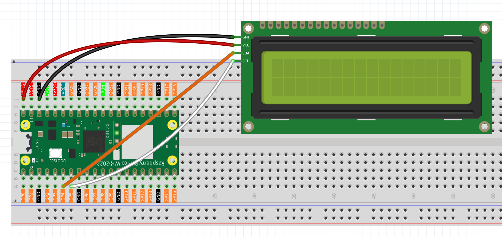

2.4 LCD Displayer
=========================
Time to add a display to our projects! An **LCD1602** is like a tiny digital billboard that can show text messages - perfect for displaying sensor readings, status messages, or user interfaces. It can show 32 characters total: 2 rows with 16 characters each.

**Why I²C LCD?** Regular LCDs need 6+ wires, but our I²C version needs only **2 wires** (SDA + SCL)! This saves precious GPIO pins for other components. Think of I²C as a "highway" where multiple devices can share the same communication path.

We'll display custom messages that appear and disappear in sequence - like a simple animation!

Component List
^^^^^^^^^^^^^^^
- Raspberry Pi Pico W x1
- MicroUSB cable x1
- 830 Tie-Points Breadboard x1
- LCD1602 IIC x1
- Jumper Wire Several

Component knowledge
^^^^^^^^^^^^^^^^^^^^
:ref:`LCD1602 <cpn_lcd1602>`
"""""""""""""""""""""""""""""

Connect
^^^^^^^^^

Code
^^^^^^^
.. note::

    * Open the ``2.4_lcd_displayer.ino`` file under the path of ``Ultimate-Starter-Kit-for-Pico-W\Arduino\1.Project`` or copy this code into Thonny, then click "Run Current Script" or simply press F5 to run it.

    * Or copy this code into Arduino IDE.

    * Don’t forget to select the board(Raspberry Pi Pico) and the correct port before clicking the Upload button. 

.. 2.4.png

After running the code, watch the LCD screen come alive! First "From Lafvin" appears, then clears, followed by "Hello" on the first line and "World!" on the second line. The text sequence demonstrates cursor positioning and display timing - perfect for creating informative project displays!

The following is the program code:

.. code-block:: c++

    #include <Wire.h>
    #include <LiquidCrystal_I2C.h>

    // Initialize LCD object with I2C address 0x27, 16 columns and 2 rows
    LiquidCrystal_I2C lcd(0x27, 16, 2);

    void setup() {
      // Initialize I2C communication
      Wire.begin();
      // Initialize LCD
      lcd.init();
      // Turn on the backlight
      lcd.backlight();
      
      // Display the first line message
      lcd.setCursor(0, 0); // Set cursor position to the first column of the first row
      lcd.print("From Lafvin");
      
      // Wait for 2 seconds
      delay(2000);
      
      // Clear the display
      lcd.clear();
      
      // Display the second line message
      lcd.setCursor(0, 0); // Set cursor position to the first column of the first row
      lcd.print("Hello");
      lcd.setCursor(0, 1); // Set cursor position to the first column of the second row
      lcd.print("       World!");
      
      // Wait for 5 seconds
      delay(5000);
      
      // Clear the display
      lcd.clear();
    }

    void loop() {
      // Empty loop, no operation
    }

Phenomenon
^^^^^^^^^^^
.. video:: img/5.phenomenon/2.4.mp4
    :width: 100%