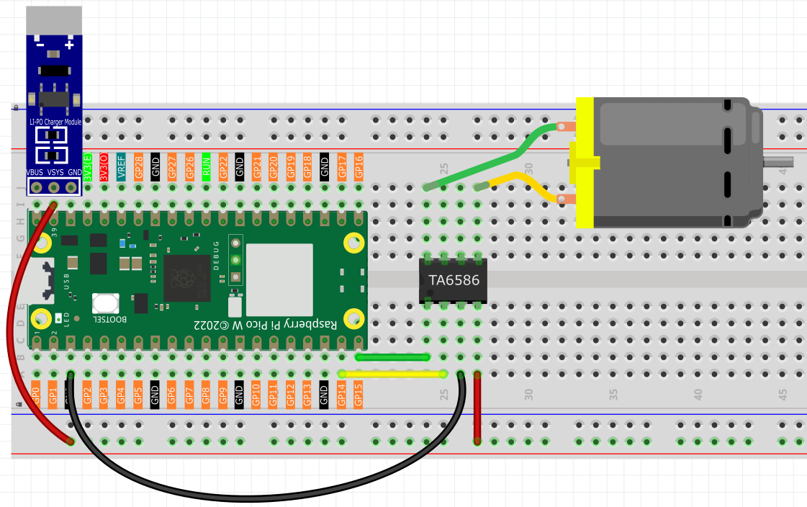

2.5 Motor & Fan
=========================
Time to add movement to our projects! DC motors can spin fans, wheels, conveyor belts, or any rotating mechanism. Unlike LEDs that just light up, motors create **mechanical motion** - they can push, pull, spin, and move things in the real world!

We're using a **TA6586 motor driver** chip that lets us control both **speed** and **direction**. Think of it as a "motor remote control" that can make the motor spin clockwise, counterclockwise, or stop completely.

**Why need a motor driver?** Motors are hungry for power! The Pico can't provide enough current safely, so the TA6586 acts like a power amplifier.

Component List
^^^^^^^^^^^^^^^
- Raspberry Pi Pico W x1
- MicroUSB cable x1
- 830 Tie-Points Breadboard x1
- TA6586 x1
- DC Motor x1
- Li-po Charger Module x1
- Battery Holder x1
- Jumper Wire Several

Component knowledge
^^^^^^^^^^^^^^^^^^^^
:ref:`TA6586 <cpn_ta6586>`
"""""""""""""""""""""""""""

:ref:`Li-po Charger Module <cpn_li_po_charger_module>`
"""""""""""""""""""""""""""""""""""""""""""""""""""""""""

:ref:`DC Motor <cpn_dc_motor>`
""""""""""""""""""""""""""""""""

How bidirectional motor control works:

**Direction Control Logic:**
- **Clockwise**: Pin A = HIGH, Pin B = LOW → Current flows one direction
- **Counterclockwise**: Pin A = LOW, Pin B = HIGH → Current flows opposite direction  
- **Stop**: Both pins = LOW → No current flows

**Safety First:** The Li-Po charger module provides clean, regulated power to prevent motor damage and protect your circuit from voltage spikes.

.. note:: 

    * Since DC motors require a high current, we use a Li-po Charger module to power the motor here for safety reasons.

    * Make sure your Li-po Charger Module is connected as shown in the diagram. Otherwise, a short circuit will likely damage your battery and circuitry.

Connect
^^^^^^^^^

Code
^^^^^^^
.. note::

    * Open the ``2.5_motor_and_fan.ino`` file under the path of ``Ultimate-Starter-Kit-for-Pico-W\Arduino\1.Project`` or copy this code into Thonny, then click "Run Current Script" or simply press F5 to run it.

    * Or copy this code into Arduino IDE.

    * Don’t forget to select the board(Raspberry Pi Pico) and the correct port before clicking the Upload button. 

.. 2.5.png

After running the code, watch the motor spring into action! It follows a rhythmic pattern: spins clockwise for 1 second, stops for 1 second, spins counterclockwise for 1 second, stops again, then repeats. Perfect for creating oscillating fans, automatic stirrers, or robotic movements!

The following is the program code:

.. code-block:: c++

    /*
     * DC Motor and Fan Control Project
     * 
     * This project demonstrates bidirectional control of a DC motor or fan
     * using digital pins. The motor alternates between clockwise rotation,
     * stop, counterclockwise rotation, and stop in a continuous cycle.
     * 
     * Hardware Requirements:
     * - Arduino-compatible board
     * - DC motor or fan
     * - TA6586 motor driver IC
     * - Appropriate power supply for motor (typically 3V-12V)
     */

    // Hardware Configuration Constants
    #define MOTOR_PIN_A           14    // TA6586 input pin A (connects to IN1)
    #define MOTOR_PIN_B           15    // TA6586 input pin B (connects to IN2)

    // Timing Constants
    #define ROTATION_DURATION_MS  1000  // How long motor runs in each direction (milliseconds)
    #define STOP_DURATION_MS      1000  // How long motor stops between direction changes (milliseconds)

    /**
     * Arduino Setup Function
     * 
     * Initializes the motor control pins as outputs.
     * This function runs once when the Arduino starts up.
     */
    void setup() {
      // Configure motor control pins as outputs
      pinMode(MOTOR_PIN_A, OUTPUT);
      pinMode(MOTOR_PIN_B, OUTPUT);
      
      // Ensure motor starts in stopped state
      stopMotor();
    }

    /**
     * Arduino Main Loop Function
     * 
     * Continuously cycles through motor operations:
     * clockwise → stop → counterclockwise → stop → repeat
     */
    void loop() {
      // Run motor clockwise
      rotateClockwise();
      delay(ROTATION_DURATION_MS);
      
      // Stop motor
      stopMotor();
      delay(STOP_DURATION_MS);
      
      // Run motor counterclockwise
      rotateCounterclockwise();
      delay(ROTATION_DURATION_MS);
      
      // Stop motor
      stopMotor();
      delay(STOP_DURATION_MS);
    }

    /**
     * Rotate Motor Clockwise
     * 
     * Sets the motor control pins to rotate the motor in clockwise direction.
     * Pin A is set HIGH and Pin B is set LOW to create the direction signal.
     */
    void rotateClockwise() {
      digitalWrite(MOTOR_PIN_A, HIGH);
      digitalWrite(MOTOR_PIN_B, LOW);
    }

    /**
     * Rotate Motor Counterclockwise
     * 
     * Sets the motor control pins to rotate the motor in counterclockwise direction.
     * Pin A is set LOW and Pin B is set HIGH to reverse the direction signal.
     */
    void rotateCounterclockwise() {
      digitalWrite(MOTOR_PIN_A, LOW);
      digitalWrite(MOTOR_PIN_B, HIGH);
    }

    /**
     * Stop Motor
     * 
     * Stops the motor by setting both control pins to LOW.
     * This removes power from the motor, causing it to stop spinning.
     */
    void stopMotor() {
      digitalWrite(MOTOR_PIN_A, LOW);
      digitalWrite(MOTOR_PIN_B, LOW);
    }

Phenomenon
^^^^^^^^^^^
.. video:: img/5.phenomenon/2.5.mp4
    :width: 100%