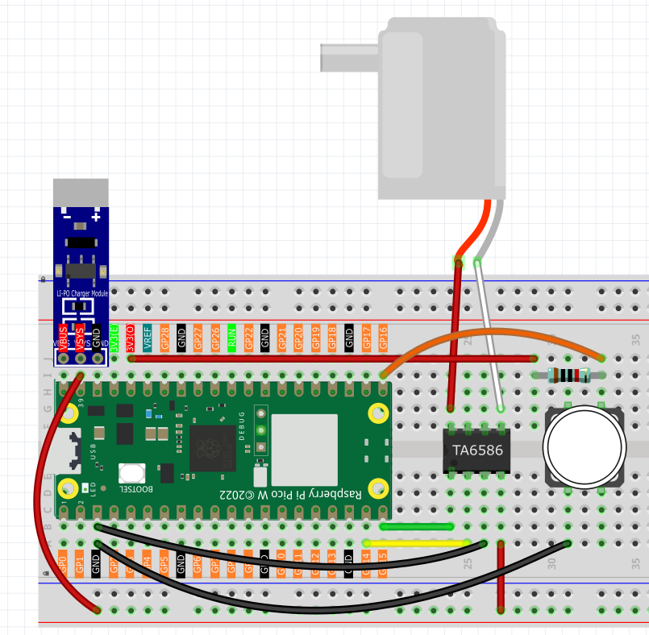

2.6 Pump Control
=========================
Let's build something that moves water! **Mini water pumps** open up amazing project possibilities: automatic plant watering, desktop fountains, aquarium circulation, or even cooling systems. It's like having a tiny robotic assistant that can move liquids on command!

Our **DC water pump** is basically a motor with an impeller inside - when it spins, it creates suction that pulls water in one end and pushes it out the other. Think of it as a "water mover" controlled by your Pico!

.. attention:: 
    
    1.Connect the tube to the motor outlet, submerge the pump in water, and then power it on.
    2.You need to make sure that the water level is always higher than the motor. Idling may damage the motor due to heat generation and will also generate noise.
    3.If you are watering plants, you need to avoid soil being drawn in, as this can clog the pump.
    4.If water does not come out of the tube, there may be residual water in the tube blocking the air flow and needs to be drained first.

Component List
^^^^^^^^^^^^^^^
- Raspberry Pi Pico W x1
- MicroUSB cable x1
- 830 Tie-Points Breadboard x1
- TA6586 x1
- DC Water Pump x1
- Resistor 10KΩ x1
- Li-po Charger Module x1
- Battery Holder x1
- Jumper Wire Several

Component knowledge
^^^^^^^^^^^^^^^^^^^^
:ref:`DC Water Pump <cpn_dc_water_pump>`
""""""""""""""""""""""""""""""""""""""""""

How our button-controlled pump works:

**Toggle Control System:**
- **Button press**: Pump switches ON → Water starts flowing
- **Button press again**: Pump switches OFF → Water stops
- **Button debouncing**: Prevents false triggers from electrical noise

**Power Management:** Like motors, pumps need more current than the Pico can provide, so we use the Li-Po module for safe, reliable power.

.. warning:: 

    * Since DC pump require a high current, we use a Li-po Charger module to power the motor here for safety reasons.

    * Make sure your Li-po Charger Module is connected as shown in the diagram. Otherwise, a short circuit will likely damage your battery and circuitry.

Connect
^^^^^^^^^

Code
^^^^^^^
.. note::

    * Open the ``2.6_pump_control.ino`` file under the path of ``Ultimate-Starter-Kit-for-Pico-W\Arduino\1.Project`` or copy this code into Thonny, then click "Run Current Script" or simply press F5 to run it.

    * Or copy this code into Arduino IDE.

    * Don’t forget to select the board(Raspberry Pi Pico) and the correct port before clicking the Upload button. 

.. 2.6.png

After running the code, connect a button to pin 16 and press it to toggle the pump on/off! When ON, you'll hear the pump motor spinning and see water flowing through the tube. The serial monitor shows "Power on" and "Power off" messages. Perfect for creating remote-controlled irrigation systems!

The following is the program code:

.. code-block:: c++

    const int motor1A = 14;
    const int motor2A = 15;
    const int switchPin = 16;

    bool pumpState = false;
    int lastSwitchState = HIGH; // HIGH indicates not pressed

    void setup() {
    pinMode(motor1A, OUTPUT);
    pinMode(motor2A, OUTPUT);
    pinMode(switchPin, INPUT_PULLUP);

    pumpOff(); // Initial state: Off
    }

    void loop() {
    int currentSwitchState = digitalRead(switchPin);

    // Detect the moment when the button changes from not pressed to pressed (falling edge)
    if (currentSwitchState == LOW && lastSwitchState == HIGH) {
        delay(20); // Debounce
        if (digitalRead(switchPin) == LOW) { // Confirm the button state again
        pumpState = !pumpState; // Toggle the state
        if (pumpState) {
            pumpOn();
            Serial.println("Power on");
        } else {
            pumpOff();
            Serial.println("Power off");
        }
        }
    }

    lastSwitchState = currentSwitchState;
    delay(50); // Add a delay to avoid excessive CPU usage
    }

    void pumpOn() {
    digitalWrite(motor1A, HIGH);
    digitalWrite(motor2A, LOW);
    }

    void pumpOff() {
    digitalWrite(motor1A, LOW);
    digitalWrite(motor2A, LOW);
    }

Phenomenon
^^^^^^^^^^^
.. video:: img/5.phenomenon/2.6.mp4
    :width: 100%