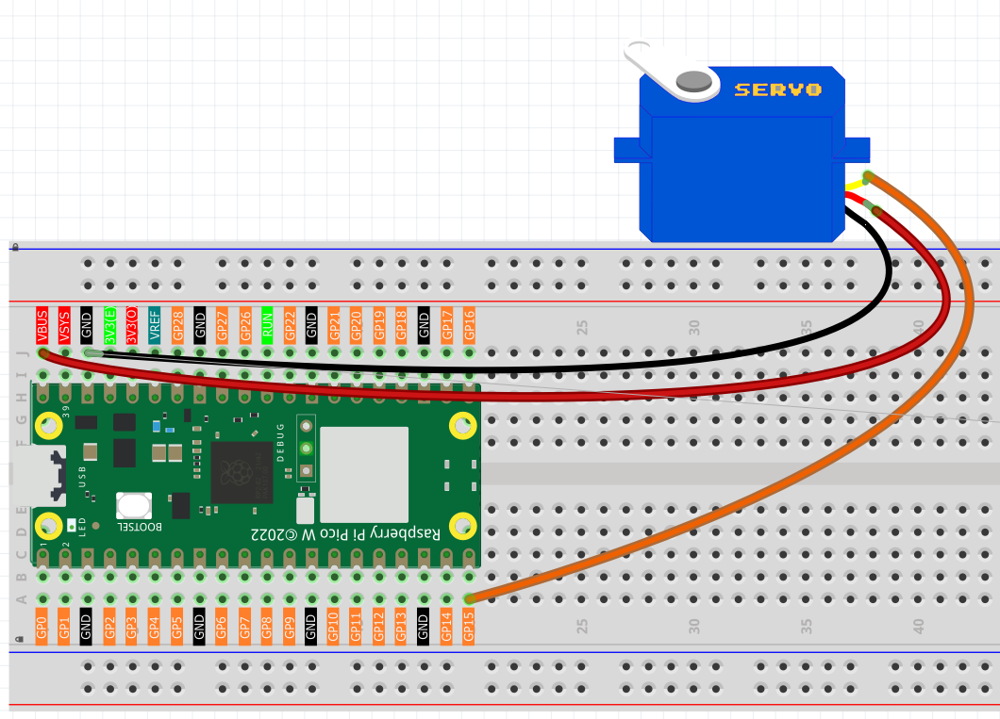

2.7 Swinging Servo
=========================
Meet the **servo motor** - the "precision mover" of the electronics world! Unlike regular motors that just spin endlessly, servos can move to **exact angles** and hold their position. Think of it as a robotic arm joint that can point precisely where you tell it to.

**Why servos are amazing:**
- **Precise positioning**: Move to exact angles (0° to 180°)
- **Position holding**: Stays where you put it, even under load
- **PWM control**: Simple 3-wire connection (power, ground, signal)

Perfect for robot arms, camera gimbals, steering mechanisms, or automatic doors. Let's create a mesmerizing pendulum motion!

Component List
^^^^^^^^^^^^^^^
- Raspberry Pi Pico W x1
- MicroUSB cable x1
- 830 Tie-Points Breadboard x1
- Servo x1
- Jumper Wire Several

Component knowledge
^^^^^^^^^^^^^^^^^^^^
:ref:`Servo <cpn_servo>`
""""""""""""""""""""""""""""""""

How servo PWM control works:

**PWM Signal Timing:**
- **0° position**: 1ms pulse width → Servo turns fully left
- **90° position**: 1.5ms pulse width → Servo centers
- **180° position**: 2ms pulse width → Servo turns fully right

**Smooth Movement:** Our code moves 1 degree at a time with small delays, creating fluid motion instead of jerky jumps.

Connect
^^^^^^^^^

* Orange wire is signal and connected to GP15.

* Red wire is VCC and connected to VBUS(5V).

* Brown wire is GND and connected to GND.

Code
^^^^^^^
.. note::

    * Open the ``2.7_swinging_servo.ino`` file under the path of ``Ultimate-Starter-Kit-for-Pico-W\Arduino\1.Project`` or copy this code into Thonny, then click "Run Current Script" or simply press F5 to run it.

    * Or copy this code into Arduino IDE.

    * Don’t forget to select the board(Raspberry Pi Pico) and the correct port before clicking the Upload button. 

.. 2.7.png

After running the code, watch the servo arm create a beautiful pendulum motion! It smoothly sweeps from 0° to 180° (taking 3 seconds), then back to 0° (another 3 seconds), creating a hypnotic back-and-forth rhythm. The movement is perfectly smooth thanks to the 15ms delay between each degree step.

The following is the program code:

.. code-block:: c++

    /*
     * Servo Motor Swinging Project
     * 
     * This project demonstrates smooth servo motor control by creating
     * a continuous swinging motion from 0 to 180 degrees and back.
     * The servo sweeps back and forth in a pendulum-like motion.
     * 
     * Hardware Requirements:
     * - Arduino-compatible board
     * - Standard servo motor (SG90 or similar)
     * - Appropriate power supply for servo
     */

    #include <Servo.h>

    // Hardware Configuration Constants
    #define SERVO_CONTROL_PIN     15    // Digital pin connected to servo signal wire

    // Movement Constants
    #define SERVO_MIN_ANGLE       0     // Minimum servo angle (degrees)
    #define SERVO_MAX_ANGLE       180   // Maximum servo angle (degrees)
    #define SERVO_STEP_DELAY_MS   15    // Delay between each degree step (milliseconds)
    #define STARTUP_DELAY_MS      1000  // Initial delay after servo attachment (milliseconds)

    // Create servo object to control the servo motor
    Servo servoMotor;

    /**
     * Arduino Setup Function
     * 
     * Initializes the servo motor and sets it to the starting position.
     * This function runs once when the Arduino starts up.
     */
    void setup() {
      // Attach servo to the specified control pin
      servoMotor.attach(SERVO_CONTROL_PIN);
      
      // Move servo to starting position (0 degrees)
      servoMotor.write(SERVO_MIN_ANGLE);
      
      // Wait for servo to reach starting position
      delay(STARTUP_DELAY_MS);
    }

    /**
     * Arduino Main Loop Function
     * 
     * Continuously performs the servo swinging motion.
     * Creates a smooth back-and-forth pendulum effect.
     */
    void loop() {
      // Perform complete swinging cycle
      performSwingingMotion();
    }

    /**
     * Perform Complete Swinging Motion
     * 
     * Executes one full cycle of servo movement:
     * 1. Swing from minimum to maximum angle
     * 2. Swing back from maximum to minimum angle
     */
    void performSwingingMotion() {
      // Swing forward: from 0 to 180 degrees
      swingServoForward();
      
      // Swing backward: from 180 to 0 degrees
      swingServoBackward();
    }

    /**
     * Swing Servo Forward
     * 
     * Moves the servo smoothly from minimum angle to maximum angle.
     * Each step is delayed to create smooth, visible movement.
     */
    void swingServoForward() {
      for (int currentAngle = SERVO_MIN_ANGLE; currentAngle <= SERVO_MAX_ANGLE; currentAngle++) {
        // Set servo to current angle position
        servoMotor.write(currentAngle);
        
        // Wait for servo to reach position before next step
        delay(SERVO_STEP_DELAY_MS);
      }
    }

    /**
     * Swing Servo Backward
     * 
     * Moves the servo smoothly from maximum angle back to minimum angle.
     * Each step is delayed to create smooth, visible movement.
     */
    void swingServoBackward() {
      for (int currentAngle = SERVO_MAX_ANGLE; currentAngle >= SERVO_MIN_ANGLE; currentAngle--) {
        // Set servo to current angle position
        servoMotor.write(currentAngle);
        
        // Wait for servo to reach position before next step
        delay(SERVO_STEP_DELAY_MS);
      }
    }

Phenomenon
^^^^^^^^^^^
.. video:: img/5.phenomenon/2.7.mp4
    :width: 100%