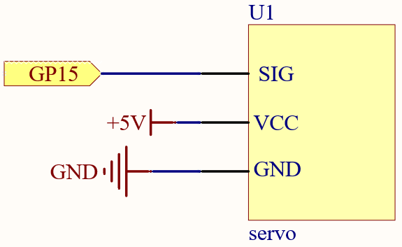
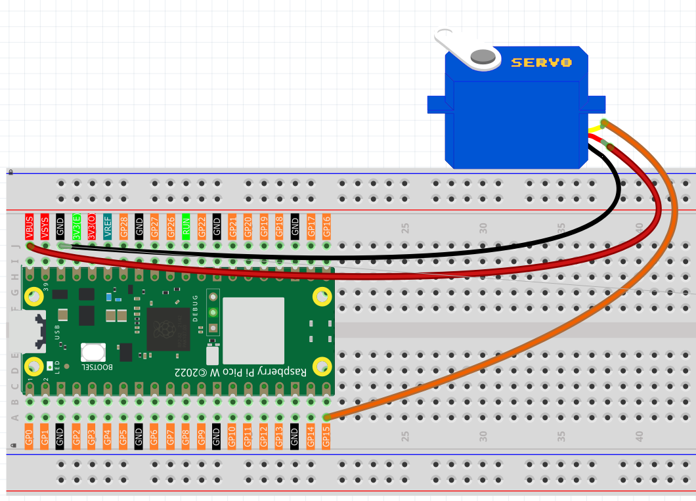
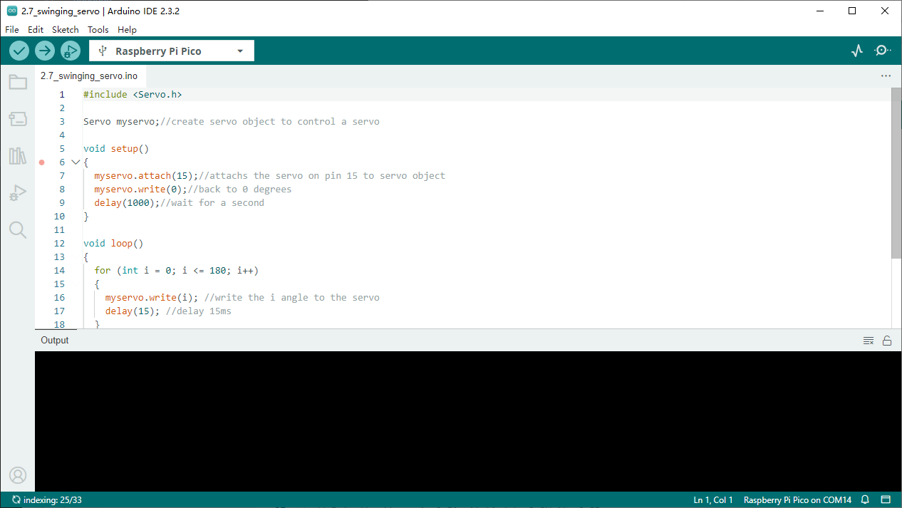

2.7 Swinging Servo
=========================
In this kit, besides the LED and passive buzzer, there’s also a servo motor that’s 
controlled by a PWM signal. A servo is a type of position (angle) control device, 
perfect for systems that require continuous angle adjustments and the ability to 
maintain specific positions. It’s widely used in high-end remote-controlled toys, 
including model airplanes, submarines, and robotic devices.

Now, let’s try making the servo motor swing back and forth!

Component List
^^^^^^^^^^^^^^^
- Raspberry Pi Pico W x1
- MicroUSB cable x1
- 830 Tie-Points Breadboard x1
- Servo x1
- Jumper Wire Several

Component knowledge
^^^^^^^^^^^^^^^^^^^^
:ref:`Servo <cpn_servo>`
""""""""""""""""""""""""""""""""

Schematic
^^^^^^^^^^

Connect
^^^^^^^^^

* Orange wire is signal and connected to GP15.

* Red wire is VCC and connected to VBUS(5V).

* Brown wire is GND and connected to GND.

Code
^^^^^^^
.. note::

    * Open the ``2.7_swinging_servo.ino`` file under the path of ``Ultimate-Starter-Kit-for-Pico-W\Arduino\1.Project`` or copy this code into Thonny, then click "Run Current Script" or simply press F5 to run it.

    * Or copy this code into Arduino IDE.

    * Don’t forget to select the board(Raspberry Pi Pico) and the correct port before clicking the Upload button. 

Click “Run current script”, we can see the Servo Arm swinging back and forth from 0° to 180°.

The program will always run because of the while True loop, we need to press the Stop button to end the program.

The following is the program code:

.. code-block:: c++

    #include <Servo.h>

    Servo myservo;//create servo object to control a servo

    void setup()
    {
    myservo.attach(15);//attachs the servo on pin 15 to servo object
    myservo.write(0);//back to 0 degrees
    delay(1000);//wait for a second
    }

    void loop()
    {
    for (int i = 0; i <= 180; i++)
    {
        myservo.write(i); //write the i angle to the servo
        delay(15); //delay 15ms
    }
    for (int i = 180; i >= 0; i--)
    {
        myservo.write(i); //write the i angle to the servo
        delay(15); //delay 15ms
    }
    }

Phenomenon
^^^^^^^^^^^
.. video:: img/5.phenomenon/2.7.mp4
    :width: 100%