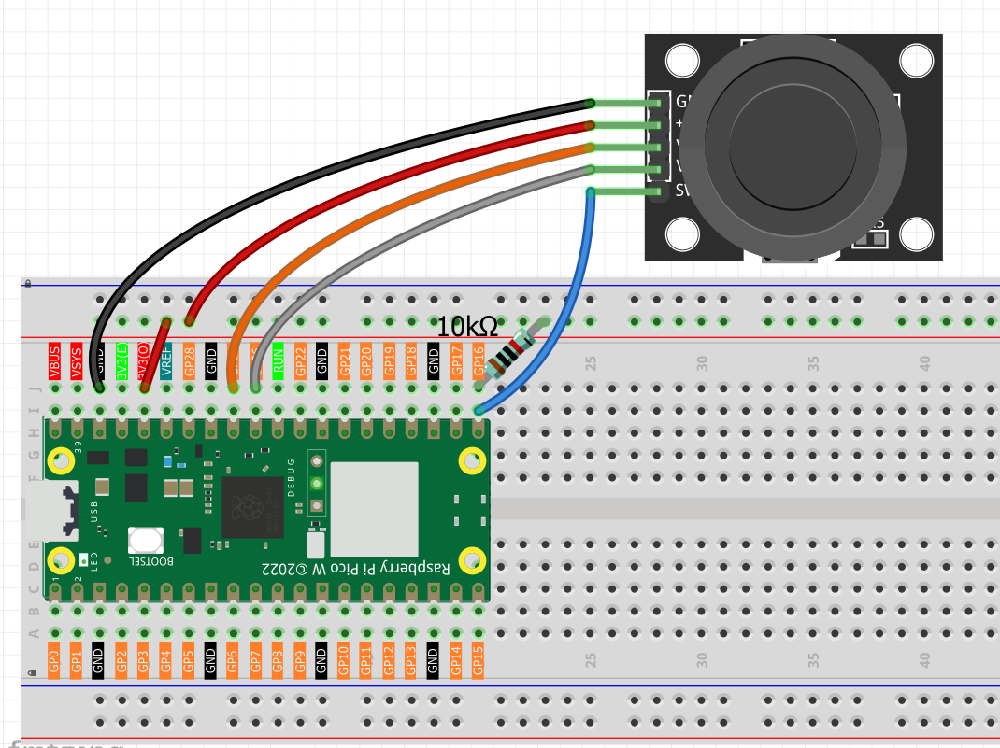

3.1 Joystick
=========================
Welcome to 2D control! A **joystick** is like having a mouse that can move in all directions - perfect for gaming, robot control, camera gimbals, or any project needing **precise directional input**.

**How it works:** Inside the joystick are two potentiometers positioned at 90° to each other. As you move the stick, these potentiometers change resistance, giving us **X and Y coordinates** (0-1023 in each direction). Plus there's a hidden bonus - push down on the stick and it becomes a **button**!

Think of it as a "digital compass" that tells your Pico exactly where you're pointing and whether you're pressing down.

Component List
^^^^^^^^^^^^^^^
- Raspberry Pi Pico W x1
- MicroUSB cable x1
- 830 Tie-Points Breadboard x1
- Joystick Module x1
- Jumper Wire Several
- 10kΩ Resistor x1

Component knowledge
^^^^^^^^^^^^^^^^^^^^
:ref:`Joystick Module <cpn_joystick>`
""""""""""""""""""""""""""""""""""""""

Connect
^^^^^^^^^

Code
^^^^^^^
.. note::

    * Open the ``3.1_joystick.ino`` file under the path of ``Ultimate-Starter-Kit-for-Pico-W\Arduino\1.Project`` or copy this code into Thonny, then click "Run Current Script" or simply press F5 to run it.

    * Or copy this code into Arduino IDE.

    * Don’t forget to select the board(Raspberry Pi Pico) and the correct port before clicking the Upload button. 

After running the code, move the joystick around and watch the live coordinate tracking! The serial monitor shows real-time X/Y values (0-1023) and button state (0/1). The Y-axis is inverted for intuitive control - up = higher values, down = lower values. Try moving in circles, pressing the button, or holding positions to see how responsive the readings are!

The following is the program code:

.. code-block:: c++

    /*
     * Analog Joystick Control Project
     * 
     * This project reads X and Y axis positions from an analog joystick
     * and the state of the built-in button. The Y-axis and button values
     * are inverted for more intuitive control behavior.
     * 
     * Hardware Requirements:
     * - Arduino-compatible board
     * - Analog joystick module (with X, Y, and SW pins)
     * - Serial monitor for output display
     */

    // Hardware Configuration Constants
    #define JOYSTICK_X_PIN        A1    // Joystick X-axis analog pin (VRX)
    #define JOYSTICK_Y_PIN        A0    // Joystick Y-axis analog pin (VRY)
    #define JOYSTICK_BUTTON_PIN   16    // Joystick button digital pin (SW)

    // Analog Reading Constants
    #define ANALOG_MIN_VALUE      0     // Minimum analog reading value
    #define ANALOG_MAX_VALUE      1023  // Maximum analog reading value
    #define SERIAL_BAUD_RATE      115200  // Serial communication speed
    #define READING_DELAY_MS      100   // Delay between readings (milliseconds)

    // Button States
    #define BUTTON_PRESSED        LOW   // Active button state (pulled down when pressed)
    #define BUTTON_RELEASED       HIGH  // Inactive button state (pulled up when released)

    /**
     * Arduino Setup Function
     * 
     * Initializes the joystick button pin and serial communication.
     * Sets up pull-up resistor for the button pin.
     */
    void setup() {
      // Configure button pin as input with internal pull-up resistor
      pinMode(JOYSTICK_BUTTON_PIN, INPUT_PULLUP);
      
      // Initialize serial communication for data output
      Serial.begin(SERIAL_BAUD_RATE);
      
      // Display startup message
      Serial.println("=== Joystick Controller Initialized ===");
      Serial.println("Format: X: value | Y: value | Button: state");
      Serial.println("Y-axis inverted, Button inverted for intuitive control");
      Serial.println("======================================");
    }

    /**
     * Arduino Main Loop Function
     * 
     * Continuously reads joystick position and button state,
     * then outputs the values to serial monitor with inversions applied.
     */
    void loop() {
      // Read and display joystick values
      displayJoystickValues();
      
      // Wait before next reading
      delay(READING_DELAY_MS);
    }

    /**
     * Display Joystick Values
     * 
     * Reads all joystick inputs and displays them with appropriate
     * inversions for Y-axis and button state.
     */
    void displayJoystickValues() {
      // Read raw joystick values
      int xValue = readXAxis();
      int yValue = readYAxisInverted();
      int buttonState = readButtonInverted();
      
      // Display formatted output
      Serial.print("X: ");
      Serial.print(xValue);
      Serial.print(" | Y: ");
      Serial.print(yValue);
      Serial.print(" | Button: ");
      Serial.println(buttonState);
    }

    /**
     * Read X-Axis Value
     * 
     * Reads the X-axis analog value without any inversion.
     * 
     * @return Raw X-axis value (0-1023)
     */
    int readXAxis() {
      return analogRead(JOYSTICK_X_PIN);
    }

    /**
     * Read Y-Axis Value (Inverted)
     * 
     * Reads the Y-axis analog value and inverts it for more
     * intuitive control (up = higher value, down = lower value).
     * 
     * @return Inverted Y-axis value (0-1023)
     */
    int readYAxisInverted() {
      int rawValue = analogRead(JOYSTICK_Y_PIN);
      // Invert the Y-axis: 1023 - raw_value
      return ANALOG_MAX_VALUE - rawValue;
    }

    /**
     * Read Button State (Inverted)
     * 
     * Reads the button state and inverts it for logical output
     * (1 = pressed, 0 = released instead of hardware LOW/HIGH).
     * 
     * @return Inverted button state (1 = pressed, 0 = released)
     */
    int readButtonInverted() {
      int rawButtonState = digitalRead(JOYSTICK_BUTTON_PIN);
      // Invert the button: pressed (LOW) becomes 1, released (HIGH) becomes 0
      return (rawButtonState == BUTTON_PRESSED) ? 1 : 0;
    }

Phenomenon
^^^^^^^^^^^
.. image:: img/5.phenomenon/3.1.png
    :width: 100%