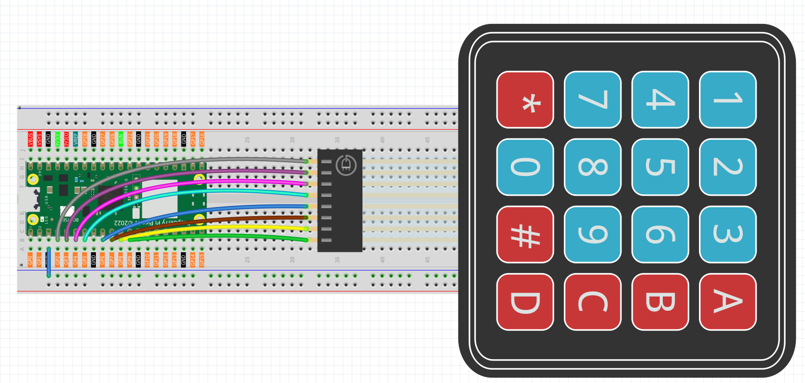
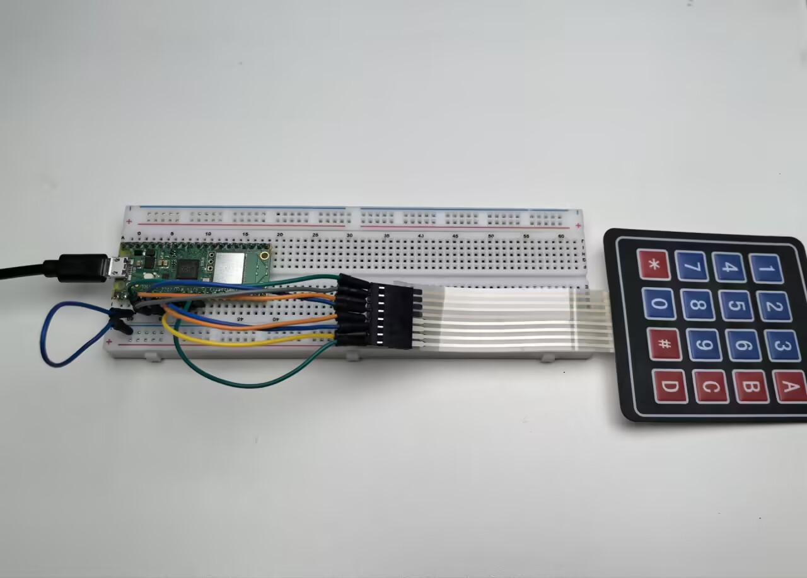

3.2 4x4 Keypad
=========================
Time to add a **full keyboard interface** to your projects! A 4x4 matrix keypad gives you 16 buttons in a compact package - perfect for security codes, menu navigation, calculators, or game controllers.

**Why "matrix" design?** Instead of needing 16 separate wires, this clever grid design uses only **8 wires** (4 rows + 4 columns) to detect all 16 buttons. It's like playing digital battleship - by scanning rows and columns, we can pinpoint exactly which button was pressed!

Our keypad includes: **numbers 0-9**, **letters A-D**, and **symbols * #** - everything you need for most user interfaces.

Component List
^^^^^^^^^^^^^^^
- Raspberry Pi Pico W x1
- MicroUSB cable x1
- 830 Tie-Points Breadboard x1
- Resistor 10KΩ x4
- 4x4 Keypad x1
- Jumper Wire Several

Component knowledge
^^^^^^^^^^^^^^^^^^^^
:ref:`4x4 Keypad <cpn_keypad>`
"""""""""""""""""""""""""""""""""""

How matrix scanning works:

**Scanning Logic:**
- **Rows (GP2-GP5)**: Set to HIGH one at a time
- **Columns (GP6-GP9)**: Read for HIGH signals
- **Key detection**: When a button connects a HIGH row to a column, we detect the intersection!

**Example:** Pressing button "1" connects Row 1 (GP2) to Column 1 (GP6). When GP2 is HIGH and we detect GP6 as HIGH, we know button "1" was pressed.

**Pull-down resistors** keep columns LOW when no buttons are pressed, preventing false readings.

Connect
^^^^^^^^^

To make the wiring easier, in the above diagram, the column row of the matrix keyboard and the 10K resistors are inserted into the holes where G6 ~ G9 are located at the same time.

Code
^^^^^^^
.. note::

    * Open the ``3.2_4x4_keypad.ino`` file under the path of ``Ultimate-Starter-Kit-for-Pico-W\Arduino\1.Project`` or copy this code into Thonny, then click "Run Current Script" or simply press F5 to run it.

    * Or copy this code into Arduino IDE.

    * Don’t forget to select the board(Raspberry Pi Pico) and the correct port before clicking the Upload button. 

After running the code, start pressing keys on the keypad! The serial monitor shows both **PRESSED** and **RELEASED** events for every key. Try typing sequences, holding buttons down, or pressing multiple keys to see the real-time detection. Perfect for building security keypads or interactive control panels!

The following is the program code:

.. code-block:: c++

    /*
     * 4x4 Matrix Keypad Input Project
     * 
     * This project demonstrates reading input from a 4x4 matrix keypad
     * using the Adafruit_Keypad library. The keypad provides 16 buttons
     * including numbers (0-9), letters (A-D), and symbols (* #).
     * 
     * Hardware Requirements:
     * - Arduino-compatible board
     * - 4x4 matrix keypad
     * - 8 digital pins for keypad connections
     * - Serial monitor for output display
     */

    #include "Adafruit_Keypad.h"

    // Keypad Configuration Constants
    #define KEYPAD_ROWS           4     // Number of rows in the keypad matrix
    #define KEYPAD_COLS           4     // Number of columns in the keypad matrix

    // Communication Constants
    #define SERIAL_BAUD_RATE      115200  // Serial communication speed
    #define KEYPAD_SCAN_DELAY_MS  10      // Delay between keypad scans (milliseconds)

    // Hardware Pin Configuration Constants
    #define ROW_PIN_1             2     // First row pin connection
    #define ROW_PIN_2             3     // Second row pin connection
    #define ROW_PIN_3             4     // Third row pin connection
    #define ROW_PIN_4             5     // Fourth row pin connection

    #define COL_PIN_1             6     // First column pin connection
    #define COL_PIN_2             7     // Second column pin connection
    #define COL_PIN_3             8     // Third column pin connection
    #define COL_PIN_4             9     // Fourth column pin connection

    // Keypad layout mapping - defines what character each button represents
    char keypadLayout[KEYPAD_ROWS][KEYPAD_COLS] = {
      { '1', '2', '3', 'A' },  // First row: numbers and letter A
      { '4', '5', '6', 'B' },  // Second row: numbers and letter B
      { '7', '8', '9', 'C' },  // Third row: numbers and letter C
      { '*', '0', '#', 'D' }   // Fourth row: symbols and letter D
    };

    // Pin mapping arrays for keypad connections
    byte rowPinConnections[KEYPAD_ROWS] = { ROW_PIN_1, ROW_PIN_2, ROW_PIN_3, ROW_PIN_4 };
    byte colPinConnections[KEYPAD_COLS] = { COL_PIN_1, COL_PIN_2, COL_PIN_3, COL_PIN_4 };

    // Create keypad object with configuration
    Adafruit_Keypad matrixKeypad = Adafruit_Keypad(
      makeKeymap(keypadLayout), 
      rowPinConnections, 
      colPinConnections, 
      KEYPAD_ROWS, 
      KEYPAD_COLS
    );

    /**
     * Arduino Setup Function
     * 
     * Initializes serial communication and the keypad hardware.
     * This function runs once when the Arduino starts up.
     */
    void setup() {
      // Initialize serial communication for output display
      Serial.begin(SERIAL_BAUD_RATE);
      
      // Initialize the matrix keypad
      matrixKeypad.begin();
      
      // Display startup information
      Serial.println("=== 4x4 Matrix Keypad Controller ===");
      Serial.println("Press any key on the keypad...");
      Serial.println("Available keys: 0-9, A-D, *, #");
      Serial.println("===================================");
    }

    /**
     * Arduino Main Loop Function
     * 
     * Continuously scans the keypad for button presses and releases,
     * then displays the events to the serial monitor.
     */
    void loop() {
      // Scan keypad for any state changes
      scanKeypadForEvents();
      
      // Small delay to prevent excessive CPU usage
      delay(KEYPAD_SCAN_DELAY_MS);
    }

    /**
     * Scan Keypad for Events
     * 
     * Updates the keypad state and processes any key press or release events.
     * Displays formatted output for each detected event.
     */
    void scanKeypadForEvents() {
      // Update the internal state of all keys
      matrixKeypad.tick();
      
      // Process all available keypad events
      while (matrixKeypad.available()) {
        // Read the next keypad event
        keypadEvent currentEvent = matrixKeypad.read();
        
        // Process and display the event
        processKeypadEvent(currentEvent);
      }
    }

    /**
     * Process Keypad Event
     * 
     * Analyzes a keypad event and displays appropriate information
     * about which key was pressed or released.
     * 
     * @param event The keypad event to process
     */
    void processKeypadEvent(keypadEvent event) {
      // Extract the key character from the event
      char pressedKey = (char)event.bit.KEY;
      
      // Display the key that was pressed
      Serial.print("Key '");
      Serial.print(pressedKey);
      Serial.print("' ");
      
      // Display the type of event (press or release)
      if (event.bit.EVENT == KEY_JUST_PRESSED) {
        Serial.println("PRESSED");
      } else if (event.bit.EVENT == KEY_JUST_RELEASED) {
        Serial.println("RELEASED");
      }
    }

Phenomenon
^^^^^^^^^^^
