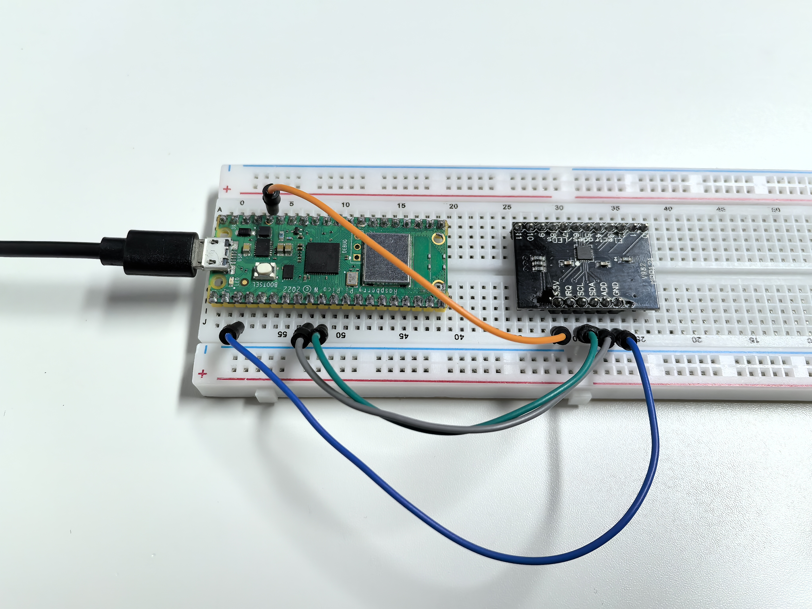

3.3 Touch Keyboard
=========================
Enter the world of **capacitive touch sensing**! The MPR121 chip can detect touch through **12 separate channels** - imagine having 12 invisible buttons that respond to the slightest touch, no physical pressure needed!

**The magic:** Each electrode detects tiny changes in electrical capacitance when your finger approaches. But here's the fun part - you can extend these electrodes to **any conductive material**: fruits, metal objects, water, even plants! Turn a banana into a button, or create a musical fruit piano.

**Creative possibilities:** Touch-sensitive art installations, interactive walls, musical instruments, or invisible control panels.

Component List
^^^^^^^^^^^^^^^
- Raspberry Pi Pico W x1
- MicroUSB cable x1
- 830 Tie-Points Breadboard x1
- MPR121 Module x1
- Jumper Wire Several

Component knowledge
^^^^^^^^^^^^^^^^^^^^
:ref:`MPR121 Module <cpn_mpr121>`
"""""""""""""""""""""""""""""""""""

Connect
^^^^^^^^^
.. image:: img/3.connect/3.3.png

Code
^^^^^^^
.. note::

    * Open the ``3.3_touch_keyboard.ino`` file under the path of ``Ultimate-Starter-Kit-for-Pico-W\Arduino\1.Project`` or copy this code into Thonny, then click "Run Current Script" or simply press F5 to run it.

    * Or copy this code into Arduino IDE.

    * Don’t forget to select the board(Raspberry Pi Pico) and the correct port before clicking the Upload button. 

After running the code, start touching the 12 electrodes on the MPR121 board! The serial monitor displays a live **binary pattern** (like "001010000100") showing which electrodes are being touched in real-time.

**Experiment time:** Try connecting wires to the electrodes and touching fruits, aluminum foil, or even cups of water. Watch how the touch patterns change as you create your own custom touch interfaces! Each electrode can detect touch through thin materials, opening up endless creative possibilities.

The following is the program code:

.. code-block:: c++

    /*
     * MPR121 Capacitive Touch Sensor Project
     * 
     * Reads 12-channel touch input and displays touch patterns.
     * Hardware: MPR121 breakout board connected via I2C
     */

    #include <Wire.h>
    #include "Adafruit_MPR121.h"

    // Configuration Constants
    #define TOUCH_CHANNELS        12      // Number of touch channels
    #define MPR121_ADDRESS        0x5A    // Default I2C address
    #define SERIAL_BAUD           115200  // Serial communication speed

    // Create touch sensor object and state variables
    Adafruit_MPR121 touchSensor = Adafruit_MPR121();
    uint16_t lastTouched = 0;
    uint16_t currentTouched = 0;
    boolean touchState[TOUCH_CHANNELS];

    /**
     * Arduino Setup Function
     * Initializes serial communication and MPR121 touch sensor.
     */
    void setup() {
      Serial.begin(SERIAL_BAUD);
      while (!Serial) delay(10);  // Wait for serial connection
      
      Serial.println("MPR121 Touch Sensor Initializing...");
      
      if (!touchSensor.begin(MPR121_ADDRESS)) {
        Serial.println("MPR121 not found! Check wiring.");
        while (1);  // Halt if sensor not found
      }
    }

    /**
     * Arduino Main Loop Function
     * Monitors touch states and displays changes.
     */
    void loop() {
      currentTouched = touchSensor.touched();
      
      // Only display when touch state changes
      if (currentTouched != lastTouched) {
        updateTouchStates();
        displayTouchPattern();
        lastTouched = currentTouched;
      }
    }

    /**
     * Update Individual Touch States
     * Extracts each channel state using bit manipulation.
     */
    void updateTouchStates() {
      for (int i = 0; i < TOUCH_CHANNELS; i++) {
        touchState[i] = (currentTouched & (1 << i)) ? true : false;
      }
    }

    /**
     * Display Touch Pattern
     * Shows current touch state as binary pattern.
     */
    void displayTouchPattern() {
      Serial.print("Touch: ");
      for (int i = 0; i < TOUCH_CHANNELS; i++) {
        Serial.print(touchState[i] ? "1" : "0");
      }
      Serial.println();
    }

Phenomenon
^^^^^^^^^^^
