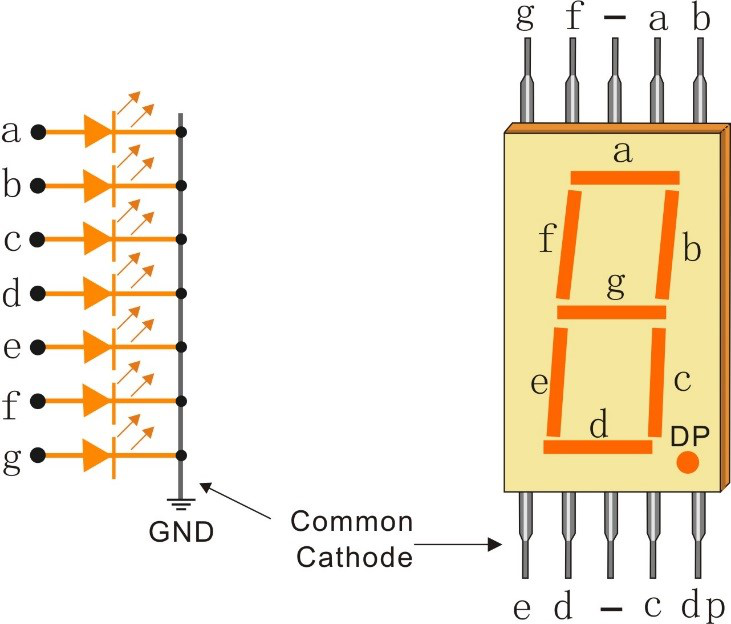
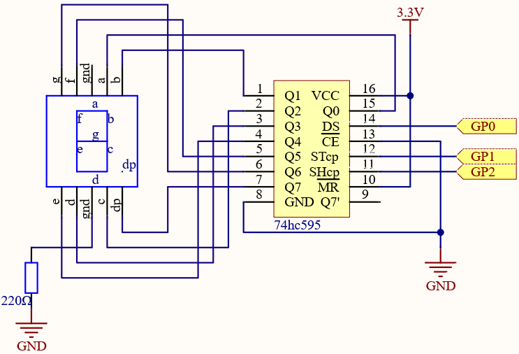
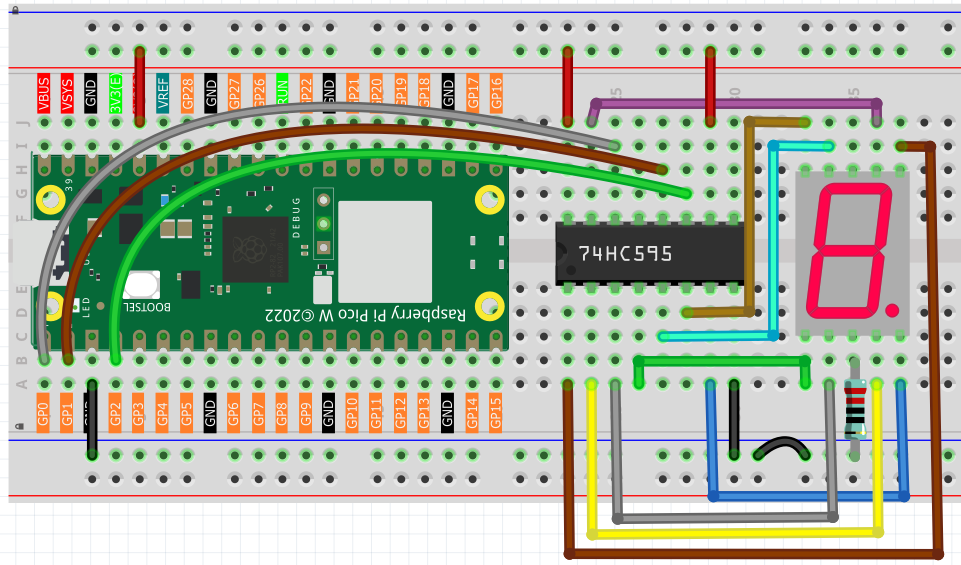
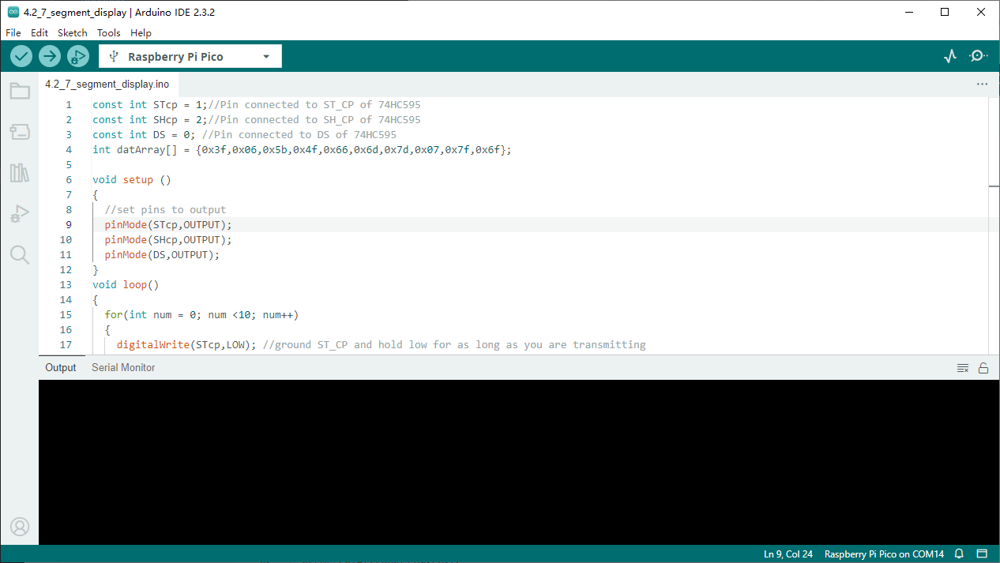

4.2 7-Segment Display
=========================
7 Segment Displays are ubiquitous in everyday life. For instance, they are used 
on air conditioners to display temperature and on traffic indicators to show countdown 
timers. Essentially, a 7 Segment Display is a package of 8 LEDs, with 7 strip-shaped 
LEDs forming an "8" shape and an additional smaller dot LED serving as a decimal 
point. These LEDs are labeled as a, b, c, d, e, f, g, and dp. 

They each have their own anode pins and share common cathodes. The pin layout is 
illustrated in the figure below.

This means that it needs to be controlled by 8 digital signals at the same time to fully work and the 74HC595 can do this.

Component List
^^^^^^^^^^^^^^^
- Raspberry Pi Pico W x1
- MicroUSB cable x1
- 830 Tie-Points Breadboard x1
- 7-segment Display x1
- Resistor 220Ω x1
- 74HC595 x1
- Jumper Wire Several

Component knowledge
^^^^^^^^^^^^^^^^^^^^
:ref:`7-segment Display <cpn_7_segment_display>`
"""""""""""""""""""""""""""""""""""""""""""""""""

Schematic
^^^^^^^^^^

The wiring principle here is largely the same as that of the 74HC595 described in 
Section 4.1, with the only difference being that the Q0-Q7 outputs are connected 
to the a to g pins of the 7 Segment Display.

Connect
^^^^^^^^^

Code
^^^^^^^
.. note::

    * Open the ``4.2_7_segment_display.ino`` file under the path of ``Ultimate-Starter-Kit-for-Pico-W\Arduino\1.Project`` or copy this code into Thonny, then click "Run Current Script" or simply press F5 to run it.

    * Or copy this code into Arduino IDE.

    * Don’t forget to select the board(Raspberry Pi Pico) and the correct port before clicking the Upload button. 

Click “Run current script”, you will be able to see the LED Segment Display display 0~9 in sequence.

The following is the program code:

.. code-block:: c++

    const int STcp = 1;//Pin connected to ST_CP of 74HC595
    const int SHcp = 2;//Pin connected to SH_CP of 74HC595 
    const int DS = 0; //Pin connected to DS of 74HC595 
    int datArray[] = {0x3f,0x06,0x5b,0x4f,0x66,0x6d,0x7d,0x07,0x7f,0x6f};

    void setup ()
    {
    //set pins to output
    pinMode(STcp,OUTPUT);
    pinMode(SHcp,OUTPUT);
    pinMode(DS,OUTPUT);
    }
    void loop()
    {
    for(int num = 0; num <10; num++)
    {
        digitalWrite(STcp,LOW); //ground ST_CP and hold low for as long as you are transmitting
        shiftOut(DS,SHcp,MSBFIRST,datArray[num]);
        digitalWrite(STcp,HIGH); //pull the ST_CPST_CP to save the data
        delay(1000);
    }
    }

Phenomenon
^^^^^^^^^^^
.. video:: img/5.phenomenon/4.2.mp4
    :width: 100%