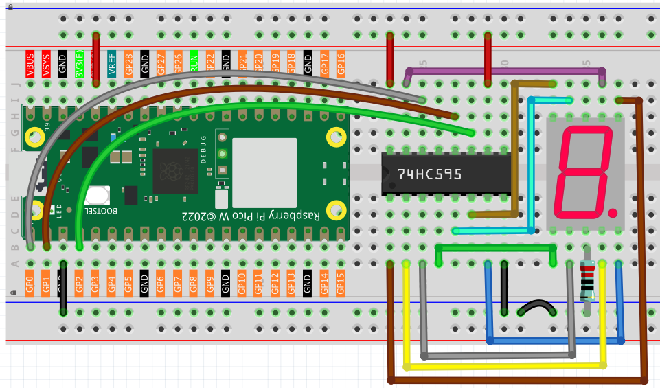

4.2 7-Segment Display
=========================
Welcome to the world of **7-segment displays** - those classic digital digits you see everywhere! From digital clocks to calculators, microwave timers to elevator floors, these displays create numbers in that familiar "digital font" we all recognize.

**What's inside:** It's actually 8 individual LEDs cleverly arranged:
- **7 segments** (labeled a, b, c, d, e, f, g) form the "8" shape
- **1 decimal point** (dp) for numbers like "3.14"

The pin layout is illustrated in the figure below.

**The challenge:** Controlling 8 LEDs normally needs 8 GPIO pins! But with our **74HC595** from the previous lesson, we can control all segments using just 3 pins. Smart engineering!

Component List
^^^^^^^^^^^^^^^
- Raspberry Pi Pico W x1
- MicroUSB cable x1
- 830 Tie-Points Breadboard x1
- 7-segment Display x1
- Resistor 220Ω x1
- 74HC595 x1
- Jumper Wire Several

Component knowledge
^^^^^^^^^^^^^^^^^^^^
:ref:`7-segment Display <cpn_7_segment_display>`
"""""""""""""""""""""""""""""""""""""""""""""""""

How we create numbers:

**Pattern Magic:**
- Each digit (0-9, A-F) has a unique LED segment pattern
- Example: "8" = all 7 segments ON, "1" = only segments b+c ON
- We store these patterns as binary codes and send them to the 74HC595

**Same 74HC595 setup** as before, but now the 8 outputs connect to the display segments instead of individual LEDs.

Connect
^^^^^^^^^

Code
^^^^^^^
.. note::

    * Open the ``4.2_7_segment_display.ino`` file under the path of ``Ultimate-Starter-Kit-for-Pico-W\Arduino\1.Project`` or copy this code into Thonny, then click "Run Current Script" or simply press F5 to run it.

    * Or copy this code into Arduino IDE.

    * Don’t forget to select the board(Raspberry Pi Pico) and the correct port before clicking the Upload button. 

.. 4.2.png

After running the code, watch your 7-segment display count through all **hexadecimal digits** (0-9, A-F)! Each digit appears for about 0.8 seconds, showing how different segment combinations create recognizable numbers and letters. It's like watching a tiny digital counter in action!

The following is the program code:

.. code-block:: c++

    /*
     * 7-Segment Hexadecimal Display Project
     * 
     * Displays hexadecimal digits 0-F on a 7-segment display using
     * a 74HC595 shift register. Cycles through all 16 hex digits
     * continuously for educational and debugging purposes.
     * 
     * Hardware: 74HC595 shift register + Common Cathode 7-segment display
     */

    // 74HC595 Pin Configuration Constants
    #define LATCH_PIN             1     // ST_CP (Storage Register Clock) - pin 12 of 74HC595
    #define CLOCK_PIN             2     // SH_CP (Shift Register Clock) - pin 11 of 74HC595
    #define DATA_PIN              0     // DS (Serial Data Input) - pin 14 of 74HC595

    // Display Timing Constants
    #define DIGIT_DISPLAY_MS      800   // Time to display each digit (milliseconds)

    // 7-Segment Display Patterns for Hexadecimal Digits (0-F)
    // Pattern format: gfedcba (bit 7 unused, bits 6-0 control segments)
    byte hexDigitPatterns[] = {
      0x3F,  // 0: segments a,b,c,d,e,f
      0x06,  // 1: segments b,c
      0x5B,  // 2: segments a,b,d,e,g
      0x4F,  // 3: segments a,b,c,d,g
      0x66,  // 4: segments b,c,f,g
      0x6D,  // 5: segments a,c,d,f,g
      0x7D,  // 6: segments a,c,d,e,f,g
      0x07,  // 7: segments a,b,c
      0x7F,  // 8: segments a,b,c,d,e,f,g
      0x6F,  // 9: segments a,b,c,d,f,g
      0x77,  // A: segments a,b,c,e,f,g
      0x7C,  // b: segments c,d,e,f,g
      0x39,  // C: segments a,d,e,f
      0x5E,  // d: segments b,c,d,e,g
      0x79,  // E: segments a,d,e,f,g
      0x71   // F: segments a,e,f,g
    };

    /**
     * Arduino Setup Function
     * Initializes the 74HC595 control pins as outputs.
     */
    void setup() {
      pinMode(LATCH_PIN, OUTPUT);
      pinMode(CLOCK_PIN, OUTPUT);
      pinMode(DATA_PIN, OUTPUT);
      
      // Clear display initially
      updateDisplay(0x00);
    }

    /**
     * Arduino Main Loop Function
     * Continuously cycles through hexadecimal digits 0-F.
     */
    void loop() {
      displayHexadecimalSequence();
    }

    /**
     * Update Display
     * Sends pattern data to 74HC595 and updates the 7-segment display.
     */
    void updateDisplay(byte pattern) {
      digitalWrite(LATCH_PIN, LOW);                    // Prepare for data transmission
      shiftOut(DATA_PIN, CLOCK_PIN, MSBFIRST, pattern); // Send 8-bit pattern
      digitalWrite(LATCH_PIN, HIGH);                   // Latch data to display
    }

    /**
     * Display Hexadecimal Sequence
     * Cycles through all hexadecimal digits 0-F with appropriate timing.
     */
    void displayHexadecimalSequence() {
      for (int digitIndex = 0; digitIndex < 16; digitIndex++) {
        updateDisplay(hexDigitPatterns[digitIndex]);
        delay(DIGIT_DISPLAY_MS);
      }
    }

Phenomenon
^^^^^^^^^^^
.. video:: img/5.phenomenon/4.2.mp4
    :width: 100%