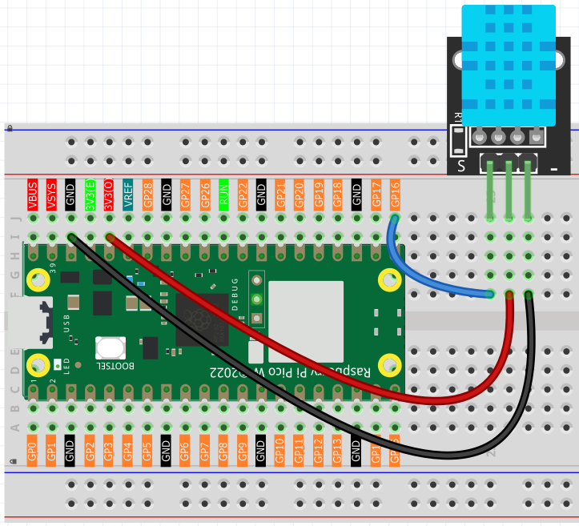

5.2 Temp & Humidity Monitoring
==============================
Build your own **weather station**! The DHT11 sensor can read both temperature and humidity from the air around it - perfect for monitoring room comfort, greenhouse conditions, or weather tracking projects.

**Why monitor both?**
- **Temperature**: How hot or cold it feels (measured in °C)
- **Humidity**: How much moisture is in the air (measured in %RH)
- **Together**: They determine comfort levels - 40-60% humidity feels best!

.. image:: img/1.detail/5.2.png

**Smart features:** The DHT11 sends **digital data** directly to your Pico - no complex analog readings needed! It's like having a tiny meteorologist that reports weather conditions every few seconds.

Component List
^^^^^^^^^^^^^^^
- Raspberry Pi Pico W x1
- MicroUSB cable x1
- 830 Tie-Points Breadboard x1
- DHT11 Module x1
- Jumper Wire Several

Component knowledge
^^^^^^^^^^^^^^^^^^^^
:ref:`DHT11 Module <cpn_dht11_module>`
""""""""""""""""""""""""""""""""""""""""

Connect
^^^^^^^^^

Code
^^^^^^^
.. note::

    * Open the ``5.2_temp_and_humidity_monitoring.ino`` file under the path of ``Ultimate-Starter-Kit-for-Pico-W\Arduino\1.Project`` or copy this code into Thonny, then click "Run Current Script" or simply press F5 to run it.

    * Or copy this code into Arduino IDE.

    * Don’t forget to select the board(Raspberry Pi Pico) and the correct port before clicking the Upload button. 

.. 5.2.png

After running the code, watch your personal weather station come alive! The sensor reports temperature and humidity every 2 seconds. Try breathing on the sensor (increases humidity), or moving it to different rooms to see how conditions vary. The readings stabilize and become more accurate after a few minutes of operation.

The following is the program code:

.. code-block:: c++

    #include <DHT.h>

    // Constants
    #define SENSOR_PIN            16    // Pin connected to DHT11 sensor
    #define SENSOR_TYPE           DHT11 // DHT sensor type
    #define SERIAL_BAUD_RATE      115200 // Serial communication speed
    #define INITIAL_DELAY_S       5     // Initial sensor warm-up time (seconds)
    #define READ_INTERVAL_S       2     // Interval between reads (seconds)
    #define ERROR_RETRY_DELAY_MS  200   // Delay before retry on error (milliseconds)

    // Create DHT sensor object
    DHT sensor(SENSOR_PIN, SENSOR_TYPE);

    void setup() {
      // Initialize serial communication
      Serial.begin(SERIAL_BAUD_RATE);
      
      // Initialize DHT sensor
      sensor.begin();
      
      // Allow sensor to stabilize
      Serial.println("Warming up DHT11 sensor...");
      delay(INITIAL_DELAY_S * 1000);
      Serial.println("DHT11 sensor is ready.");
    }

    void loop() {
      // Read humidity and temperature
      float humidity = sensor.readHumidity();
      float temperature = sensor.readTemperature();
      
      // Check if reading failed
      if (isnan(humidity) || isnan(temperature)) {
        Serial.println("Bad reading - retrying...");
        delay(ERROR_RETRY_DELAY_MS);
      } else {
        // Print temperature and humidity in clean format
        Serial.print("Temperature: ");
        Serial.print(temperature, 1);
        Serial.print(" C, Humidity: ");
        Serial.print(humidity, 1);
        Serial.println(" %");
        
        delay(READ_INTERVAL_S * 1000);
      }
    }

Phenomenon
^^^^^^^^^^^
.. image:: img/5.phenomenon/5.2.png
    :width: 100%