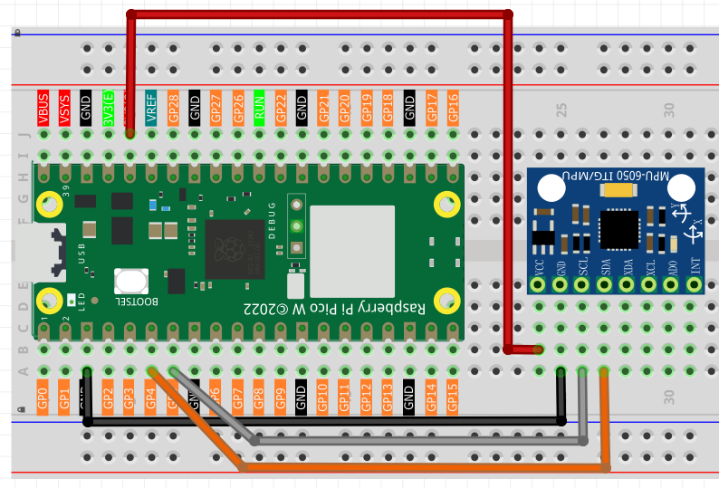
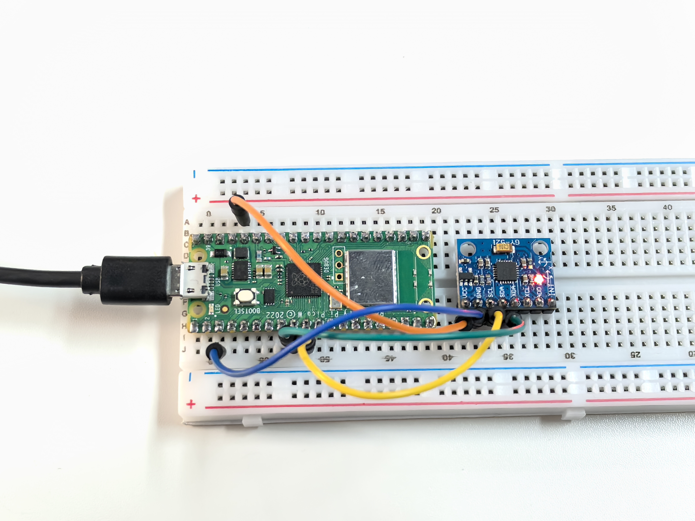

5.3 GY521 Module
=========================
Meet the **GY-521** - your project's motion detective! This tiny sensor is like having a smartphone's motion sensing brain in your project. It combines two powerful sensors in one:

**6-Axis Motion Sensing:**
- **3-axis Accelerometer**: Detects acceleration and gravity (up/down, left/right, forward/back)
- **3-axis Gyroscope**: Detects rotation speed (pitch, roll, yaw)
- **Together**: They create a complete picture of how your project is moving in 3D space!

**Real-world applications:** Drone stabilization, gaming controllers, fitness trackers, earthquake detectors, or self-balancing robots. It's the same technology that makes your phone rotate the screen and helps drones stay stable!

Component List
^^^^^^^^^^^^^^^
- Raspberry Pi Pico W x1
- MicroUSB cable x1
- 830 Tie-Points Breadboard x1
- MPU6050 Module
- Jumper Wire Several

Component knowledge
^^^^^^^^^^^^^^^^^^^^

:ref:`MPU6050 Module <cpn_mpu6050_module>`
"""""""""""""""""""""""""""""""""""""""""""

Connect
^^^^^^^^^

Code
^^^^^^^
.. note::

    * Open the ``5.3_gy521_module.ino`` file under the path of ``Ultimate-Starter-Kit-for-Pico-W\Arduino\1.Project`` or copy this code into Thonny, then click "Run Current Script" or simply press F5 to run it.

    * Or copy this code into Arduino IDE.

    * Don’t forget to select the board(Raspberry Pi Pico) and the correct port before clicking the Upload button. 

.. 5.3.png

After running the code, try rotating and moving the sensor in different directions! Watch the real-time 6-axis data streaming:

- **Gyroscope values (°/s)**: Show rotation speed - twist the sensor to see these change
- **Accelerometer values (g-force)**: Show acceleration and tilt - flip the sensor to see gravity effects
- **Calculated angles**: The code even calculates tilt angles for you!

Try different movements: gentle tilting, fast spinning, or shaking to see how this "digital motion detector" responds to every movement.

The following is the program code:

.. code-block:: c++

    // MPU6050 Gyroscope and Accelerometer Reading (Arduino)

    #include <Adafruit_MPU6050.h>
    #include <Wire.h>
    #include <math.h>

    // Constants
    #define SERIAL_BAUD_RATE      115200 // Serial communication speed
    #define READING_INTERVAL_MS   500    // Interval between sensor readings
    #define ACCEL_RANGE_G         8      // Accelerometer range (±8g)
    #define GYRO_RANGE_DEG        500    // Gyroscope range (±500°/s)
    #define FILTER_BANDWIDTH_HZ   21     // Digital filter bandwidth

    // Create MPU6050 sensor object
    Adafruit_MPU6050 mpu;

    void setup() {
      // Initialize serial communication
      Serial.begin(SERIAL_BAUD_RATE);
      while (!Serial) delay(10);
      
      Serial.println("MPU6050 sensor reading started.");
      
      // Initialize MPU6050
      if (!mpu.begin()) {
        Serial.println("Failed to find MPU6050 chip");
        while (1) delay(10);
      }
      
      // Configure sensor settings
      mpu.setAccelerometerRange(MPU6050_RANGE_8_G);
      mpu.setGyroRange(MPU6050_RANGE_500_DEG);
      mpu.setFilterBandwidth(MPU6050_BAND_21_HZ);
      
      Serial.println("MPU6050 sensor is ready.");
      Serial.println();
    }

    void loop() {
      // Get new sensor readings
      sensors_event_t accel, gyro, temp;
      mpu.getEvent(&accel, &gyro, &temp);
      
      // Calculate rotation angles from accelerometer data
      double xRotation = calculateXRotation(accel.acceleration.x, accel.acceleration.y, accel.acceleration.z);
      double yRotation = calculateYRotation(accel.acceleration.x, accel.acceleration.y, accel.acceleration.z);
      
      // Display formatted sensor data (similar to C code output)
      displaySensorData(gyro, accel, xRotation, yRotation);
      
      delay(READING_INTERVAL_MS);
    }

    // Calculate X-axis rotation from accelerometer data
    double calculateXRotation(double x, double y, double z) {
      return atan2(y, sqrt(x*x + z*z)) * 180.0 / PI;
    }

    // Calculate Y-axis rotation from accelerometer data  
    double calculateYRotation(double x, double y, double z) {
      return -atan2(x, sqrt(y*y + z*z)) * 180.0 / PI;
    }

    // Display sensor data in organized format (matching C code style)
    void displaySensorData(sensors_event_t gyro, sensors_event_t accel, double xRot, double yRot) {
      Serial.println("--- Gyroscope (°/s) ---");
      Serial.print("X: "); Serial.print(gyro.gyro.x * 180.0/PI, 2);
      Serial.print(" | Y: "); Serial.print(gyro.gyro.y * 180.0/PI, 2);
      Serial.print(" | Z: "); Serial.print(gyro.gyro.z * 180.0/PI, 2);
      Serial.println();
      
      Serial.println("--- Accelerometer (g) ---");
      Serial.print("X: "); Serial.print(accel.acceleration.x / 9.81, 2);
      Serial.print(" | Y: "); Serial.print(accel.acceleration.y / 9.81, 2);
      Serial.print(" | Z: "); Serial.print(accel.acceleration.z / 9.81, 2);
      Serial.println();
      
      Serial.println("--- Calculated Rotation (°) ---");
      Serial.print("X-Rotation: "); Serial.print(xRot, 1);
      Serial.print(" | Y-Rotation: "); Serial.print(yRot, 1);
      Serial.println();
      
      Serial.println();
      Serial.println("----------------------------------");
      Serial.println();
    }

Phenomenon
^^^^^^^^^^^
