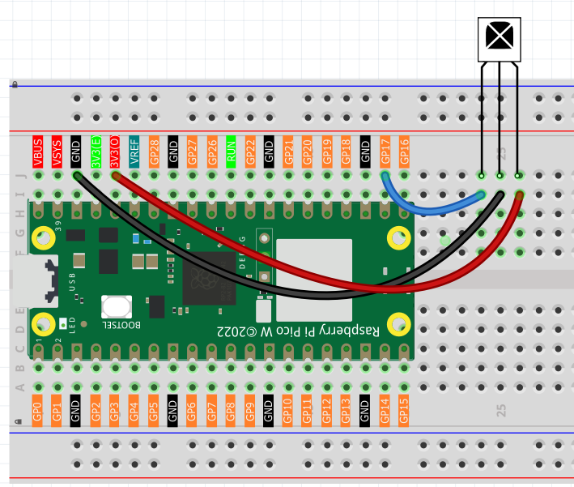
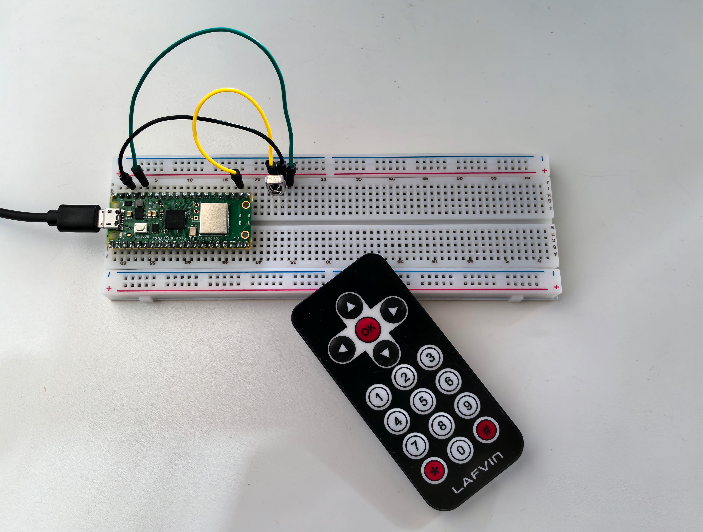

5.4 IR Remote Control
=========================
Add **wireless remote control** to your projects! IR (Infrared) remote control is the same technology used in TV remotes, air conditioners, and countless household devices. Now you can make your own projects respond to button presses from across the room!

**How it works:** 
- **Remote control**: Contains an IR LED that blinks invisible light patterns
- **IR receiver**: Detects these light patterns and decodes them into button presses
- **Your code**: Responds to specific buttons (numbers, arrows, OK button, etc.)

**Project possibilities:** Remote-controlled robots, wireless light switches, presentation clickers, or smart home devices that respond to any IR remote!

Component List
^^^^^^^^^^^^^^^
- Raspberry Pi Pico W x1
- MicroUSB cable x1
- 830 Tie-Points Breadboard x1
- Infrared Receiver x1
- Jumper Wire Several

Component knowledge
^^^^^^^^^^^^^^^^^^^^

:ref:`Infrared Receiver <cpn_infrared_receiver>`
"""""""""""""""""""""""""""""""""""""""""""""""""""

Connect
^^^^^^^^^

Code
^^^^^^^
.. note::

    * Open the ``5.4_ir_remote_control.ino`` file under the path of ``Ultimate-Starter-Kit-for-Pico-W\Arduino\1.Project`` or copy this code into Thonny, then click "Run Current Script" or simply press F5 to run it.

    * Or copy this code into Arduino IDE.

    * Don’t forget to select the board(Raspberry Pi Pico) and the correct port before clicking the Upload button. 

.. 5.4.png

After running the code, grab the included remote control (remove the battery tab first!) and start pressing buttons. The serial monitor will decode and display each button press with its name and hex code:

**Try pressing:** Numbers (0-9), arrow keys (UP/DOWN/LEFT/RIGHT), OK button, or symbols (* #). Each button has a unique code that your projects can respond to. Perfect for building wireless-controlled gadgets!

The following is the program code:

.. code-block:: c++

    /*
     * IR Remote Control Receiver Project (Arduino)
     */

    #include "IR.h"

    // Constants
    #define IR_RECEIVER_PIN       17       // Pin connected to IR receiver
    #define SERIAL_BAUD_RATE      115200   // Serial communication speed
    #define REPEAT_CODE           0xFFFFFFFF // IR repeat signal code

    // IR Remote Key Codes (NEC Protocol)
    #define IR_KEY_UP             0xFF629D  // Navigation up
    #define IR_KEY_DOWN           0xFFA857  // Navigation down  
    #define IR_KEY_LEFT           0xFF22DD  // Navigation left
    #define IR_KEY_RIGHT          0xFFC23D  // Navigation right
    #define IR_KEY_OK             0xFF02FD  // OK/Enter button
    #define IR_KEY_1              0xFF6897  // Number 1
    #define IR_KEY_2              0xFF9867  // Number 2
    #define IR_KEY_3              0xFFB04F  // Number 3
    #define IR_KEY_4              0xFF30CF  // Number 4
    #define IR_KEY_5              0xFF18E7  // Number 5
    #define IR_KEY_6              0xFF7A85  // Number 6
    #define IR_KEY_7              0xFF10EF  // Number 7
    #define IR_KEY_8              0xFF38C7  // Number 8
    #define IR_KEY_9              0xFF5AA5  // Number 9
    #define IR_KEY_0              0xFF4AB5  // Number 0
    #define IR_KEY_STAR           0xFF42BD  // Star (*) key
    #define IR_KEY_HASH           0xFF52AD  // Hash (#) key

    String decodeIRKey(unsigned long data) {
      switch (data) {
        case IR_KEY_UP:    return "UP";
        case IR_KEY_DOWN:  return "DOWN";
        case IR_KEY_LEFT:  return "LEFT";
        case IR_KEY_RIGHT: return "RIGHT";
        case IR_KEY_OK:    return "OK";
        case IR_KEY_1:     return "1";
        case IR_KEY_2:     return "2";
        case IR_KEY_3:     return "3";
        case IR_KEY_4:     return "4";
        case IR_KEY_5:     return "5";
        case IR_KEY_6:     return "6";
        case IR_KEY_7:     return "7";
        case IR_KEY_8:     return "8";
        case IR_KEY_9:     return "9";
        case IR_KEY_0:     return "0";
        case IR_KEY_STAR:  return "*";
        case IR_KEY_HASH:  return "#";
        default:
          // Unknown key - display raw code for debugging
          Serial.print("Unknown IR Code: 0x");
          Serial.println(data, HEX);
          return "UNKNOWN";
      }
    }

    void setup() {
      // Initialize serial communication
      Serial.begin(SERIAL_BAUD_RATE);
      
      // Initialize IR receiver
      IR_Init(IR_RECEIVER_PIN);
      
      // Display startup information
      Serial.println("IR Remote Control Receiver Started");
      Serial.println("Press any key on the remote control...");
      Serial.println("================================");
    }

    void loop() {
      // Check for incoming IR signal
      if (flagCode) {
        processIRSignal();
      }
    }

    // Process received IR signal
    void processIRSignal() {
      unsigned long irCode = IR_Decode(flagCode);
      
      // Ignore repeat codes (key held down)
      if (irCode != REPEAT_CODE) {
        String keyName = decodeIRKey(irCode);
        
        // Display key press information
        if (keyName != "UNKNOWN") {
          displayKeyPress(keyName, irCode);
        }
      }
      
      // Release IR system for next reading
      IR_Release();
    }

    // Display key press information
    void displayKeyPress(String keyName, unsigned long irCode) {
      Serial.print("Key: ");
      Serial.print(keyName);
      Serial.print(" | Code: 0x");
      Serial.println(irCode, HEX);
    }

Phenomenon
^^^^^^^^^^^
