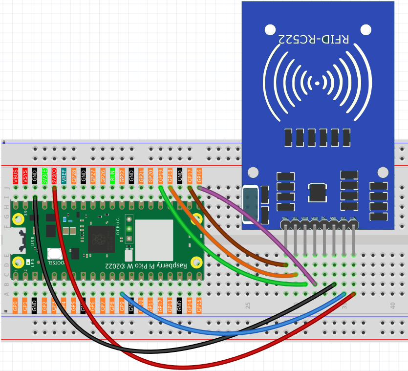
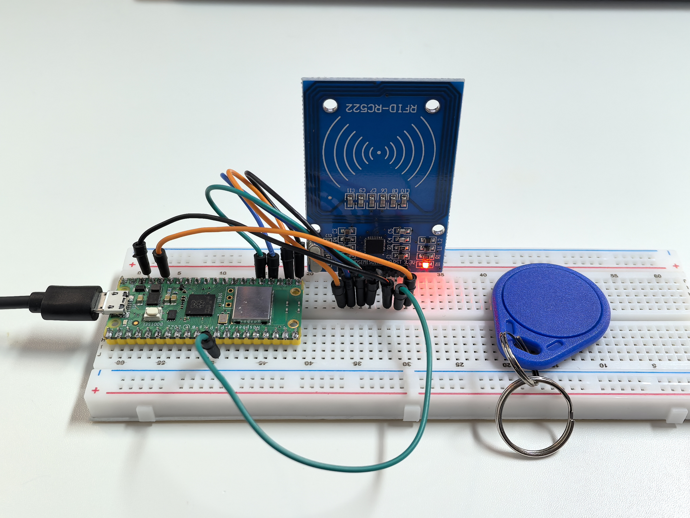

5.5 MFRC522 RFID Module
=========================
Enter the world of **RFID technology** - contactless smart cards! RFID (Radio Frequency Identification) lets you store and read data by simply bringing a card or tag near a sensor. No contact needed!

**How RFID works:**
- **RFID tags/cards**: Contain a tiny chip and antenna (like credit cards, hotel keycards, or transit cards)
- **RFID reader**: Sends radio waves that power the tag and read/write data
- **Your projects**: Can store custom messages, unlock doors, track inventory, or create interactive experiences

**Magic moment:** Just tap a card near the sensor and instantly read/write data! It's the same technology in contactless payments, building access cards, and smart transportation systems.

Component List
^^^^^^^^^^^^^^^
- Raspberry Pi Pico W x1
- MicroUSB cable x1
- 830 Tie-Points Breadboard x1
- MFRC522 Module x1
- Jumper Wire Several

Component knowledge
^^^^^^^^^^^^^^^^^^^^
:ref:`MFRC522 Module <cpn_mfrc522_module>`
"""""""""""""""""""""""""""""""""""""""""""

Connect
^^^^^^^^^

Code
^^^^^^^
.. note::

    * Open the ``5.5.1_rfid_write.py and 5.5.2_rfid_read.ino`` file under the path of ``Ultimate-Starter-Kit-for-Pico-W\Arduino\1.Project`` or copy this code into Thonny, then click "Run Current Script" or simply press F5 to run it.

    * Or copy this code into Arduino IDE.

    * Don’t forget to select the board(Raspberry Pi Pico) and the correct port before clicking the Upload button. 
    
    * Here you need to use the libraries in mfrc522 folder, please check if it has been uploaded to Pico W, 可以在 Python Preparation中的上传库文件查看详情

This project has **two powerful programs**:

.. 5.5-1.png

**RFID Writer Program:** Type any message (ending with #) and tap a card to store it!

After running the writer, type your message in the serial monitor (like "Hello World#") then bring your RFID card close to the sensor. The message gets permanently written to the card's memory.

.. code-block:: c++

    /*
     * MFRC522 RFID Card Writer Project (Arduino)
     * 
     * This project writes text data to RFID cards using the MFRC522 module.
     * Features a user-friendly interface for card programming and verification.
     * 
     * Hardware Requirements:
     * - Arduino-compatible board
     * - MFRC522 RFID module
     * - RFID cards (MIFARE Classic 1K)
     */

    #include <SPI.h>
    #include <MFRC522.h>

    // Pin Configuration Constants
    #define RFID_RST_PIN          9       // Reset pin for MFRC522
    #define RFID_SS_PIN           17      // Slave Select (CS) pin for MFRC522

    // Communication Constants
    #define SERIAL_BAUD_RATE      115200  // Serial communication speed
    #define SERIAL_TIMEOUT_MS     10      // Serial initialization timeout

    // RFID Writing Constants
    #define INPUT_BUFFER_SIZE     34      // Buffer size for input data
    #define MAX_INPUT_LENGTH      30      // Maximum input string length
    #define CARD_SECTION          0       // Default card section to write
    #define INPUT_TERMINATOR      '#'     // Character to end input

    // Create MFRC522 instance
    MFRC522 rfidReader(RFID_SS_PIN, RFID_RST_PIN);

    void setup() {
      Serial.begin(SERIAL_BAUD_RATE);
      while (!Serial) {
        delay(SERIAL_TIMEOUT_MS);
      }
      
      initializeRFID();
      displayWelcomeMessage();
    }

    void loop() {
      byte inputBuffer[INPUT_BUFFER_SIZE];
      byte inputLength;
      
      // Read user input from serial
      inputLength = Serial.readBytesUntil(INPUT_TERMINATOR, (char*)inputBuffer, MAX_INPUT_LENGTH);
      
      if (inputLength == 0) {
        return; // No input received, continue waiting
      }
      
      // Pad buffer with spaces to fill the card section
      for (byte i = inputLength; i < MAX_INPUT_LENGTH; i++) {
        inputBuffer[i] = ' ';
      }
      
      // Display card placement prompt
      Serial.println("\n" + String("=").substring(0, 40));
      Serial.println("Place an RFID card near the sensor...");
      Serial.println(String("=").substring(0, 40));
      
      // Wait for card and write data
      waitForCardAndGetInfo();
      writeDataToCard(inputBuffer);
    }

    // Initialize RFID reader hardware
    void initializeRFID() {
      SPI.begin();
      rfidReader.PCD_Init();
    }

    // Display welcome message and instructions
    void displayWelcomeMessage() {
      Serial.println(String("=").substring(0, 50));
      Serial.println("    RFID CARD WRITER");
      Serial.println(String("=").substring(0, 50));
      Serial.println("This program writes text data to RFID cards.");
      Serial.println(String("=").substring(0, 50));
      Serial.println("\nWriting mode active...");
      Serial.println("Type your message and end with '#' to write to card");
      Serial.println("Example: Hello World#");
      Serial.println(String("-").substring(0, 50));
    }

    // Wait for card placement and display card information
    void waitForCardAndGetInfo() {
      // Wait for a new card to be present
      while (!rfidReader.PICC_IsNewCardPresent()) {
        // Keep waiting
      }
      
      // Select one of the cards
      while (!rfidReader.PICC_ReadCardSerial()) {
        // Keep waiting
      }
      
      Serial.println("\nCARD DETECTED!");
      Serial.println("+" + String("-").substring(0, 48) + "+");
      
      // Display card UID
      Serial.print("| Card ID:    ");
      for (byte i = 0; i < rfidReader.uid.size; i++) {
        Serial.print(rfidReader.uid.uidByte[i] < 0x10 ? " 0" : " ");
        Serial.print(rfidReader.uid.uidByte[i], HEX);
      }
      
      // Pad the line to make it align properly
      int spaces = 32 - (rfidReader.uid.size * 3);
      for (int i = 0; i < spaces; i++) {
        Serial.print(" ");
      }
      Serial.println(" |");
      
      // Display card type
      MFRC522::PICC_Type cardType = rfidReader.PICC_GetType(rfidReader.uid.sak);
      String typeName = String(rfidReader.PICC_GetTypeName(cardType));
      Serial.print("| Card Type:  " + typeName);
      
      // Pad the line
      spaces = 32 - typeName.length();
      for (int i = 0; i < spaces; i++) {
        Serial.print(" ");
      }
      Serial.println(" |");
      Serial.println("+" + String("-").substring(0, 48) + "+");
    }

    // Write data to RFID card with error handling and status display
    void writeDataToCard(byte* dataBuffer) {
      MFRC522::StatusCode status;
      MFRC522::MIFARE_Key authKey;
      
      // Initialize default authentication key (all 0xFF)
      for (byte i = 0; i < 6; i++) {
        authKey.keyByte[i] = 0xFF;
      }
      
      // Calculate block addresses for section 0 (blocks 1 and 2)
      byte firstBlock = CARD_SECTION * 3 + 1;
      byte secondBlock = firstBlock + 1;
      
      Serial.println("\nWriting data to card...");
      
      // Write first 16 bytes to first block
      if (authenticateAndWriteBlock(firstBlock, &authKey, dataBuffer)) {
        Serial.println("Block 1 write: SUCCESS");
        
        // Write remaining 16 bytes to second block
        if (authenticateAndWriteBlock(secondBlock, &authKey, &dataBuffer[16])) {
          Serial.println("Block 2 write: SUCCESS");
          Serial.println("\n" + String("=").substring(0, 40));
          Serial.println("Write operation completed successfully!");
          Serial.println("Card programming finished.");
          Serial.println(String("=").substring(0, 40));
        } else {
          Serial.println("Block 2 write: FAILED");
        }
      } else {
        Serial.println("Block 1 write: FAILED");
      }
      
      // Clean up - halt card and stop encryption
      rfidReader.PICC_HaltA();
      rfidReader.PCD_StopCrypto1();
      
      Serial.println("\nReady for next write operation...");
      Serial.println("Type your next message ending with '#'");
    }

    // Authenticate and write a single block of data
    bool authenticateAndWriteBlock(byte blockNumber, MFRC522::MIFARE_Key* key, byte* data) {
      MFRC522::StatusCode status;
      
      // Authenticate with the card
      status = rfidReader.PCD_Authenticate(MFRC522::PICC_CMD_MF_AUTH_KEY_A, blockNumber, key, &(rfidReader.uid));
      if (status != MFRC522::STATUS_OK) {
        Serial.print("Authentication failed for block ");
        Serial.print(blockNumber);
        Serial.print(": ");
        Serial.println(rfidReader.GetStatusCodeName(status));
        return false;
      }
      
      // Write data to the block
      status = rfidReader.MIFARE_Write(blockNumber, data, 16);
      if (status != MFRC522::STATUS_OK) {
        Serial.print("Write failed for block ");
        Serial.print(blockNumber);
        Serial.print(": ");
        Serial.println(rfidReader.GetStatusCodeName(status));
        return false;
      }
      
      return true;
    }

.. 5.5-2.png

**RFID Reader Program:** Tap any programmed card to instantly read its stored message!

After running the reader, simply bring your programmed RFID card near the sensor. The stored message appears instantly on screen with card details. It's like having a digital library where each card holds a different piece of information!

.. code-block:: c++

    /*
     * MFRC522 RFID Card Reader Project (Arduino)
     * 
     * This project reads text data from RFID cards using the MFRC522 module.
     * Features a user-friendly interface inspired by professional implementations.
     * 
     * Hardware Requirements:
     * - Arduino-compatible board
     * - MFRC522 RFID module
     * - RFID cards (MIFARE Classic 1K)
     */

    #include <SPI.h>
    #include <MFRC522.h>

    // Pin Configuration Constants
    #define RFID_RST_PIN          9       // Reset pin for MFRC522
    #define RFID_SS_PIN           17      // Slave Select (CS) pin for MFRC522

    // Communication Constants
    #define SERIAL_BAUD_RATE      115200  // Serial communication speed
    #define SERIAL_TIMEOUT_MS     10      // Serial initialization timeout

    // RFID Reading Constants
    #define CARD_SECTION          0       // Default card section to read
    #define READ_DELAY_MS         1000    // Delay between card reads
    #define BLOCK_SIZE            16      // Size of each MIFARE block in bytes

    // Create MFRC522 instance
    MFRC522 rfidReader(RFID_SS_PIN, RFID_RST_PIN);

    void setup() {
      Serial.begin(SERIAL_BAUD_RATE);
      while (!Serial) {
        delay(SERIAL_TIMEOUT_MS);
      }
      
      initializeRFID();
      displayWelcomeMessage();
    }

    void loop() {
      Serial.println("\nReading mode active...");
      Serial.println("Please place an RFID card near the sensor.");
      
      waitForCardAndGetInfo();
      String cardData = readCardData();
      displayReadResults(cardData);
      
      delay(READ_DELAY_MS);
    }

    // Initialize RFID reader hardware
    void initializeRFID() {
      SPI.begin();
      rfidReader.PCD_Init();
    }

    // Display welcome message and instructions
    void displayWelcomeMessage() {
      Serial.println(String("=").substring(0, 50));
      Serial.println("    RFID CARD READER");
      Serial.println(String("=").substring(0, 50));
      Serial.println("This program reads data from RFID cards.");
      Serial.println(String("=").substring(0, 50));
    }

    // Wait for card placement and display card information
    void waitForCardAndGetInfo() {
      // Wait for a new card to be present
      while (!rfidReader.PICC_IsNewCardPresent()) {
        // Keep waiting
      }
      
      // Select one of the cards
      while (!rfidReader.PICC_ReadCardSerial()) {
        // Keep waiting
      }
      
      Serial.println("\nCARD DETECTED!");
      Serial.println("+" + String("-").substring(0, 48) + "+");
      
      // Display card UID
      Serial.print("| Card ID:    ");
      for (byte i = 0; i < rfidReader.uid.size; i++) {
        Serial.print(rfidReader.uid.uidByte[i] < 0x10 ? " 0" : " ");
        Serial.print(rfidReader.uid.uidByte[i], HEX);
      }
      
      // Pad the line to make it align properly
      int spaces = 32 - (rfidReader.uid.size * 3);
      for (int i = 0; i < spaces; i++) {
        Serial.print(" ");
      }
      Serial.println(" |");
      
      // Display card type
      MFRC522::PICC_Type cardType = rfidReader.PICC_GetType(rfidReader.uid.sak);
      String typeName = String(rfidReader.PICC_GetTypeName(cardType));
      Serial.print("| Card Type:  " + typeName);
      
      // Pad the line
      spaces = 32 - typeName.length();
      for (int i = 0; i < spaces; i++) {
        Serial.print(" ");
      }
      Serial.println(" |");
      Serial.println("+" + String("-").substring(0, 48) + "+");
    }

    // Read data from RFID card
    String readCardData() {
      return readCardSection(CARD_SECTION);
    }

    // Read data from specific card section with error handling
    String readCardSection(byte section) {
      MFRC522::StatusCode status;
      MFRC522::MIFARE_Key authKey;
      
      // Initialize default authentication key (all 0xFF)
      for (byte i = 0; i < 6; i++) {
        authKey.keyByte[i] = 0xFF;
      }
      
      // Calculate block address for the section
      byte blockNumber = section * 3 + 1;
      byte dataBuffer[18];
      byte bufferLength = 18;
      
      // Authenticate with the card
      status = rfidReader.PCD_Authenticate(MFRC522::PICC_CMD_MF_AUTH_KEY_A, blockNumber, &authKey, &(rfidReader.uid));
      if (status != MFRC522::STATUS_OK) {
        Serial.print("Authentication failed: ");
        Serial.println(rfidReader.GetStatusCodeName(status));
        return "";
      }
      
      // Read data from the block
      status = rfidReader.MIFARE_Read(blockNumber, dataBuffer, &bufferLength);
      if (status != MFRC522::STATUS_OK) {
        Serial.print("Reading failed: ");
        Serial.println(rfidReader.GetStatusCodeName(status));
        return "";
      }
      
      // Clean up - halt card and stop encryption
      rfidReader.PICC_HaltA();
      rfidReader.PCD_StopCrypto1();
      
      // Convert byte data to string
      String result = "";
      for (uint8_t i = 0; i < BLOCK_SIZE; i++) {
        result += String((char)dataBuffer[i]);
      }
      
      return result;
    }

    // Display read results in a formatted table
    void displayReadResults(String cardData) {
      Serial.println("\nRead operation completed!");
      Serial.println("+" + String("-").substring(0, 48) + "+");
      
      // Create a clean copy of the data for processing
      String cleanData = cardData;
      cleanData.trim();
      
      if (cardData.length() > 0 && cleanData.length() > 0) {
        Serial.print("| Content:   '");
        Serial.print(cleanData);
        Serial.print("'");
        
        // Pad the line
        int spaces = 30 - cleanData.length();
        for (int i = 0; i < spaces; i++) {
          Serial.print(" ");
        }
        Serial.println(" |");
      } else {
        Serial.println("| Content:   Empty or uninitialized            |");
      }
      
      Serial.println("+" + String("-").substring(0, 48) + "+");
      Serial.println("Read operation completed successfully!");
    }

Phenomenon
^^^^^^^^^^^
