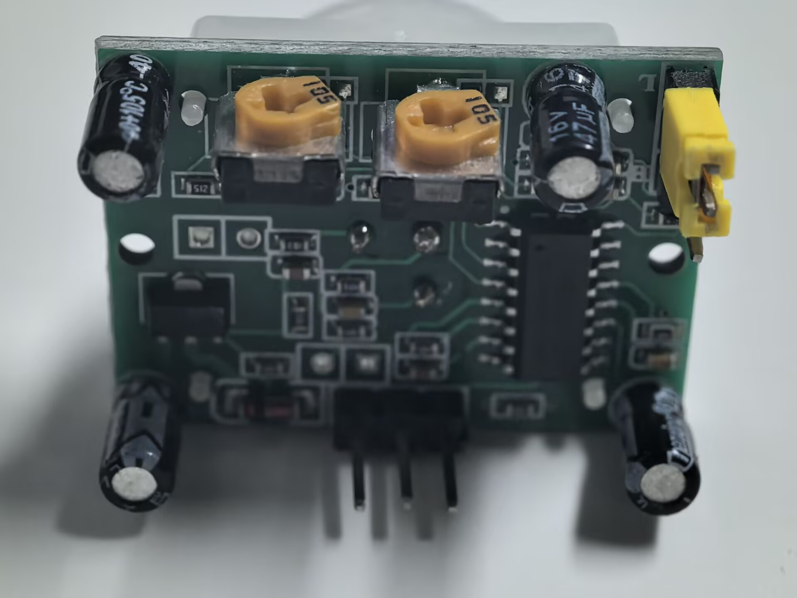
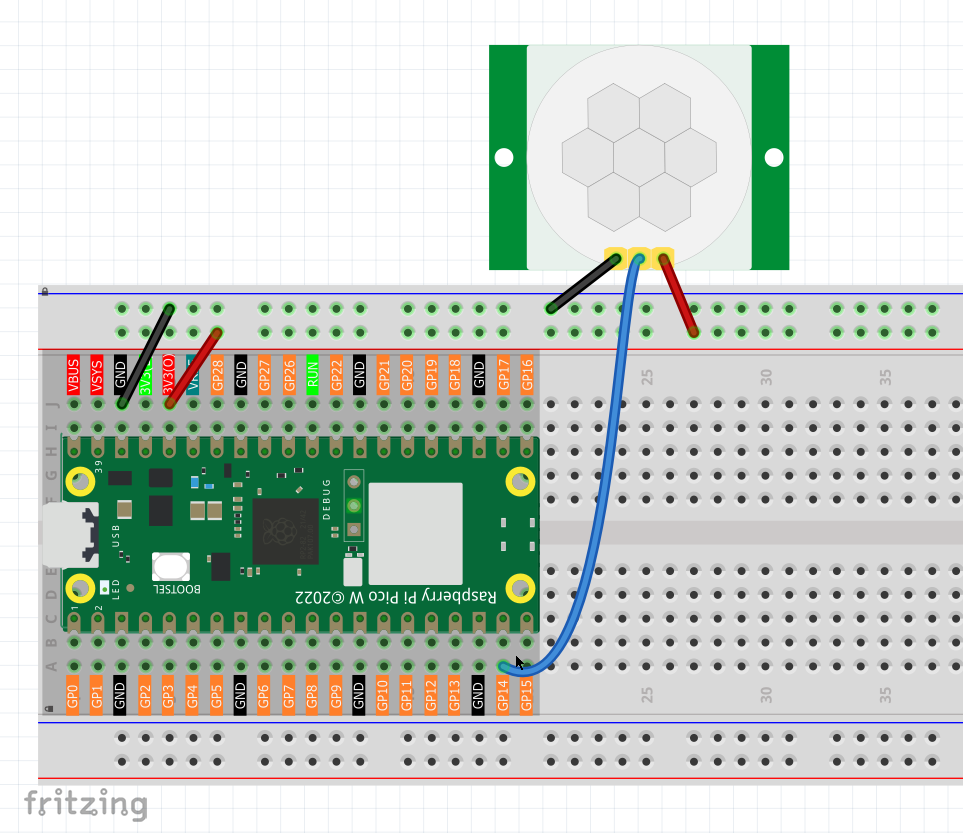
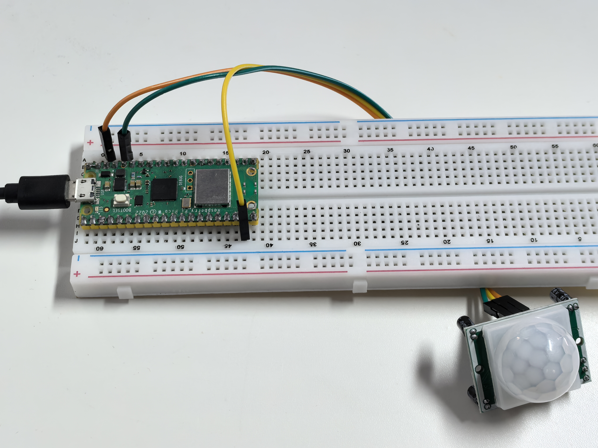

1.10 Motion Detection
=========================
A PIR (Passive Infrared) sensor is like an electronic "heat vision" detector! It doesn't emit anything - instead, it "watches" for changes in infrared heat patterns. When a warm object (like a person or pet) moves through its field of view, it detects the heat signature change and triggers an alert.

You'll find PIR sensors in automatic lights, security systems, and smart home devices. They're perfect for detecting "something moved" rather than "something is there."

Component List
^^^^^^^^^^^^^^^
- Raspberry Pi Pico W x1
- MicroUSB cable x1
- 830 Tie-Points Breadboard x1
- Jumper Wire Several
- PIR Motion Sensor Module x1

Component knowledge
^^^^^^^^^^^^^^^^^^^^
:ref:`PIR Motion Sensor Module <cpn_pir_module>`
"""""""""""""""""""""""""""""""""""""""""""""""""

How motion detection works:
- **No movement**: PIR sees steady heat pattern → GP14 reads **LOW** (0V)
- **Motion detected**: PIR detects heat change → GP14 reads **HIGH** (3.3V)

The PIR module has **built-in processing** - it only triggers when it detects a change in heat patterns, not just the presence of warm objects.

.. note:: 
    PIR is a very sensitive sensor. In order to adapt it to the environment of use, 
    it needs to be adjusted. Let the side with the 2 potentiometers facing you, turn 
    both potentiometers counterclockwise to the end and insert the jumper cap on the 
    pin with L and the middle pin.

Connect
^^^^^^^^^

Code
^^^^^^^
.. note::

    * Open the ``1.10_motion_detection.py`` file under the path of ``Ultimate-Starter-Kit-for-Pico-W\Python\1.Project`` or copy this code into Thonny, then click "Run Current Script" or simply press F5 to run it.

    * Don't forget to click on the "MicroPython (Raspberry Pi Pico)" interpreter in the bottom right corner. 

.. 1.10.png

After running the code, wave your hand or walk in front of the PIR sensor. You'll see "MOTION DETECTED!" alerts with detection counters, timestamps, and status updates. The system will also tell you when motion stops and the area is clear again.

The following is the program code:

.. code-block:: python

    """
    Motion Detection Alert System

    Uses a PIR sensor to detect motion and provides 
    alert messages with detection counting.
    """

    import machine
    import utime

    # Pin definition and constants
    PIR_SENSOR_PIN = 14             # PIR sensor connected to pin 14
    DETECTION_DELAY = 200           # delay between readings in milliseconds

    # Variables for motion tracking
    motion_detected = False         # current motion state
    last_motion_state = False       # previous state for change detection
    detection_count = 0             # total number of detections
    last_detection_time = 0         # timestamp of last detection

    # Initialize PIR sensor
    pir_sensor = machine.Pin(PIR_SENSOR_PIN, machine.Pin.IN)

    def show_startup_message():
        """Display startup information"""
        print("=== Motion Detection System ===")
        print("PIR sensor monitoring active")
        print("Waiting for motion...")
        print("==============================")
        print()

    def trigger_motion_alert():
        """Handle motion detection alert"""
        global detection_count, last_detection_time
        
        print(">>> MOTION DETECTED! <<<")
        print("Alert: Movement in monitored area")
        
        # Show detection statistics
        print(f"Detection #{detection_count}")
        print(f"Time: {last_detection_time} ms")
        print("Status: ACTIVE")
        print()

    def check_motion_sensor():
        """Monitor PIR sensor and detect motion changes"""
        global motion_detected, last_motion_state, detection_count, last_detection_time
        
        # Read current PIR sensor state
        motion_detected = pir_sensor.value()
        
        # Check if motion was just detected (state change from no motion to motion)
        if motion_detected and not last_motion_state:
            # Record detection time and increment counter
            last_detection_time = utime.ticks_ms()
            detection_count += 1
            
            # Trigger motion alert
            trigger_motion_alert()
        
        # Check if motion stopped (state change from motion to no motion)
        if not motion_detected and last_motion_state:
            print("Motion stopped - area clear")
            print()
        
        # Update last state for next comparison
        last_motion_state = motion_detected

    def main():
        """Main function"""
        show_startup_message()
        
        try:
            while True:
                # Check for motion detection
                check_motion_sensor()
                
                # Wait before next reading
                utime.sleep_ms(DETECTION_DELAY)
                
        except KeyboardInterrupt:
            print("\nMotion detection system stopped.")
            print(f"Total detections: {detection_count}")

    if __name__ == "__main__":
        main()

Phenomenon
^^^^^^^^^^^

