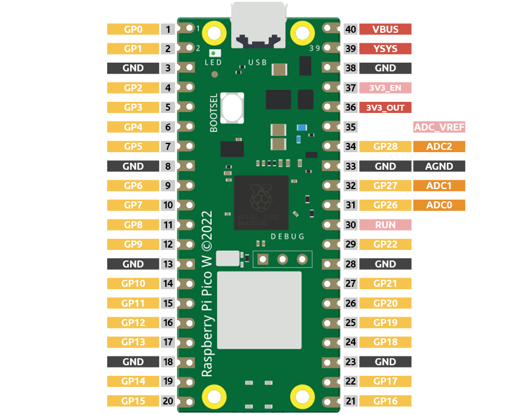
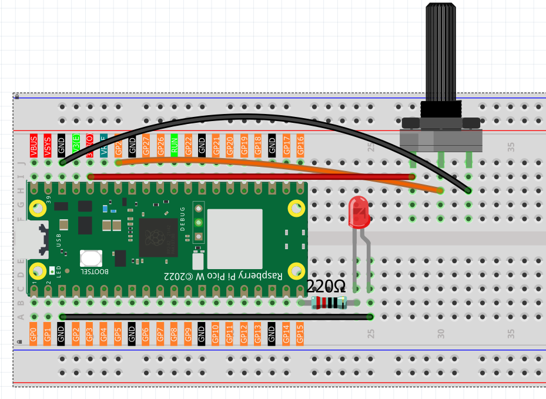

1.11 Potentiometer Control
===========================
So far, we've used **digital inputs** - simple ON/OFF signals like button presses. Now let's explore **analog inputs** - signals that can vary smoothly between minimum and maximum values, like a dimmer switch!

Analog inputs let us read real-world measurements: brightness levels, temperature, sound volume, position of a knob, and much more. The Pico W has a built-in **ADC (Analog-to-Digital Converter)** that transforms these smooth analog signals into digital numbers our code can understand.

The Pico W features three GPIO pins capable of analog input: GP26, GP27, and GP28, 
corresponding to analog channels 0, 1, and 2. Additionally, there is a fourth analog 
channel connected to an internal temperature sensor, which we won't cover here.

In this project, we will focus on reading the analog value from a potentiometer.
    
Component List
^^^^^^^^^^^^^^^
- Raspberry Pi Pico W x1
- MicroUSB cable x1
- 830 Tie-Points Breadboard x1
- Jumper Wire Several
- Resistor 220Ω x1
- LED x1
- Potentiometer x1

Component knowledge
^^^^^^^^^^^^^^^^^^^^
:ref:`Potentiometer <cpn_potentiometer>`
"""""""""""""""""""""""""""""""""""""""""

How our analog brightness control works:
- **Potentiometer**: Acts like a variable voltage divider - turn the knob to change voltage from 0V to 3.3V
ADC conversion: Pico W reads this voltage and converts it to numbers (0-65535 in MicroPython)
- **PWM output**: We map these numbers to LED brightness values (0-255)

**Turn knob left** → Lower voltage → Dimmer LED  
**Turn knob right** → Higher voltage → Brighter LED

This creates smooth, real-time brightness control!

Connect
^^^^^^^^^

Code
^^^^^^^
.. note::

    * Open the ``1.11_potentiometer_control.py`` file under the path of ``Ultimate-Starter-Kit-for-Pico-W\Python\1.Project`` or copy this code into Thonny, then click "Run Current Script" or simply press F5 to run it.

    * Don't forget to click on the "MicroPython (Raspberry Pi Pico)" interpreter in the bottom right corner. 

After running the code, turn the potentiometer knob and watch the magic! The serial monitor shows real-time readings, PWM values, brightness percentages, and even a visual brightness bar. The LED brightness changes smoothly as you turn the knob - perfect analog control!

The following is the program code:

.. code-block:: python

    """
    LED Brightness Controller

    Controls LED brightness using a potentiometer input.
    Shows real-time values and provides smooth brightness control.
    """

    import machine
    import utime

    # Pin definitions and constants
    POTENTIOMETER_PIN = 28          # potentiometer connected to ADC pin 28
    LED_PIN = 15                    # LED connected to pin 15
    READING_DELAY = 100             # delay between readings in milliseconds

    # ADC and PWM value ranges
    MIN_ANALOG_VALUE = 0            # minimum analog reading
    MAX_ANALOG_VALUE = 65535        # maximum analog reading (16-bit)
    MIN_PWM_VALUE = 0               # minimum PWM output
    MAX_PWM_VALUE = 65535           # maximum PWM output (16-bit)
    PWM_FREQUENCY = 1000            # PWM frequency in Hz

    # Change detection threshold
    CHANGE_THRESHOLD = 1000         # minimum change to trigger display update

    # Variables for brightness control
    current_reading = 0             # current potentiometer reading
    led_brightness = 0              # calculated LED brightness
    last_reading = -1               # previous reading for change detection

    # Initialize hardware
    potentiometer = machine.ADC(POTENTIOMETER_PIN)
    led = machine.PWM(machine.Pin(LED_PIN))
    led.freq(PWM_FREQUENCY)

    def map_value(value, from_min, from_max, to_min, to_max):
        """Map a value from one range to another"""
        return int((value - from_min) * (to_max - to_min) / (from_max - from_min) + to_min)

    def show_control_info():
        """Display control information at startup"""
        print("=== LED Brightness Controller ===")
        print("Turn potentiometer to adjust brightness")
        print("Range: 0% to 100% brightness")
        print("================================")
        print()

    def display_current_status():
        """Display current brightness status"""
        global current_reading, led_brightness
        
        # Calculate percentage for user-friendly display
        brightness_percent = map_value(led_brightness, MIN_PWM_VALUE, MAX_PWM_VALUE, 0, 100)
        
        print(f"Potentiometer: {current_reading} | LED Brightness: {led_brightness}/{MAX_PWM_VALUE} ({brightness_percent}%)")
        
        # Show visual brightness indicator
        print("Brightness: [", end="")
        bar_length = brightness_percent // 10  # scale to 0-10 for visual bar
        for i in range(10):
            if i < bar_length:
                print("█", end="")
            else:
                print("░", end="")
        print("]")
        print()

    def update_brightness_control():
        """Read potentiometer and control LED brightness"""
        global current_reading, led_brightness, last_reading
        
        # Read current potentiometer value
        current_reading = potentiometer.read_u16()
        
        # Convert analog reading to PWM value for LED brightness
        led_brightness = map_value(current_reading, MIN_ANALOG_VALUE, MAX_ANALOG_VALUE,
                                  MIN_PWM_VALUE, MAX_PWM_VALUE)
        
        # Apply brightness to LED
        led.duty_u16(led_brightness)
        
        # Only display info when value changes significantly (reduce serial spam)
        if abs(current_reading - last_reading) > CHANGE_THRESHOLD:
            display_current_status()
            last_reading = current_reading

    def main():
        """Main function"""
        show_control_info()
        
        try:
            while True:
                # Read potentiometer and update LED
                update_brightness_control()
                
                # Wait before next reading
                utime.sleep_ms(READING_DELAY)
                
        except KeyboardInterrupt:
            print("\nShutting down...")
            # Turn off LED
            led.duty_u16(0)
            led.deinit()

    if __name__ == "__main__":
        main()

Phenomenon
^^^^^^^^^^^
.. video:: img/5.phenomenon/1.11.mp4
    :width: 100%