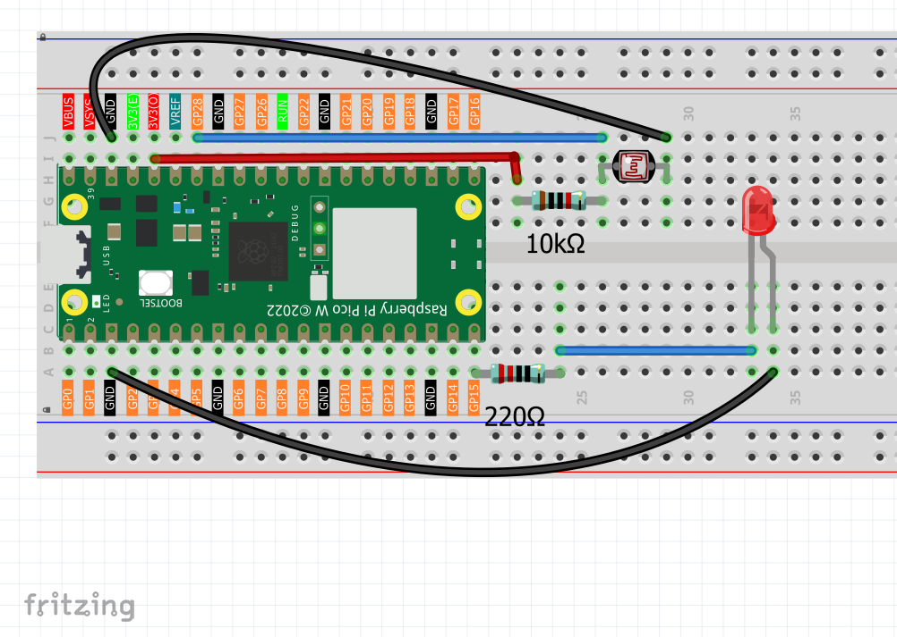
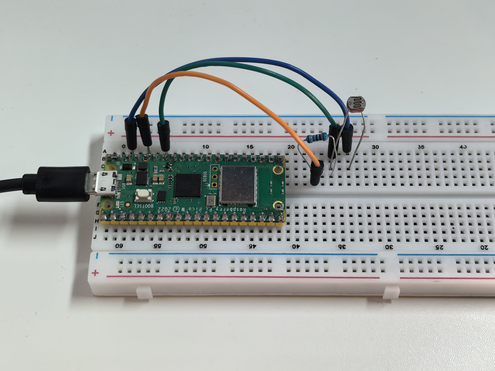

1.12 Photoresistor & LED
=========================
A photoresistor (also called LDR - Light Dependent Resistor) is like an "electronic eye" that changes its electrical resistance based on light levels! In bright light, it has low resistance. In darkness, it has high resistance.

We'll use this to create an **automatic night light** - the darker it gets, the brighter our LED shines. It's like the automatic headlights on cars or streetlights that turn on at dusk!

Component List
^^^^^^^^^^^^^^^
- Raspberry Pi Pico W x1
- MicroUSB cable x1
- 830 Tie-Points Breadboard x1
- Jumper Wire Several
- Resistor 10KΩ x1
- Photoresistor x1

Component knowledge
^^^^^^^^^^^^^^^^^^^^
:ref:`Photoresistor <cpn_photoresistor>`
"""""""""""""""""""""""""""""""""""""""""""

How our automatic night light works:

**Voltage Divider Circuit:**
- Photoresistor and 10KΩ resistor create a voltage divider
- GP28 reads the voltage between them

**Light Response:**
- **Bright light**: Photoresistor resistance LOW → GP28 reads LOW values → LED dims
- **Dark environment**: Photoresistor resistance HIGH → GP28 reads HIGH values → LED brightens

**Smart Logic:** Our code maps light sensor readings directly to LED brightness - the darker your environment, the brighter the LED becomes automatically!

Connect
^^^^^^^^^

Code
^^^^^^^
.. note::

    * Open the ``1.12_photoresistor&led.py`` file under the path of ``Ultimate-Starter-Kit-for-Pico-W\Python\1.Project`` or copy this code into Thonny, then click "Run Current Script" or simply press F5 to run it.

    * Don't forget to click on the "MicroPython (Raspberry Pi Pico)" interpreter in the bottom right corner. 

After running the code, try covering the photoresistor with your hand or shining a flashlight on it. Watch how the LED automatically adjusts its brightness! The serial monitor shows real-time light readings and LED brightness levels, plus helpful status messages like "Dark - LED bright" or "Bright - LED dim".

The following is the program code:

.. code-block:: python

    """
    Automatic Night Light

    Uses a photoresistor to control LED brightness automatically.
    Bright environment = dim LED, dark environment = bright LED.
    """

    import machine
    import utime

    # Pin connections
    LIGHT_SENSOR_PIN = 28           # photoresistor on ADC pin 28
    LED_PIN = 15                    # LED on digital pin 15

    # Settings
    UPDATE_DELAY = 200              # how often to check sensor (milliseconds)

    # ADC and PWM constants
    ADC_MAX_VALUE = 65535           # 16-bit ADC maximum value
    PWM_MAX_VALUE = 65535           # 16-bit PWM maximum value
    PWM_FREQUENCY = 1000            # PWM frequency in Hz

    # Initialize hardware
    photoresistor = machine.ADC(LIGHT_SENSOR_PIN)
    led = machine.PWM(machine.Pin(LED_PIN))
    led.freq(PWM_FREQUENCY)

    def map_value(value, from_min, from_max, to_min, to_max):
        """Map a value from one range to another"""
        return int((value - from_min) * (to_max - to_min) / (from_max - from_min) + to_min)

    def read_and_control_light():
        """Read light sensor and control LED brightness"""
        # Read light sensor (0-65535)
        light_reading = photoresistor.read_u16()
        
        # Convert to LED brightness (0-65535)
        # Note: our sensor gives HIGH values in dark, LOW values in bright light
        led_brightness = map_value(light_reading, 0, ADC_MAX_VALUE, 0, PWM_MAX_VALUE)
        
        # Set LED brightness using PWM
        led.duty_u16(led_brightness)
        
        # Show current values
        print(f"Light sensor: {light_reading} -> LED brightness: {led_brightness}/{PWM_MAX_VALUE}", end="")
        
        # Show simple status
        if light_reading > 45000:  # Dark environment threshold (16-bit ADC)
            print(" (Dark - LED bright)")
        elif light_reading > 26000:  # Medium light threshold (16-bit ADC)
            print(" (Medium - LED medium)")
        else:
            print(" (Bright - LED dim)")

    def main():
        """Main function"""
        print("Automatic Night Light Started!")
        print("Cover sensor = LED gets brighter")
        print("Expose sensor to light = LED gets dimmer")
        print()
        
        try:
            while True:
                # Read sensor and control LED
                read_and_control_light()
                
                # Wait before next reading
                utime.sleep_ms(UPDATE_DELAY)
                
        except KeyboardInterrupt:
            print("\nShutting down...")
            # Turn off LED
            led.duty_u16(0)
            led.deinit()

    if __name__ == "__main__":
        main()

Phenomenon
^^^^^^^^^^^
