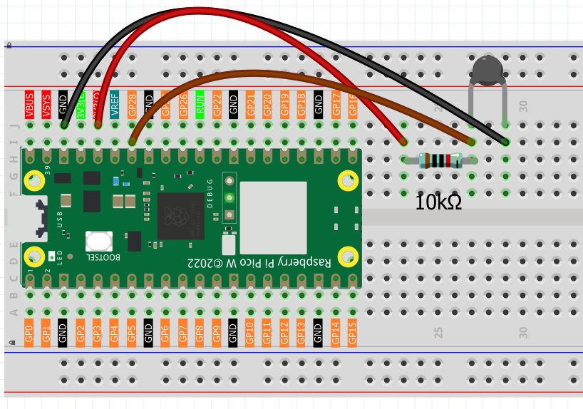

1.13 Thermometer
=========================
Let's build a digital thermometer using a **thermistor** - a special resistor that changes its resistance based on temperature! Think of it as a temperature-sensitive resistor.

We're using an **NTC (Negative Temperature Coefficient) thermistor**:
- **Hotter temperature** = **Lower resistance**
- **Cooler temperature** = **Higher resistance**

By measuring these resistance changes, we can calculate the exact temperature and display it in both Celsius and Fahrenheit - just like a real digital thermometer!

Component List
^^^^^^^^^^^^^^^
- Raspberry Pi Pico W x1
- MicroUSB cable x1
- 830 Tie-Points Breadboard x1
- Jumper Wire Several
- Resistor 10KΩ x1
- Thermistor x1

Component knowledge
^^^^^^^^^^^^^^^^^^^^
:ref:`Thermistor <cpn_thermistor>`
"""""""""""""""""""""""""""""""""""""

How our digital thermometer works:

**Temperature Sensing Circuit:**
- Thermistor + 10KΩ resistor form a voltage divider
- GP28 reads the voltage that changes with temperature

**Temperature Response:**
- **Warmer**: Thermistor resistance decreases → GP28 reads lower values
- **Cooler**: Thermistor resistance increases → GP28 reads higher values

**Smart Calculation:** Our code uses the **Beta equation** to convert these voltage readings into precise temperature values, automatically displaying results in both °C and °F with helpful temperature categories (Cold/Cool/Comfortable/Warm).

Connect
^^^^^^^^^

.. note:: 
        
    The thermistor is black and marked 103.
    The color ring of the 10K ohm resistor is red, black, black, red and brown.

Code
^^^^^^^
.. note::

    * Open the ``1.13_thermometer.py`` file under the path of ``Ultimate-Starter-Kit-for-Pico-W\Python\1.Project`` or copy this code into Thonny, then click "Run Current Script" or simply press F5 to run it.

    * Don't forget to click on the "MicroPython (Raspberry Pi Pico)" interpreter in the bottom right corner. 

After running the code, watch your digital thermometer in action! The serial monitor continuously displays the current temperature in both Celsius and Fahrenheit, plus helpful descriptions like "Cold", "Comfortable", or "Warm". Try touching the thermistor with your finger to see the temperature rise!

The following is the program code:

.. code-block:: python

    """
    Digital Thermometer

    Reads temperature from a thermistor and displays 
    the temperature in both Celsius and Fahrenheit.
    """

    import machine
    import utime
    import math

    # Pin and sensor constants
    THERMISTOR_PIN = 28              # thermistor connected to pin 28 (ADC)
    BETA_VALUE = 3950                # beta coefficient of the thermistor
    PULLUP_RESISTANCE = 10000        # pull-up resistor value in Ohms
    UPDATE_INTERVAL = 1000           # reading interval in milliseconds

    # Temperature calculation constants
    ROOM_TEMP_KELVIN = 298.15        # room temperature in Kelvin (25°C)
    KELVIN_OFFSET = 273.15           # conversion offset from Celsius to Kelvin
    ADC_MAX_VALUE = 65535            # 16-bit ADC maximum value
    SUPPLY_VOLTAGE = 3.3             # supply voltage

    # Initialize thermistor ADC
    thermistor = machine.ADC(THERMISTOR_PIN)

    def read_and_display_temperature():
        """Read thermistor and calculate temperature"""
        # Read raw analog value from thermistor
        analog_value = thermistor.read_u16()
        
        # Calculate temperature using the same logic as reference code
        # Convert ADC reading to voltage (0-65535 maps to 0-3.3V)
        voltage = SUPPLY_VOLTAGE * float(analog_value) / ADC_MAX_VALUE
        
        # Calculate thermistor resistance using voltage divider formula
        thermistor_resistance = PULLUP_RESISTANCE * voltage / (SUPPLY_VOLTAGE - voltage)
        
        # Calculate temperature using Beta equation
        temp_kelvin = 1.0 / (1.0 / ROOM_TEMP_KELVIN + math.log(thermistor_resistance / PULLUP_RESISTANCE) / BETA_VALUE)
        temp_celsius = temp_kelvin - KELVIN_OFFSET
        
        # Convert to Fahrenheit
        temp_fahrenheit = (temp_celsius * 1.8) + 32.0
        
        # Display temperature readings
        print(f"Temperature: {temp_celsius:.1f}°C ({temp_fahrenheit:.1f}°F)", end="")
        
        # Show temperature category
        if temp_celsius < 15:
            print(" - Cold")
        elif temp_celsius < 25:
            print(" - Cool")
        elif temp_celsius < 30:
            print(" - Comfortable")
        else:
            print(" - Warm")

    def main():
        """Main function"""
        print("=== Digital Thermometer ===")
        print("Reading temperature from thermistor...")
        print()
        
        while True:
            # Read temperature and display results
            read_and_display_temperature()
            
            # Wait before next reading
            utime.sleep_ms(UPDATE_INTERVAL)

    if __name__ == "__main__":
        main()

.. image:: img/5.phenomenon/1.13.png
    :width: 100%