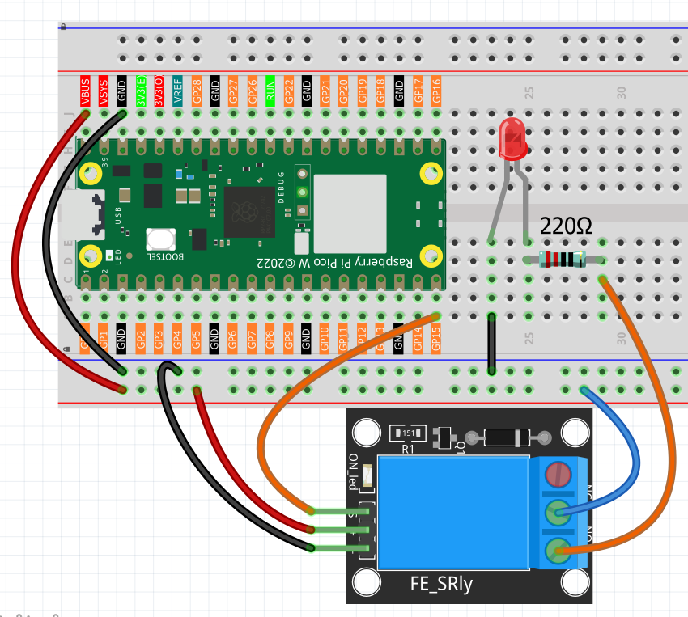

1.16 Relay Module Control
==========================
Imagine controlling a lamp, fan, or motor with your Pico - that's exactly what relay modules do! A relay is like a **remote-controlled switch** that lets low-voltage electronics (like our Pico) safely control high-voltage devices (like household appliances).

Think of it as a "digital hand" that can flip a physical switch. When the Pico sends a signal, the relay clicks and switches the connected device on or off. This is the foundation of **home automation** - smart lights, automatic fans, timed appliances, and IoT devices!

**Safety first**: Our relay module includes protection circuits to ensure safe operation.

.. warning:: 
    
    Modification of electrical appliances comes with great danger, do not try it 
    lightly, please do it under the guidance of professionals.

Here we only use a simple circuit powered by a breadboard power module as an 
example to show how to control it using relay.

Component List
^^^^^^^^^^^^^^^
- Raspberry Pi Pico W x1
- MicroUSB cable x1
- 830 Tie-Points Breadboard x1
- Jumper Wire Several
- Relay Module x1

Component knowledge
^^^^^^^^^^^^^^^^^^^^
:ref:`Relay Module <cpn_relay_module>` 
"""""""""""""""""""""""""""""""""""""""
 
Connect
^^^^^^^^^

Code
^^^^^^^
.. note::

    * Open the ``1.16_relay_module_control.py`` file under the path of ``Ultimate-Starter-Kit-for-Pico-W\Python\1.Project`` or copy this code into Thonny, then click "Run Current Script" or simply press F5 to run it.

    * Don't forget to click on the "MicroPython (Raspberry Pi Pico)" interpreter in the bottom right corner. 

.. 1.16.png

After running the code, you'll hear the satisfying "click-clack" sound of the relay switching every few seconds! The serial monitor shows automatic timing cycles with countdowns - "Relay ON for 2s, turning OFF in 1s". This demonstrates how you could control any device with precise timing: auto-shutoff lights, timed watering systems, or scheduled appliances.

The following is the program code:

.. code-block:: python

    """
  Automatic Relay Controller

  Controls a relay to automatically switch external circuits
  on and off with timing control and status monitoring.
  """

  import machine
  import utime

  # Pin and timing constants
  RELAY_PIN = 15                      # relay control pin
  ON_TIME = 3000                      # relay on duration (milliseconds)
  OFF_TIME = 2000                     # relay off duration (milliseconds)
  STATUS_UPDATE_INTERVAL = 5000       # status update interval (milliseconds)

  # Variables for timing and status
  last_switch_time = 0
  relay_state = False
  cycle_count = 0
  last_status_time = 0

  # Initialize relay
  relay = machine.Pin(RELAY_PIN, machine.Pin.OUT)

  def setup():
      """Initialize the relay controller"""
      global last_switch_time, relay_state
      
      print("=== Automatic Relay Controller ===")
      print("Relay switches external circuit ON/OFF automatically")
      print("Can control lights, motors, or other AC/DC devices")
      print()
      
      # Start with relay OFF
      relay.value(0)
      relay_state = False
      last_switch_time = utime.ticks_ms()
      print("Starting cycle... Relay: OFF")
      print()

  def check_relay_timing():
      """Handle relay timing and switching"""
      global last_switch_time, relay_state, cycle_count
      
      current_time = utime.ticks_ms()
      elapsed_time = utime.ticks_diff(current_time, last_switch_time)
      
      # Check if it's time to switch state
      should_switch = False
      
      if relay_state and elapsed_time >= ON_TIME:
          # Relay is ON and ON_TIME has passed - turn OFF
          should_switch = True
      elif not relay_state and elapsed_time >= OFF_TIME:
          # Relay is OFF and OFF_TIME has passed - turn ON
          should_switch = True
      
      # Switch relay if needed
      if should_switch:
          relay_state = not relay_state
          relay.value(1 if relay_state else 0)
          last_switch_time = current_time
          
          if relay_state:
              cycle_count += 1
          
          # Display switch event
          print(f"Cycle #{cycle_count} - Relay switched: {'ON' if relay_state else 'OFF'}")
          
          if relay_state:
              print("External circuit powered - Device running")
          else:
              print("External circuit off - Device stopped")
          print()

  def show_periodic_status():
      """Show periodic status updates"""
      global last_status_time
      
      current_time = utime.ticks_ms()
      
      # Show status every 5 seconds
      if utime.ticks_diff(current_time, last_status_time) >= STATUS_UPDATE_INTERVAL:
          time_in_state = utime.ticks_diff(current_time, last_switch_time)
          
          if relay_state:
              remaining_time = ON_TIME - time_in_state
              print(f"Status: Relay ON for {time_in_state // 1000}s, turning OFF in {remaining_time // 1000}s")
          else:
              remaining_time = OFF_TIME - time_in_state
              print(f"Status: Relay OFF for {time_in_state // 1000}s, turning ON in {remaining_time // 1000}s")
          
          last_status_time = current_time

  def main():
      """Main function"""
      setup()
      
      try:
          while True:
              # Check if it's time to switch relay state
              check_relay_timing()
              
              # Show continuous status every 5 seconds
              show_periodic_status()
              
              # Small delay to prevent excessive CPU usage
              utime.sleep_ms(100)
              
      except KeyboardInterrupt:
          print("\nRelay controller stopped.")
          print(f"Total cycles completed: {cycle_count}")
          
          # Turn off relay safely
          relay.value(0)
          print("Relay turned OFF - System safe.")

  if __name__ == "__main__":
      main()

Phenomenon
^^^^^^^^^^^
.. video:: img/5.phenomenon/1.16.mp4
    :width: 100%