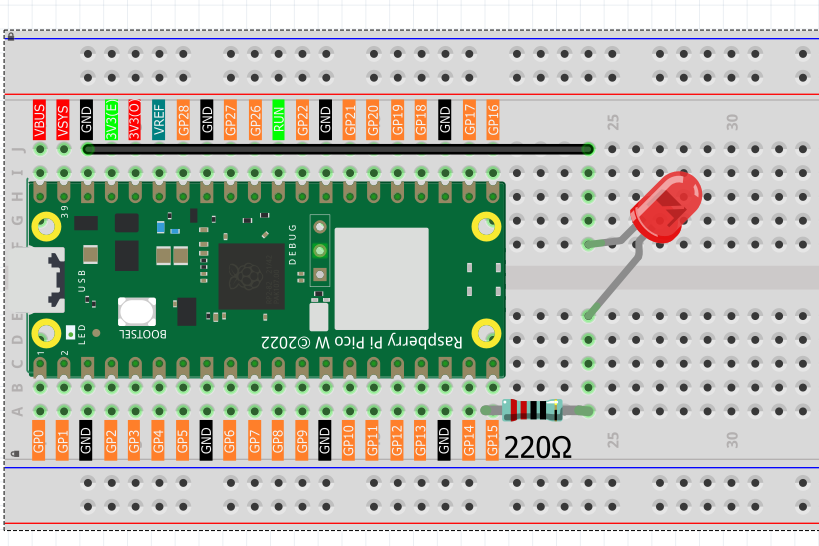

1.1 LED_Blink (Important)
=================================
This chapter is the Start Point in the journey to build and explore Raspberry Pi Pico
electronic projects. We will start with simple “Blink” project.

In this project, we will use Pico to control blinking a common LED.

Power Pico needs 5v power supply. In this tutorial, we need connect Pico to computer via USB cable to power it and program it.

Component List
^^^^^^^^^^^^^^^
- Raspberry Pi Pico W x1
- MicroUSB cable x1
- 830 Tie-Points Breadboard x1
- LED x1
- Resistor 220Ω x1
- Jumper Wire Several
  
Component knowledge
^^^^^^^^^^^^^^^^^^^^
:ref:`LED <cpn_led>`
""""""""""""""""""""

:ref:`Resistor <cpn_resistor>`
"""""""""""""""""""""""""""""""""""""

:ref:`Breadboard <cpn_breadboard>`
""""""""""""""""""""""""""""""""""

This circuit works on a simple principle, and the current direction is shown in 
the figure. The LED will light up after the 220ohm current limiting resistor when 
GP15 outputs high level (3.3v). The LED will turn off when GP15 outputs low level (0v).

Connect
^^^^^^^^^^^^^^^

Code
^^^^^^^^
.. note::

    * Open the ``1.1_led_blink.py`` file under the path of ``Ultimate-Starter-Kit-for-Pico-W\Python\1.Project`` or copy this code into Thonny, then click "Run Current Script" or simply press F5 to run it.

    * Don't forget to click on the "MicroPython (Raspberry Pi Pico)" interpreter in the bottom right corner. 

After running the code, you will see the LED light up for 200 milliseconds and then turn off for 200 milliseconds.

If you want to stop the code, you can click the stop button in the IDE or press Ctrl+C in the shell area.

.. 1.1.png

The following is the program code:

.. code-block:: python

    from time import sleep_ms
    from machine import Pin

    led = Pin(15, Pin.OUT)  # Create an LED object from pin 15 and set it as output
    try:
        while True:
            led.value(1)  # Turn on the LED
            sleep_ms(200)
            led.value(0)  # Turn off the LED
            sleep_ms(200)
    except:
        pass

.. video:: img/5.phenomenon/1.1-1.mp4
    :width: 100%

We can also simplify the previous code by using MicroPython's API. By calling the 
led.toggle() method in the ``machine.Pin`` class, we can more concisely change the 
state of the pin without having to explicitly set the pin's high or low voltage 
value.

.. note::

    * Open the ``1.1_led_blink2.py`` file under the path of ``Ultimate-Starter-Kit-for-Pico-W\Python\1.Project`` or copy this code into Thonny, then click "Run Current Script" or simply press F5 to run it.

    * Don't forget to click on the "MicroPython (Raspberry Pi Pico)" interpreter in the bottom right corner. 

.. 1.1-2.png

The following is the program code:

.. code-block:: python

    import machine
    import utime

    led = machine.Pin(15, machine.Pin.OUT)  # Create a Pin object for the LED connected to pin 15, set as output

    while True:  # Infinite loop to keep the program running
        led.toggle()  # Toggle the LED state: turn it on if it's off, and turn it off if it's on
        utime.sleep(1)  # Wait for 1 second before toggling the LED again, creating a blinking effect every 2 seconds

Phenomenon
^^^^^^^^^^^
.. video:: img/5.phenomenon/1.1-2.mp4
    :width: 100%