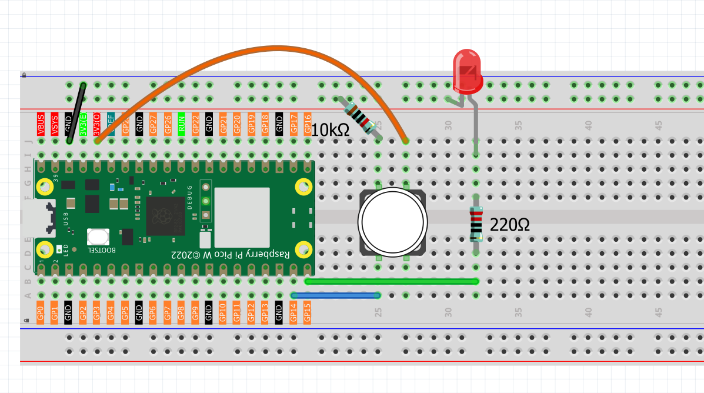

1.2 Button & LED
=========================
In the previous lesson, we made an LED blink automatically. Now we'll learn something new: how to use a button to control an LED. This adds **user interaction** to our project for the first time.

We'll use the Pico's GPIO pins in a new way: as **inputs** to read button presses. In the previous lesson, we used GPIO pins as **outputs** to control the LED. This lesson introduces using GPIO pins as **inputs**.

This project demonstrates a basic control system: **Button (Input) → Pico (Control) → LED (Output)**.

Component List
^^^^^^^^^^^^^^^
- Raspberry Pi Pico W x1
- MicroUSB cable x1
- 830 Tie-Points Breadboard x1
- Resistor 10KΩ x1
- Jumper Wire Several
- Button x1

Component knowledge
^^^^^^^^^^^^^^^^^^^^
:ref:`Button <cpn_button>`
"""""""""""""""""""""""""""

When the button is pressed, it connects 3.3V to GP14, creating a HIGH signal. When not pressed, GP14 becomes "floating" and can read unpredictable values.

To fix this, we use a **pull-down resistor** (10KΩ) that connects GP14 to ground. This ensures GP14 reads LOW when the button is not pressed, and HIGH when pressed. The resistor "pulls" the pin to a stable LOW state, making readings reliable.

Connect
^^^^^^^^^^

Code
^^^^^^^
.. note::

    * Open the ``1.2_button_led.py`` file under the path of ``Ultimate-Starter-Kit-for-Pico-W\Python\1.Project`` or copy this code into Thonny, then click "Run Current Script" or simply press F5 to run it.

    * Don't forget to click on the "MicroPython (Raspberry Pi Pico)" interpreter in the bottom right corner. 
  
After running the code, when you press the button, the LED will turn on. When you release the button, the LED will turn off.

The following is the program code:

.. code-block:: python

    """
    Button Control LED

    Turns on and off a LED connected to digital pin 15, 
    when pressing a pushbutton attached to pin 14.
    """

    import machine
    import utime

    # Constants for pin numbers
    BUTTON_PIN = 14         # the number of the pushbutton pin
    LED_PIN = 15           # the number of the LED pin

    # Variables
    button_state = 0       # variable for reading the pushbutton status

    # Initialize pins
    button = machine.Pin(BUTTON_PIN, machine.Pin.IN)  # pushbutton pin as input
    led = machine.Pin(LED_PIN, machine.Pin.OUT)       # LED pin as output

    def setup():
        """Initialize the system"""
        print("=== Button Control LED ===")
        print("Press the button to control the LED")
        print("Button: Pin", BUTTON_PIN)
        print("LED: Pin", LED_PIN)
        print("==========================")
        
        # Ensure LED starts in OFF state
        led.value(0)
        print("System initialized - LED OFF")

    def main():
        """Main control loop"""
        global button_state
        
        setup()
        
        try:
            while True:
                # Read the state of the pushbutton
                button_state = button.value()
                
                # Check if the pushbutton is pressed
                # Note: Assuming button pressed = HIGH (1), adjust if needed
                if button_state == 1:
                    # Turn LED on
                    led.value(1)
                else:
                    # Turn LED off
                    led.value(0)
                
                # Small delay for stability
                utime.sleep_ms(10)
                
        except KeyboardInterrupt:
            print("\nProgram stopped.")
            print("Turning off LED...")
            led.value(0)
            print("Button control ended.")

    if __name__ == "__main__":
        main()

Phenomenon
^^^^^^^^^^^
.. video:: img/5.phenomenon/1.2.mp4
    :width: 100%