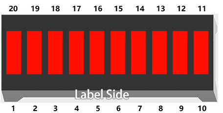

1.3 Chaser Light
====================
Now let's create a fun visual effect using multiple LEDs! We'll use an LED Bar Graph, which contains 10 LEDs in a single package. This creates a "chaser light" effect where LEDs light up one after another, like you see on old TV shows or electronic displays.

.. image:: img/1.detail/1.3-1.png

Component List
^^^^^^^^^^^^^^^
- Raspberry Pi Pico W x1
- MicroUSB cable x1
- 830 Tie-Points Breadboard x1
- Resistor 220Ω x10
- Jumper Wire Several
- LED Bar Graph x1

Component knowledge
^^^^^^^^^^^^^^^^^^^^
:ref:`LED Bar Graph <cpn_led_bar_graph>`
""""""""""""""""""""""""""""""""""""""""""

In the LED Bar Graph, there are 10 LEDs, each of which can be controlled individually. 
Each LED's anode is connected to GPIO pins 6-15, and its cathode is connected through a 220Ω resistor to GND.

Connect
^^^^^^^^^^
.. image:: img/3.connect/1.3.png

Code
^^^^^^^
.. note::

    * Open the ``1.3_chaser_light.py.py`` file under the path of ``Ultimate-Starter-Kit-for-Pico-W\Python\1.Project`` or copy this code into Thonny, then click "Run Current Script" or simply press F5 to run it.

    * Don't forget to click on the "MicroPython (Raspberry Pi Pico)" interpreter in the bottom right corner. 
  
After running the code, you'll see three different light patterns: first odd LEDs (1st, 3rd, 5th...), then even LEDs (2nd, 4th, 6th...), and finally all LEDs lighting up in sequence from left to right.

.. 1.3.png

The following is the program code:

.. code-block:: python
    
    """
    Chaser Light

    Controls 10 LEDs in sequence with different animation patterns:
    - Odd positioned LEDs (0, 2, 4, 6, 8)
    - Even positioned LEDs (1, 3, 5, 7, 9)
    - All LEDs in sequence (0 to 9)
    """

    import machine
    import utime

    # LED pins array - using pins 6 through 15
    LED_PINS = [6, 7, 8, 9, 10, 11, 12, 13, 14, 15]
    NUM_LEDS = 10
    DELAY_TIME = 300  # delay between LED changes in milliseconds

    # Initialize LED array
    leds = []

    def initialize_leds():
        """Initialize all LED pins as outputs"""
        global leds
        
        for i in range(NUM_LEDS):
            led_pin = machine.Pin(LED_PINS[i], machine.Pin.OUT)
            led_pin.value(0)  # turn off LED initially
            leds.append(led_pin)
        
        print(f"Initialized {NUM_LEDS} LEDs on pins {LED_PINS}")

    def light_odd_leds():
        """Light odd positioned LEDs (0, 2, 4, 6, 8)"""
        print("Pattern 1: Lighting odd positioned LEDs...")
        
        for i in range(0, NUM_LEDS, 2):  # 0, 2, 4, 6, 8
            leds[i].value(1)  # turn LED on
            utime.sleep_ms(DELAY_TIME)
            leds[i].value(0)  # turn LED off

    def light_even_leds():
        """Light even positioned LEDs (1, 3, 5, 7, 9)"""
        print("Pattern 2: Lighting even positioned LEDs...")
        
        for i in range(1, NUM_LEDS, 2):  # 1, 3, 5, 7, 9
            leds[i].value(1)  # turn LED on
            utime.sleep_ms(DELAY_TIME)
            leds[i].value(0)  # turn LED off

    def light_all_leds():
        """Light all LEDs in sequence"""
        print("Pattern 3: Lighting all LEDs in sequence...")
        
        for i in range(NUM_LEDS):  # 0 to 9
            leds[i].value(1)  # turn LED on
            utime.sleep_ms(DELAY_TIME)
            leds[i].value(0)  # turn LED off

    def turn_off_all_leds():
        """Turn off all LEDs"""
        for i in range(NUM_LEDS):
            leds[i].value(0)

    def run_animation_cycle():
        """Run one complete animation cycle"""
        # Pattern 1: Light odd positioned LEDs (0, 2, 4, 6, 8)
        light_odd_leds()
        utime.sleep_ms(DELAY_TIME)
        
        # Pattern 2: Light even positioned LEDs (1, 3, 5, 7, 9)
        light_even_leds()
        utime.sleep_ms(DELAY_TIME)
        
        # Pattern 3: Light all LEDs in sequence
        light_all_leds()
        utime.sleep_ms(DELAY_TIME)

    def main():
        """Main function"""
        print("=== Chaser Light Animation ===")
        print("Starting LED chase patterns...")
        print("Patterns: Odd -> Even -> All LEDs")
        print("===============================")
        
        # Initialize all LEDs
        initialize_leds()
        
        try:
            cycle_count = 0
            while True:
                cycle_count += 1
                print(f"\n--- Animation Cycle #{cycle_count} ---")
                
                # Run one complete animation cycle
                run_animation_cycle()
                
        except KeyboardInterrupt:
            print(f"\nAnimation stopped after {cycle_count} cycles.")
            print("Turning off all LEDs...")
            turn_off_all_leds()
            print("Chaser light animation ended.")

    if __name__ == "__main__":
        main()

Phenomenon
^^^^^^^^^^^
.. video:: img/5.phenomenon/1.3.mp4
    :width: 100%