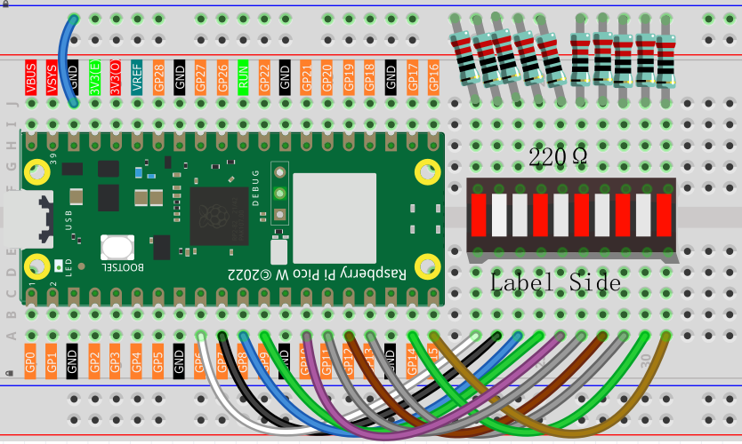

1.4 Analog & PWM
=========================
In previous study, we have known that one button has two states: pressed and 
released, and LED has lighton/off state, then how to enter a middle state? How 
to output an intermediate state to let LED "semi bright"? That's what we're going 
to learn. First, let’s learn how to control the brightness of a LED.

Meteor Flowing Light
------------------------------------
After learning about PWM, we can use it to control LED bar graph and realize a 
cooler flowing light. The component list, circuit, and hardware are exactly cons
istent with the project Flowing Light.

Component List
^^^^^^^^^^^^^^^
- Raspberry Pi Pico W x1
- MicroUSB cable x1
- 830 Tie-Points Breadboard x1
- Resistor 220Ω x10
- Jumper Wire Several
- LED Bar Graph x1

This project has the same circuit as Project 1.3, but the output signal is different. 
In Project 1.3, high and low voltage levels (0 & 1) are directly output to turn the 
LEDs on or off. In this project, PWM signals are output to control the brightness of 
the LED Bar Graph, achieving a flowing effect.

Connect
^^^^^^^

Code
^^^^^^^
.. note::

    * Open the ``1.4_analog&pwm.py`` file under the path of ``Ultimate-Starter-Kit-for-Pico-W\Python\1.Project`` or copy this code into Thonny, then click "Run Current Script" or simply press F5 to run it.

    * Don't forget to click on the "MicroPython (Raspberry Pi Pico)" interpreter in the bottom right corner. 
  
Click “Run current script”, the LED Bar Graph will continuously flow from left to right.

The following is the program code:

.. code-block:: python

    import machine
    import utime

    pin_nums = [6, 7, 8, 9, 10, 11, 12, 13, 14, 15]
    pins = [machine.Pin(p, machine.Pin.OUT) for p in pin_nums]

    pwms = [machine.PWM(pin, freq=1000) for pin in pins]

    MAX_DUTY = 65535
    steps = 32
    breath_pattern = []
    for i in range(steps):
        duty = int(MAX_DUTY * (1 - abs((i - steps/2)/(steps/2))))
        breath_pattern.append(duty)

    def cleanup():
        for pwm in pwms:
            pwm.deinit()

    try:
        while True:
            for step in range(steps):
                for i, pwm in enumerate(pwms):
                    phase = (step - i * 2) % steps 
                    pwm.duty_u16(breath_pattern[phase])
                utime.sleep_ms(50)
                
    except KeyboardInterrupt:
        cleanup()

Phenomenon
^^^^^^^^^^^
.. video:: img/5.phenomenon/1.4.mp4
    :width: 100%
