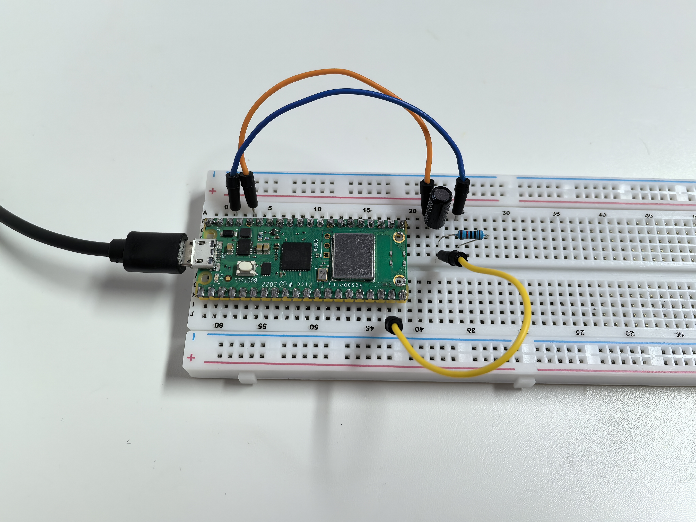

1.6 Tilt Switch
=================
A tilt switch is like a digital "bubble level" - it detects when something is tilted! It contains a small metal ball that rolls around inside. When held upright, the ball connects two metal contacts. When tilted, the ball rolls away and breaks the connection.

This makes it perfect for detecting orientation changes, like in phone screen rotation or gaming controllers.

Component List
^^^^^^^^^^^^^^^
- Raspberry Pi Pico W x1
- MicroUSB cable x1
- 830 Tie-Points Breadboard x1
- Tilt Switch x1
- Resistor 10KΩ x1
- Jumper Wire Several 

Component knowledge
^^^^^^^^^^^^^^^^^^^^
:ref:`Tilt Switch <cpn_tilt_switch>`
"""""""""""""""""""""""""""""""""""""""

How it works with our circuit:
- **Upright position**: Metal ball connects the pins → GP14 reads **HIGH**
- **Tilted position**: Metal ball rolls away → GP14 reads **LOW**

The **10KΩ pull-down resistor** ensures GP14 has a stable LOW signal when tilted, preventing floating voltage issues.

Connect
^^^^^^^^^
.. image:: img/3.connect/1.6.png

Code
^^^^^^^
.. note::

    * Open the ``1.6_tilt_switch.py`` file under the path of ``Ultimate-Starter-Kit-for-Pico-W\Python\1.Project`` or copy this code into Thonny, then click "Run Current Script" or simply press F5 to run it.

    * Don't forget to click on the "MicroPython (Raspberry Pi Pico)" interpreter in the bottom right corner. 
  
After running the code, tilt your breadboard in different directions. The serial monitor will show real-time messages when the sensor detects position changes, displaying "TILTED" or "LEVEL" with timestamps.

The following is the program code:

.. code-block:: python

    """
    Tilt Switch Monitor

    Reads a tilt switch and reports when the orientation changes.
    Shows different messages for tilt and level positions.
    """

    import machine
    import utime

    # Pin definition - connect tilt switch to this pin
    TILT_PIN = 14               # tilt switch connected to pin 14

    # Timing constants
    MONITOR_DELAY = 100         # delay between checks in milliseconds

    # Variables to track switch state
    current_state = 0           # current reading from tilt switch
    last_state = 0              # previous reading to detect changes
    show_welcome = True         # flag to show welcome message once

    # Initialize tilt switch
    tilt_switch = machine.Pin(TILT_PIN, machine.Pin.IN)

    def show_welcome_message():
        """Display welcome message with initial state"""
        global last_state, show_welcome
        
        print("=== Tilt Switch Monitor ===")
        
        # Determine initial position
        initial_position = "TILTED" if last_state == 0 else "LEVEL"
        print(f"Current position: {initial_position}")
        print("Move the sensor to see changes...")
        print()
        
        show_welcome = False

    def monitor_tilt_switch():
        """Read tilt switch and detect state changes"""
        global current_state, last_state
        
        # Read current tilt switch state
        current_state = tilt_switch.value()
        
        # Check if state changed (only act on changes, not continuous reading)
        if current_state != last_state:
            # Print timestamp for the change
            timestamp = utime.ticks_ms()
            print(f"[{timestamp}ms] ", end="")
            
            # Check new position and print appropriate message
            if current_state == 0:  # LOW state (tilted)
                print(">>> SENSOR TILTED <<<")
                print("Position changed to: TILTED")
            else:  # HIGH state (level)
                print("--- Sensor Level ---")
                print("Position changed to: LEVEL")
            
            print()  # blank line for readability
            
            # Remember this state for next comparison
            last_state = current_state

    def initialize_system():
        """Initialize the tilt monitoring system"""
        global last_state
        
        # Read initial state
        last_state = tilt_switch.value()

    def main():
        """Main function"""
        global show_welcome
        
        # Initialize system
        initialize_system()
        
        try:
            while True:
                # Show welcome message once at start
                if show_welcome:
                    show_welcome_message()
                
                # Monitor tilt switch for changes
                monitor_tilt_switch()
                
                # Small delay for stability
                utime.sleep_ms(MONITOR_DELAY)
                
        except KeyboardInterrupt:
            print("\nTilt switch monitoring stopped.")
            
            # Show final state
            final_position = "TILTED" if current_state == 0 else "LEVEL"
            print(f"Final position: {final_position}")

    if __name__ == "__main__":
        main()

Phenomenon
^^^^^^^^^^^
