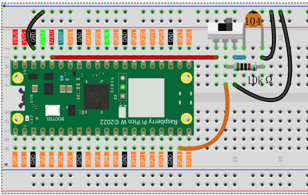

1.7 Slide_Switch
=========================
A slide switch is like a railway switch that directs electrical current to different paths! It has three pins: a common middle pin and two output pins. Slide it left or right to change which path the electricity takes.

This type of switch is commonly used for ON/OFF controls, mode selection, or toggling between two states in electronic devices.

Component List
^^^^^^^^^^^^^^^
- Raspberry Pi Pico W x1
- MicroUSB cable x1
- 830 Tie-Points Breadboard x1
- Jumper Wire Several
- Slide Switch x1
- Resistor 10KΩ x1
- Capacitor 104 x1

Component knowledge
^^^^^^^^^^^^^^^^^^^^
:ref:`Slide Switch <cpn_slide_switch>`
"""""""""""""""""""""""""""""""""""""""

:ref:`Capacitor <cpn_capacitor>`
"""""""""""""""""""""""""""""""""

How the slide switch works in our circuit:
- **Left position**: GP14 reads **LOW** (0V)
- **Right position**: GP14 reads **HIGH** (3.3V)
- **Middle position**: GP14 stays **LOW** thanks to the pull-down resistor

The **10KΩ resistor** provides a stable LOW when the switch isn't connected to HIGH, and the **104 capacitor** smooths out any electrical noise during switching.

Connect
^^^^^^^^^

Code
^^^^^^^
.. note::

    * Open the ``1.7_slide_switch.py`` file under the path of ``Ultimate-Starter-Kit-for-Pico-W\Python\1.Project`` or copy this code into Thonny, then click "Run Current Script" or simply press F5 to run it.

    * Don't forget to click on the "MicroPython (Raspberry Pi Pico)" interpreter in the bottom right corner. 

.. 1.7.png

After running the code, move the slide switch left and right. The serial monitor will display real-time position updates (HIGH/LOW), toggle counters, and timestamps showing exactly when each switch movement occurred.

The following is the program code:

.. code-block:: python

    """
    Digital Toggle Monitor

    Monitors a slide switch and counts the number of toggles
    while providing real-time status updates.
    """

    import machine
    import utime

    # Pin definition for the slide switch
    TOGGLE_PIN = 14                     # slide switch connected to pin 14

    # Timing constants
    MONITOR_DELAY = 100                 # delay between checks in milliseconds

    # Variables to track switch state and statistics
    current_position = False            # current switch position (True = HIGH)
    previous_position = False           # previous position for change detection
    toggle_count = 0                    # total number of switch toggles
    last_toggle_time = 0                # timestamp of last toggle event

    # Initialize slide switch
    toggle_switch = machine.Pin(TOGGLE_PIN, machine.Pin.IN)

    def display_welcome_message():
        """Display welcome message and instructions"""
        print("=== Digital Toggle Monitor ===")
        print("Move the switch to see position changes")
        print("Toggle counter will track all movements")
        print("--------------------------------")

    def report_status():
        """Display current switch status and statistics"""
        global current_position, toggle_count, last_toggle_time
        
        # Show digital value (HIGH/LOW)
        print(f"Position: {'HIGH' if current_position else 'LOW'}", end="")
        
        # Show logical state (ON/OFF)
        print(f" | State: {'ON ' if current_position else 'OFF'}", end="")
        
        # Show total toggle count
        print(f" | Toggles: {toggle_count}")
        
        # Show timestamp of last change (if any toggles occurred)
        if toggle_count > 0:
            print(f"Last change: {last_toggle_time} ms")
        
        # Add separator line for readability
        print("---")

    def monitor_toggle_switch():
        """Check for switch position changes"""
        global current_position, previous_position, toggle_count, last_toggle_time
        
        # Read current switch position
        current_position = bool(toggle_switch.value())
        
        # Check if position has changed
        if current_position != previous_position:
            # Increment toggle counter
            toggle_count += 1
            
            # Record the time of this toggle
            last_toggle_time = utime.ticks_ms()
            
            # Display updated status
            report_status()
            
            # Update previous position for next comparison
            previous_position = current_position

    def initialize_system():
        """Initialize the monitoring system"""
        global previous_position
        
        # Show welcome message
        display_welcome_message()
        
        # Read initial switch position
        previous_position = bool(toggle_switch.value())
        
        # Set current position to match initial state
        global current_position
        current_position = previous_position
        
        # Show initial status
        print("Initial switch state:")
        report_status()

    def main():
        """Main function"""
        initialize_system()
        
        try:
            while True:
                # Monitor the switch for changes
                monitor_toggle_switch()
                
                # Small delay for stability
                utime.sleep_ms(MONITOR_DELAY)
                
        except KeyboardInterrupt:
            print("\nToggle monitoring stopped.")
            print(f"Final statistics:")
            print(f"Total toggles: {toggle_count}")
            print(f"Final position: {'HIGH (ON)' if current_position else 'LOW (OFF)'}")

    if __name__ == "__main__":
        main()

Phenomenon
^^^^^^^^^^^
.. image:: img/5.phenomenon/1.7.png
    :width: 100%

