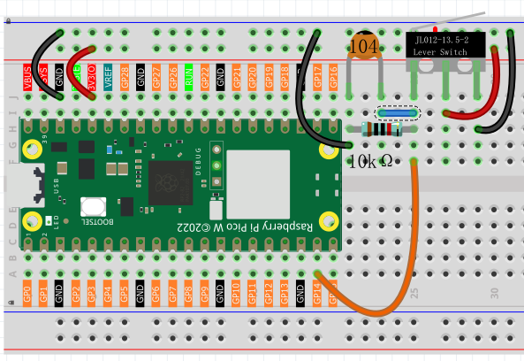

1.8 Gentle Press
===================
A micro switch is a precision button designed for detecting gentle touches! Unlike regular buttons, it has three pins: **C** (Common), **NO** (Normally Open), and **NC** (Normally Closed).

Think of it like a see-saw: when not pressed, C connects to NC. When pressed, C flips to connect to NO instead. This makes it perfect for applications requiring precise, reliable switching.

Component List
^^^^^^^^^^^^^^^
- Raspberry Pi Pico W x1
- MicroUSB cable x1
- 830 Tie-Points Breadboard x1
- Jumper Wire Several
- Resistor 10KΩx1
- Capacitor 104 x1
- Micro Switch x1

Component knowledge
^^^^^^^^^^^^^^^^^^^^ 
:ref:`Micro Switch <cpn_micro_switch>`
"""""""""""""""""""""""""""""""""""""""""

How our circuit works:
- **Not pressed**: C connects to NC → GP14 reads **LOW** (0V)
- **Pressed**: C connects to NO → GP14 reads **HIGH** (3.3V)

The **10KΩ pull-down resistor** ensures GP14 stays LOW when unpressed, and the **104 capacitor** eliminates button bounce (rapid on/off signals when pressing).

Connect
^^^^^^^^^

Code
^^^^^^^
.. note::

    * Open the ``1.8_gentle_press.py`` file under the path of ``Ultimate-Starter-Kit-for-Pico-W\Python\1.Project`` or copy this code into Thonny, then click "Run Current Script" or simply press F5 to run it.

    * Don't forget to click on the "MicroPython (Raspberry Pi Pico)" interpreter in the bottom right corner. 

After running the code, try pressing the micro switch for different durations. The program will measure how long you press and give different responses: "QUICK TAP" for short presses, "MEDIUM PRESS" for moderate holds, and "LONG HOLD" for extended presses, complete with sound effects!

The following is the program code:

.. code-block:: python

    """
    Press Duration Counter

    Measures how long a button is pressed and provides
    different responses based on press duration.
    Shows statistics about button usage.
    """

    import machine
    import utime

    # Pin definition for the button
    BUTTON_PIN = 14                     # button connected to pin 14

    # Timing constants for press categorization
    QUICK_PRESS_THRESHOLD = 500         # milliseconds for quick tap
    MEDIUM_PRESS_THRESHOLD = 2000       # milliseconds for medium press
    SCAN_DELAY = 10                     # delay between scans in milliseconds

    # Variables to track button state
    is_pressed = False                  # current button state (True = pressed)
    was_pressed = False                 # previous button state for comparison
    press_start_time = 0                # when the button was first pressed
    press_duration = 0                  # how long the button was held
    total_presses = 0                   # count of total button presses

    # Initialize button
    button = machine.Pin(BUTTON_PIN, machine.Pin.IN)

    def show_instructions():
        """Display instructions at startup"""
        print("*** Press Duration Counter ***")
        print("Press and hold the button for different durations:")
        print("- Quick press (< 500ms): Short beep")
        print("- Medium press (500-2000ms): Medium beep")
        print("- Long press (> 2000ms): Long beep")
        print("===============================")

    def categorize_press_type():
        """Categorize press type based on duration"""
        global press_duration
        
        print("Press type: ", end="")
        
        # Check duration and provide appropriate feedback
        if press_duration < QUICK_PRESS_THRESHOLD:
            print("QUICK TAP")
            print("♪ Beep!")           # short sound effect
        elif press_duration < MEDIUM_PRESS_THRESHOLD:
            print("MEDIUM PRESS")
            print("♪♪ Beep-Beep!")     # medium sound effect
        else:
            print("LONG HOLD")
            print("♪♪♪ Beep-Beep-Beep!") # long sound effect

    def show_statistics():
        """Display usage statistics"""
        global total_presses
        
        print(f"Total presses: {total_presses}")
        print("---")  # separator line for readability

    def handle_button_press():
        """Monitor button state and detect press/release events"""
        global is_pressed, was_pressed, press_start_time, press_duration, total_presses
        
        # Read current button state
        is_pressed = bool(button.value())
        
        # Check if button was just pressed (transition from not pressed to pressed)
        if is_pressed and not was_pressed:
            # Record the time when button was pressed
            press_start_time = utime.ticks_ms()
            print("Button pressed... ", end="")
        
        # Check if button was just released (transition from pressed to not pressed)
        if not is_pressed and was_pressed:
            # Calculate how long the button was held
            current_time = utime.ticks_ms()
            press_duration = utime.ticks_diff(current_time, press_start_time)
            total_presses += 1  # increment total press counter
            
            # Show the duration
            print(f"Released! Duration: {press_duration}ms")
            
            # Analyze the press type based on duration
            categorize_press_type()
            
            # Show current statistics
            show_statistics()
        
        # Remember current state for next loop comparison
        was_pressed = is_pressed

    def main():
        """Main function"""
        show_instructions()
        
        try:
            while True:
                # Check button state and handle press events
                handle_button_press()
                
                # Small delay for stability
                utime.sleep_ms(SCAN_DELAY)
                
        except KeyboardInterrupt:
            print("\nPress counter stopped.")
            print(f"Final statistics: {total_presses} total presses")

    if __name__ == "__main__":
        main()

Phenomenon
^^^^^^^^^^^
.. image:: img/5.phenomenon/1.8.png
    :width: 100%