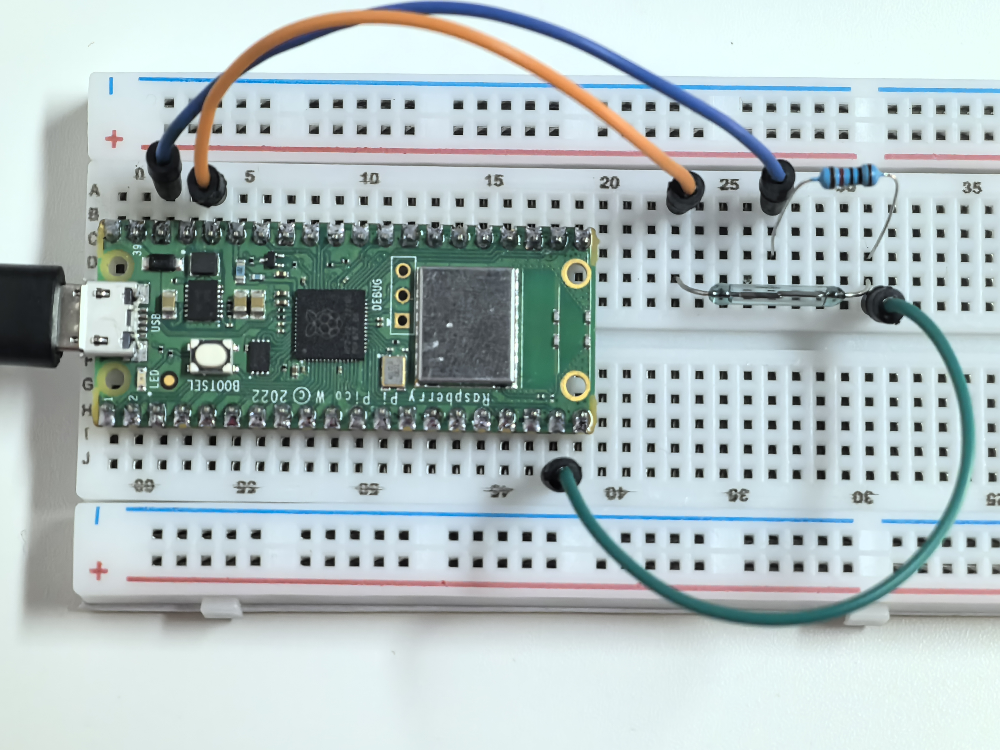

1.9 Magnetic Trigger
=========================
A reed switch is a magical "invisible touch" sensor that responds to magnetism! It contains two thin metal strips (reeds) sealed in a glass tube. When you bring a magnet close, these strips are attracted to each other and touch, completing an electrical circuit.

Remove the magnet, and the strips spring apart, breaking the connection. It's like having a wireless switch that activates through glass, plastic, or wood! You'll find these in door alarms, laptop lid sensors, and bike speedometers.

Component List
^^^^^^^^^^^^^^^
- Raspberry Pi Pico W x1
- MicroUSB cable x1
- 830 Tie-Points Breadboard x1
- Jumper Wire Several
- Resistor 10KΩ x1
- Reed Switch x1

Component knowledge
^^^^^^^^^^^^^^^^^^^^

:ref:`Reed Switch <cpn_reed_switch>`
""""""""""""""""""""""""""""""""""""""""
    
How magnetic detection works:
- **No magnet nearby**: Reed strips are apart → GP14 reads **LOW** (0V)
- **Magnet approaches**: Reed strips touch → GP14 reads **HIGH** (3.3V)

The **10KΩ pull-down resistor** ensures GP14 stays at a stable LOW when no magnetic field is detected, preventing false readings.

Connect
^^^^^^^^^
.. image:: img/3.connect/1.9.png

Code
^^^^^^^
.. note::

    * Open the ``1.9_magnetic_trigger.py`` file under the path of ``Ultimate-Starter-Kit-for-Pico-W\Python\1.Project`` or copy this code into Thonny, then click "Run Current Script" or simply press F5 to run it.

    * Don't forget to click on the "MicroPython (Raspberry Pi Pico)" interpreter in the bottom right corner. 

.. 1.9.png

After running the code, bring a magnet close to the reed switch and move it away. You'll see "MAGNET DETECTED!" messages with detection counters and timestamps, plus continuous monitoring that shows how long the magnet stays near the sensor.

The following is the program code:

.. code-block:: python

    """
    Magnetic Presence Detector

    Detects when a magnet is near using a reed switch.
    Provides user-friendly feedback and tracks detection events.

    Note: Reed switches detect presence/absence, not magnetic strength.
    """

    import machine
    import utime

    # Pin definition for the reed switch
    REED_SWITCH = 14                    # reed switch connected to pin 14

    # Timing constants
    SCAN_DELAY = 100                    # delay between scans in milliseconds
    PRESENCE_CHECK_INTERVAL = 5000      # when to start showing duration (ms)
    DURATION_UPDATE_INTERVAL = 3000     # how often to update duration display (ms)
    DURATION_UPDATE_TOLERANCE = 100     # tolerance for duration update timing (ms)

    # Variables to track magnetic presence
    magnet_present = False              # current state (True = magnet detected)
    last_magnet_state = False           # previous state for change detection
    detection_time = 0                  # when magnet was first detected
    total_detections = 0                # count of total detections

    # Initialize reed switch
    reed_switch = machine.Pin(REED_SWITCH, machine.Pin.IN)

    def initialize_detector():
        """Display welcome message and initialize system"""
        print("=== Magnetic Presence Detector ===")
        print("Bring a magnet close to the sensor")
        print("System ready for detection...")
        print("==================================")
        print()

    def trigger_detection_alert():
        """Announce when a magnet is detected"""
        global total_detections, detection_time
        
        print("*** MAGNET DETECTED! ***")
        
        # Show detection details
        print(f"Detection #{total_detections}")
        print(f"Time: {detection_time} ms")
        print("Status: ACTIVE")
        print()

    def scan_magnetic_field():
        """Check for magnetic field presence and detect changes"""
        global magnet_present, last_magnet_state, detection_time, total_detections
        
        # Read current reed switch state
        magnet_present = bool(reed_switch.value())
        
        # Check if magnet was just detected (state change from absent to present)
        if magnet_present and not last_magnet_state:
            # Record detection time and increment counter
            detection_time = utime.ticks_ms()
            total_detections += 1
            
            # Announce detection
            trigger_detection_alert()
        
        # Check if magnet was removed (state change from present to absent)
        if not magnet_present and last_magnet_state:
            print("--- Magnet removed ---")
            print("Field cleared")
            print()
        
        # Remember current state for next comparison
        last_magnet_state = magnet_present

    def update_presence_monitor():
        """Monitor continuous magnetic presence"""
        global magnet_present, detection_time
        
        # If magnet has been present for more than 5 seconds, show duration
        if magnet_present and detection_time > 0:
            current_time = utime.ticks_ms()
            duration_ms = utime.ticks_diff(current_time, detection_time)
            
            if duration_ms > PRESENCE_CHECK_INTERVAL:
                # Only show message every 3 seconds to avoid spam
                if (duration_ms % DURATION_UPDATE_INTERVAL) < DURATION_UPDATE_TOLERANCE:
                    print(">> Magnet still present <<")
                    print(f"Duration: {duration_ms // 1000} seconds")
                    print()

    def main():
        """Main function"""
        initialize_detector()
        
        try:
            while True:
                # Check for magnetic presence
                scan_magnetic_field()
                
                # Update continuous presence monitoring
                update_presence_monitor()
                
                # Small delay for stability
                utime.sleep_ms(SCAN_DELAY)
                
        except KeyboardInterrupt:
            print("\nMagnetic detection system stopped.")
            print(f"Total detections: {total_detections}")
            if magnet_present:
                current_time = utime.ticks_ms()
                final_duration = utime.ticks_diff(current_time, detection_time) // 1000
                print(f"Final detection duration: {final_duration} seconds")

    if __name__ == "__main__":
        main()

Phenomenon
^^^^^^^^^^^

    

