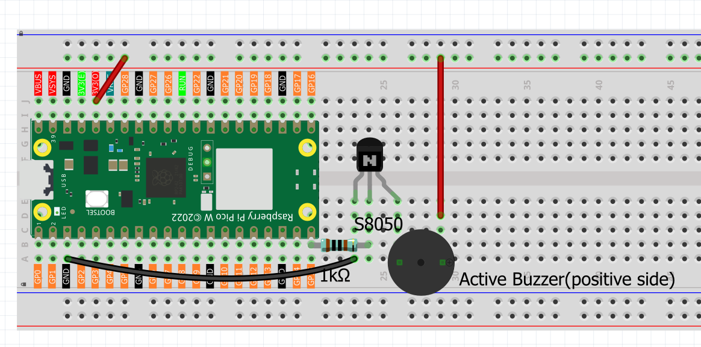

2.1 Buzzer Alert Patterns
==========================
Time to add sound to our projects! An **active buzzer** is like an electronic horn that makes sound when powered. Unlike LEDs that you see, buzzers let you **hear** your project's status - perfect for alarms, notifications, and alerts.

Active buzzers are "plug and play" - just send power and they beep! We'll create different alert patterns: standard alerts, SOS emergency signals, quick warnings, and alarm sounds.

Component List
^^^^^^^^^^^^^^^
- Raspberry Pi Pico W x1
- 830 Tie-Points Breadboard x1
- Transistor S8050 x1
- Resistor 1KΩ x1
- Active Buzzer x1
- Jumper Wire Several

Component knowledge
^^^^^^^^^^^^^^^^^^^^
:ref:`transistor <cpn_transistor>`
"""""""""""""""""""""""""""""""""""

:ref:`Buzzer <cpn_buzzer>`
"""""""""""""""""""""""""""

Why use a transistor with the buzzer?

**Power Amplification:**
- Buzzer needs more current than Pico can safely provide
- Transistor acts as a "current amplifier" - small signal controls big current
- Result: **MUCH louder sound** than direct connection

**Protection:** The 1KΩ resistor protects both the transistor and Pico from overcurrent.

Connect
^^^^^^^^
Two types of buzzers are included in the kit. We need to use active buzzer. Turn 
them around, the sealed back (not the exposed PCB) is the one we want.

The buzzer needs to use a transistor when working, here we use S8050 (NPN Transistor).

Code
^^^^^^^
.. note::

    * Open the ``2.1_buzzer_alert_patterns.py`` file under the path of ``Ultimate-Starter-Kit-for-Pico-W\Python\1.Project`` or copy this code into Thonny, then click "Run Current Script" or simply press F5 to run it.

    * Don't forget to click on the "MicroPython (Raspberry Pi Pico)" interpreter in the bottom right corner. 

.. 2.1.png

After running the code, listen to the different alert patterns! You'll hear 4 distinct sounds cycling every few seconds: Standard Alert (4 short beeps), SOS Signal (morse code ... --- ...), Quick Warning (rapid beeps), and Alarm Sound (alternating tones). Perfect for learning different notification patterns!

The following is the program code:

.. code-block:: python

    """
    Buzzer Alert System

    Creates different alert patterns using a buzzer.
    Demonstrates various beeping patterns for different situations.
    """

    import machine
    import utime

    # Pin and timing constants
    BUZZER_PIN = 15                     # buzzer connected to pin 15
    PATTERN_DELAY = 2000                # delay between different patterns
    TOTAL_PATTERNS = 4                  # number of alert patterns

    # Alert pattern settings
    SHORT_BEEP = 200                    # short beep duration
    LONG_BEEP = 600                     # long beep duration
    QUICK_PAUSE = 100                   # short pause between beeps
    MEDIUM_PAUSE = 400                  # medium pause between beeps

    # Initialize buzzer
    buzzer = machine.Pin(BUZZER_PIN, machine.Pin.OUT)

    def beep(duration):
        """Generate a beep for specified duration"""
        buzzer.value(1)
        utime.sleep_ms(duration)
        buzzer.value(0)

    def pause(duration):
        """Create a pause for specified duration"""
        utime.sleep_ms(duration)

    def standard_alert():
        """Pattern 1: Standard alert - 4 short beeps"""
        for i in range(4):
            beep(SHORT_BEEP)
            pause(MEDIUM_PAUSE)

    def sos_signal():
        """Pattern 2: SOS signal - 3 short, 3 long, 3 short"""
        # Three short beeps (S)
        for i in range(3):
            beep(SHORT_BEEP)
            pause(QUICK_PAUSE)
        
        pause(MEDIUM_PAUSE)
        
        # Three long beeps (O)
        for i in range(3):
            beep(LONG_BEEP)
            pause(QUICK_PAUSE)
        
        pause(MEDIUM_PAUSE)
        
        # Three short beeps (S)
        for i in range(3):
            beep(SHORT_BEEP)
            pause(QUICK_PAUSE)

    def quick_warning():
        """Pattern 3: Quick warning - 6 rapid beeps"""
        for i in range(6):
            beep(SHORT_BEEP // 2)  # very short beeps
            pause(QUICK_PAUSE)

    def alarm_sound():
        """Pattern 4: Alarm sound - alternating short and long beeps"""
        for i in range(3):
            # Short beep
            beep(SHORT_BEEP)
            pause(QUICK_PAUSE)
            
            # Long beep
            beep(LONG_BEEP)
            pause(QUICK_PAUSE)

    def setup():
        """Initialize the buzzer alert system"""
        print("=== Buzzer Alert System ===")
        print("Demonstrating different alert patterns:")
        print("1. Standard Alert  2. SOS Signal")
        print("3. Quick Warning   4. Alarm Sound")
        print()

    def main():
        """Main function"""
        setup()
        
        try:
            cycle_count = 0
            while True:
                cycle_count += 1
                print(f"--- Alert Cycle #{cycle_count} ---")
                
                # Pattern 1: Standard Alert (4 short beeps)
                print("Pattern 1: Standard Alert")
                standard_alert()
                pause(PATTERN_DELAY)
                
                # Pattern 2: SOS Signal (... --- ...)
                print("Pattern 2: SOS Emergency Signal")
                sos_signal()
                pause(PATTERN_DELAY)
                
                # Pattern 3: Quick Warning (rapid beeps)
                print("Pattern 3: Quick Warning")
                quick_warning()
                pause(PATTERN_DELAY)
                
                # Pattern 4: Alarm Sound (alternating tones)
                print("Pattern 4: Alarm Sound")
                alarm_sound()
                pause(PATTERN_DELAY)
                
                print("--- Cycle Complete ---")
                print()
                
        except KeyboardInterrupt:
            print("\nBuzzer alert system stopped.")
            print(f"Total cycles completed: {cycle_count}")
            
            # Turn off buzzer safely
            buzzer.value(0)
            print("Buzzer turned off.")

    if __name__ == "__main__":
        main()

Phenomenon
^^^^^^^^^^^
.. video:: img/5.phenomenon/2.1.mp4
    :width: 100%