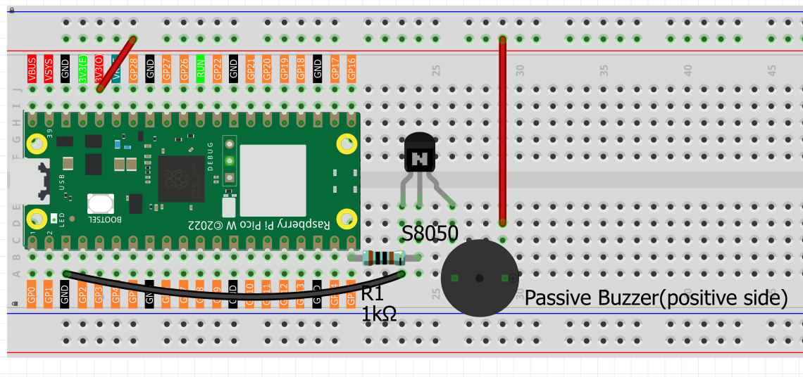
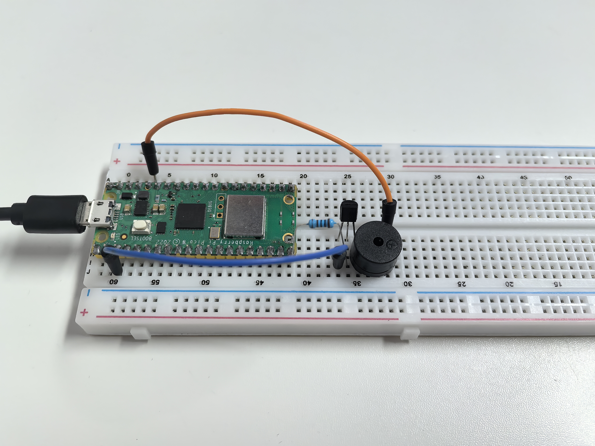

2.2 Musical Melody Player
==========================
Now let's turn our Pico into a **music player**! We'll switch from an active buzzer to a **passive buzzer** - the difference is like switching from a car horn to a piano.

**Active vs Passive Buzzer:**
- **Active buzzer**: Fixed tone, just beeps (like a smoke alarm)
- **Passive buzzer**: Variable frequency, can play **musical notes** (like a speaker)

With a passive buzzer, we can control the frequency to create Do-Re-Mi-Fa-Sol-La-Ti notes and play actual melodies! Time to make some music! ♫

Component List
^^^^^^^^^^^^^^^
- Raspberry Pi Pico W x1
- 830 Tie-Points Breadboard x1
- Transistor S8050 x1
- Resistor 1KΩ x1
- Passive Buzzer x1
- Jumper Wire Several

Component knowledge
^^^^^^^^^^^^^^^^^^^^

:ref:`transistor <cpn_transistor>`
"""""""""""""""""""""""""""""""""""

:ref:`Buzzer <cpn_buzzer>`
"""""""""""""""""""""""""""

How musical tone generation works:

**Frequency Control:** 
- Different frequencies = different musical notes (262Hz = C4, 440Hz = A4, etc.)
- MicroPython's `tone()` function generates precise frequencies
- `noteDurations[]` controls how long each note plays

**Power Amplification:** The transistor boosts the signal for clearer, louder music - like adding an amplifier to a guitar!

Connect
^^^^^^^^
Two buzzers are included in the kit, we use a passive buzzer (one with an exposed PCB on the back).

The buzzer needs a transistor to work, here we use S8050.

Code
^^^^^^^
.. note::

    * Open the ``2.2_musical_melody_player.py`` file under the path of ``Ultimate-Starter-Kit-for-Pico-W\Python\1.Project`` or copy this code into Thonny, then click "Run Current Script" or simply press F5 to run it.

    * Don't forget to click on the "MicroPython (Raspberry Pi Pico)" interpreter in the bottom right corner. 

.. 2.2.png

After running the code, enjoy the classic "Twinkle Twinkle Little Star" melody! ✨ The serial monitor shows each note being played with its frequency (Hz). The melody repeats every few seconds, and you can see the musical progression: Do-Do-Sol-Sol-La-La-Sol... It's like having a tiny digital music box!

The following is the program code:

.. code-block:: python

    """
    Musical Melody Player

    Plays "Twinkle Twinkle Little Star" melody using 
    tone generation on a buzzer or speaker.
    """

    import machine
    import utime

    # Musical note frequencies (in Hz)
    NOTE_C4 = 262       # Do
    NOTE_D4 = 294       # Re  
    NOTE_E4 = 330       # Mi
    NOTE_F4 = 349       # Fa
    NOTE_G4 = 392       # Sol
    NOTE_A4 = 440       # La
    NOTE_B4 = 494       # Ti
    NOTE_C5 = 523       # Do (high)

    # Pin and timing constants
    BUZZER_PIN = 15                     # buzzer connected to pin 15
    MELODY_LENGTH = 14                  # number of notes in melody
    REPEAT_DELAY = 2000                 # delay before repeating melody
    DUTY_CYCLE = 30000                  # PWM duty cycle for buzzer

    # "Twinkle Twinkle Little Star" melody
    melody = [
        NOTE_C4, NOTE_C4, NOTE_G4, NOTE_G4,    # Twin-kle twin-kle
        NOTE_A4, NOTE_A4, NOTE_G4,             # lit-tle star
        NOTE_F4, NOTE_F4, NOTE_E4, NOTE_E4,    # How I won-der  
        NOTE_D4, NOTE_D4, NOTE_C4              # what you are
    ]

    # Note durations (4 = quarter note, 8 = eighth note, 2 = half note)
    note_durations = [
        4, 4, 4, 4,     # quarter notes
        4, 4, 2,        # quarter, quarter, half
        4, 4, 4, 4,     # quarter notes  
        4, 4, 2         # quarter, quarter, half
    ]

    # Initialize buzzer
    buzzer = machine.PWM(machine.Pin(BUZZER_PIN))

    def tone(pin, frequency, duration):
        """Generate a tone for specified duration"""
        if frequency > 0:
            pin.freq(frequency)
            pin.duty_u16(DUTY_CYCLE)
        else:
            pin.duty_u16(0)
        
        utime.sleep_ms(duration)
        pin.duty_u16(0)

    def no_tone(pin):
        """Stop tone generation"""
        pin.duty_u16(0)

    def play_melody():
        """Play the complete melody"""
        print("♪ Now playing: Twinkle Twinkle Little Star ♪")
        
        # Play each note in the melody
        for note_index in range(MELODY_LENGTH):
            # Calculate note duration
            note_duration = 1000 // note_durations[note_index]
            
            # Play the note
            tone(buzzer, melody[note_index], note_duration)
            
            # Show current note being played
            print(f"Note {note_index + 1}/{MELODY_LENGTH}: {melody[note_index]}Hz")
            
            # Pause between notes (note duration + 30% for clear separation)
            pause_between_notes = int(note_duration * 1.30)
            utime.sleep_ms(pause_between_notes - note_duration)
            
            # Stop the tone
            no_tone(buzzer)
        
        print("Melody complete!")
        print()

    def setup():
        """Initialize the melody player"""
        print("=== Musical Melody Player ===")
        print("Playing: Twinkle Twinkle Little Star")
        print()
        
        # Play the melody once on startup
        play_melody()

    def main():
        """Main function"""
        setup()
        
        try:
            while True:
                # Wait and then repeat the melody
                print("Playing melody again...")
                utime.sleep_ms(REPEAT_DELAY)
                play_melody()
                
        except KeyboardInterrupt:
            print("\nMelody player stopped.")
            
            # Turn off buzzer safely
            no_tone(buzzer)
            buzzer.deinit()
            print("Buzzer turned off.")

    if __name__ == "__main__":
        main()

Phenomenon
^^^^^^^^^^^
