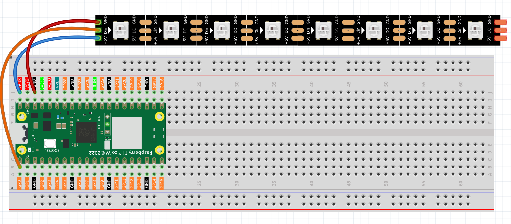
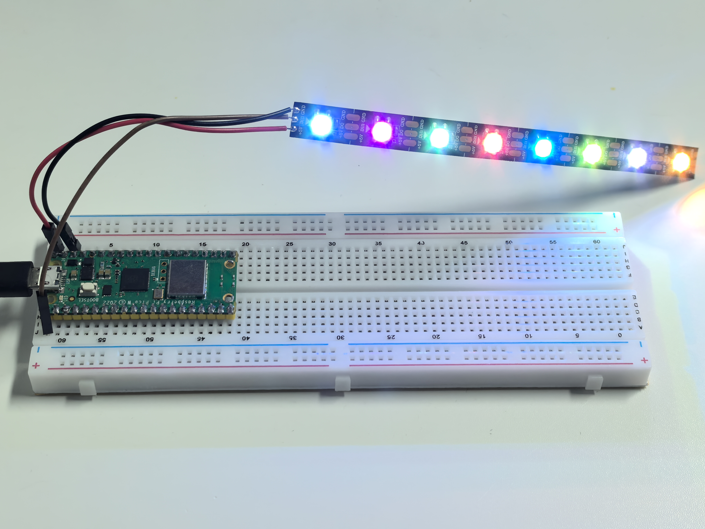

.. _py_rgb_led_strip:

2.3 RGB LED Strip
=========================
Time to create amazing light shows! **WS2812 RGB LED strips** (also called NeoPixels) are like having a string of tiny, smart TVs - each LED can display any color independently and be controlled with just one data wire.

**What makes them special:**
- **Individually addressable**: Control each LED's color separately
- **Chainable**: Connect hundreds in a row with just one signal wire
- **16.7 million colors**: Full RGB color mixing (256 levels × 3 colors)
- **Built-in intelligence**: Each LED has its own tiny computer chip!

We'll create a chaotic random color display where each LED independently changes to random colors at unpredictable intervals!

Component List
^^^^^^^^^^^^^^^
- Raspberry Pi Pico W x1
- MicroUSB cable x1
- 830 Tie-Points Breadboard x1
- RGB 8 LED Strip x1
- Jumper Wire Several

Component knowledge
^^^^^^^^^^^^^^^^^^^^
:ref:`RGB 8 LED Strip <cpn_rgb_led_strip>`
"""""""""""""""""""""""""""""""""""""""""""

How WS2812 LED strips work:

**Smart Pixel Chain:**
- Each LED receives 24-bit color data (8 bits each for Red, Green, Blue)
- First LED takes its color data, passes remaining data to next LED
- This creates a "daisy chain" where one signal controls hundreds of LEDs

**Single Wire Control:** Unlike regular LEDs that need separate wires for each color, WS2812s use clever timing to send all data through one wire - like sending Morse code at super high speed!

Connect
^^^^^^^^^

.. warning:: 
    One thing you need to pay attention to is current.

    Although the LED Strip with any number of LEDs can be used in Pico W, the power 
    of its VBUS pin is limited. Here, we will use eight LEDs, which are safe. But if 
    you want to use more LEDs, you need to add a separate power supply.

Code
^^^^^^^
.. note::

    * Open the ``2.3_rgb_led_strip.py`` file under the path of ``Ultimate-Starter-Kit-for-Pico-W\Python\1.Project`` or copy this code into Thonny, then click "Run Current Script" or simply press F5 to run it.

    * Don't forget to click on the "MicroPython (Raspberry Pi Pico)" interpreter in the bottom right corner. 

.. 2.3.png

After running the code, watch the mesmerizing chaos! Each LED will start with a random color and change to new random colors at unpredictable intervals (0.5-3 seconds). The serial monitor shows real-time updates when each LED changes color, displaying RGB values and the next change countdown. It's like having 8 independent disco lights creating a completely unpredictable light show!

The following is the program code:

.. code-block:: python

    """
    Chaotic Random LED Strip

    Each LED changes to random colors at random intervals,
    creating a completely unpredictable light display.
    """

    import machine
    import utime
    import urandom
    from ws2812 import WS2812

    # Hardware configuration
    PIXEL_PIN = 0                       # NeoPixel strip pin
    PIXEL_COUNT = 8                     # Number of LEDs in strip

    # Random timing ranges (milliseconds)
    MIN_CHANGE_TIME = 500               # Minimum time before LED can change color
    MAX_CHANGE_TIME = 3000              # Maximum time before LED can change color

    # LED data structure to track each LED independently
    class LEDData:
        def __init__(self):
            self.next_change_time = 0   # When this LED should change color next
            self.current_color = [0, 0, 0]  # Current color of this LED [R, G, B]

    # Array to store data for each LED
    leds = [LEDData() for _ in range(PIXEL_COUNT)]

    # Initialize WS2812 strip
    strip = WS2812(machine.Pin(PIXEL_PIN), PIXEL_COUNT)

    def generate_random_color():
        """Generate a completely random RGB color"""
        # Generate random RGB values (0-255 each)
        red = urandom.randint(0, 255)
        green = urandom.randint(0, 255)
        blue = urandom.randint(0, 255)
        
        # Occasionally generate pure colors for variety
        if urandom.randint(0, 9) == 0:  # 10% chance
            pure_colors = [
                [255, 0, 0],     # Pure red
                [0, 255, 0],     # Pure green
                [0, 0, 255],     # Pure blue
                [255, 255, 0],   # Yellow
                [255, 0, 255],   # Magenta
                [0, 255, 255]    # Cyan
            ]
            return pure_colors[urandom.randint(0, 5)]
        
        return [red, green, blue]

    def print_color_info(color):
        """Print color information in readable format"""
        print(f"RGB({color[0]},{color[1]},{color[2]})", end="")

    def setup():
        """Initialize the chaotic LED system"""
        print("=== Chaotic Random LED Strip ===")
        print("Each LED changes color independently at random intervals")
        print("Creating completely unpredictable light patterns")
        print()
        
        # Initialize each LED with random color and random next change time
        current_time = utime.ticks_ms()
        
        for i in range(PIXEL_COUNT):
            leds[i].current_color = generate_random_color()
            leds[i].next_change_time = current_time + urandom.randint(MIN_CHANGE_TIME, MAX_CHANGE_TIME)
            strip[i] = leds[i].current_color
            
            # Show initial color info
            print(f"LED {i} initialized: ", end="")
            print_color_info(leds[i].current_color)
            next_change_seconds = (leds[i].next_change_time - current_time) / 1000.0
            print(f", next change in {next_change_seconds:.1f} seconds")
        
        # Display initial colors
        strip.write()
        print()
        print("Starting chaotic color changes...")
        print()

    def main():
        """Main function"""
        setup()
        
        try:
            while True:
                current_time = utime.ticks_ms()
                any_led_changed = False
                
                # Check each LED independently
                for i in range(PIXEL_COUNT):
                    # Check if this LED should change color now
                    if utime.ticks_diff(current_time, leds[i].next_change_time) >= 0:
                        # Generate new random color
                        leds[i].current_color = generate_random_color()
                        
                        # Set new random time for next change
                        leds[i].next_change_time = current_time + urandom.randint(MIN_CHANGE_TIME, MAX_CHANGE_TIME)
                        
                        # Update the LED
                        strip[i] = leds[i].current_color
                        
                        # Log the change
                        print(f"LED {i} changed to ", end="")
                        print_color_info(leds[i].current_color)
                        next_change_seconds = urandom.randint(MIN_CHANGE_TIME, MAX_CHANGE_TIME) / 1000.0
                        print(f", next change in {next_change_seconds:.1f} seconds")
                        
                        any_led_changed = True
                
                # Update strip only if any LED changed (efficiency)
                if any_led_changed:
                    strip.write()
                
                # Small delay to prevent excessive CPU usage
                utime.sleep_ms(50)
                
        except KeyboardInterrupt:
            print("\nChaotic LED display stopped.")
            
            # Turn off all LEDs safely
            for i in range(PIXEL_COUNT):
                strip[i] = [0, 0, 0]
            strip.write()
            print("All LEDs turned off.")

    if __name__ == "__main__":
        main()

Phenomenon
^^^^^^^^^^^
