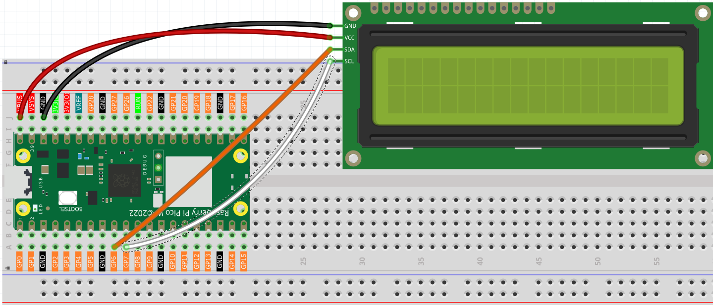

2.4 LCD Displayer
=========================
Time to add a display to our projects! An **LCD1602** is like a tiny digital billboard that can show text messages - perfect for displaying sensor readings, status messages, or user interfaces. It can show 32 characters total: 2 rows with 16 characters each.

**Why I²C LCD?** Regular LCDs need 6+ wires, but our I²C version needs only **2 wires** (SDA + SCL)! This saves precious GPIO pins for other components. Think of I²C as a "highway" where multiple devices can share the same communication path.

We'll display custom messages that appear and disappear in sequence - like a simple animation!

Component List
^^^^^^^^^^^^^^^
- Raspberry Pi Pico W x1
- MicroUSB cable x1
- 830 Tie-Points Breadboard x1
- LCD1602 IIC x1
- Jumper Wire Several

Component knowledge
^^^^^^^^^^^^^^^^^^^^
:ref:`LCD1602 <cpn_lcd1602>`
"""""""""""""""""""""""""""""

Connect
^^^^^^^^^

Code
^^^^^^^
.. note::

    * Open the ``2.4_lcd_displayer.py`` file under the path of ``Ultimate-Starter-Kit-for-Pico-W\Python\1.Project`` or copy this code into Thonny, then click "Run Current Script" or simply press F5 to run it.

    * Don't forget to click on the "MicroPython (Raspberry Pi Pico)" interpreter in the bottom right corner. 

.. 2.4.png

After running the code, watch the LCD screen come alive! First "From Lafvin" appears, then clears, followed by "Hello" on the first line and "World!" on the second line. The text sequence demonstrates cursor positioning and display timing - perfect for creating informative project displays!

The following is the program code:

.. code-block:: python

    """
    LCD1602 Display Demo

    This program demonstrates basic LCD1602 operations:
    - Display text messages
    - Clear the screen
    - Create new lines
    """

    # Import required libraries
    from machine import I2C, Pin  # For I2C communication and pin control
    from lcd1602 import LCD       # For LCD1602 display control
    import time                   # For time delays

    # Hardware pin configuration
    SDA_PIN = 6                  # I2C data pin (SDA)
    SCL_PIN = 7                  # I2C clock pin (SCL)
    I2C_FREQUENCY = 400000        # I2C communication frequency (400kHz)

    def setup_lcd():
        """
        Initialize and setup the LCD display
        Returns: LCD object ready for use
        """
        # Initialize I2C communication
        # Note: Reinitializing I2C helps clear any bus state issues
        i2c = I2C(1, sda=Pin(SDA_PIN), scl=Pin(SCL_PIN), freq=I2C_FREQUENCY)
        
        # Small delay to let I2C bus stabilize (prevents communication errors)
        time.sleep(0.1)
        
        # Create an LCD object for interfacing with the LCD1602 display
        lcd = LCD(i2c)
        
        return lcd

    def display_first_message(lcd):
        """
        Display the first message on LCD
        Args: lcd - LCD object
        """
        print("Displaying first message...")
        
        # Display the first message on the LCD
        # Use '\n' to create a new line
        message = "From Lafvin"
        lcd.message(message)
        
        # Wait for 2 seconds
        time.sleep(2)
        
        # Clear the display
        lcd.clear()

    def display_second_message(lcd):
        """
        Display the second message on LCD
        Args: lcd - LCD object
        """
        print("Displaying second message...")
        
        # Display the second message on the LCD
        # Note: '\n' creates a new line, spaces align the text
        message = "Hello\n       World!"
        lcd.message(message)
        
        # Wait for 5 seconds
        time.sleep(5)
        
        # Clear the display before exiting
        lcd.clear()

    def main():
        """
        Main function that runs the LCD demo
        """
        print("=== LCD1602 Display Demo ===")
        print("Starting LCD demonstration...")
        
        # Step 1: Setup the LCD display
        lcd = setup_lcd()
        
        # Step 2: Display first message
        display_first_message(lcd)
        
        # Step 3: Display second message  
        display_second_message(lcd)
        
        print("Demo completed!")

    # Run the program
    if __name__ == "__main__":
        main()

Phenomenon
^^^^^^^^^^^
.. video:: img/5.phenomenon/2.4.mp4
    :width: 100%