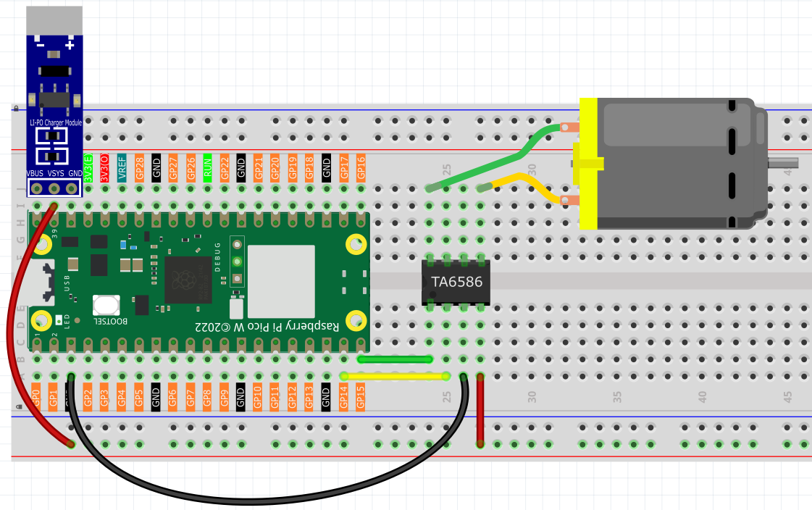

2.5 Motor & Fan
=========================
Time to add movement to our projects! DC motors can spin fans, wheels, conveyor belts, or any rotating mechanism. Unlike LEDs that just light up, motors create **mechanical motion** - they can push, pull, spin, and move things in the real world!

We're using a **TA6586 motor driver** chip that lets us control both **speed** and **direction**. Think of it as a "motor remote control" that can make the motor spin clockwise, counterclockwise, or stop completely.

**Why need a motor driver?** Motors are hungry for power! The Pico can't provide enough current safely, so the TA6586 acts like a power amplifier.

Component List
^^^^^^^^^^^^^^^
- Raspberry Pi Pico W x1
- MicroUSB cable x1
- 830 Tie-Points Breadboard x1
- TA6586 x1
- DC Motor x1
- Li-po Charger Module x1
- Battery Holder x1
- Jumper Wire Several

Component knowledge
^^^^^^^^^^^^^^^^^^^^
:ref:`TA6586 <cpn_ta6586>`
"""""""""""""""""""""""""""

:ref:`Li-po Charger Module <cpn_li_po_charger_module>`
"""""""""""""""""""""""""""""""""""""""""""""""""""""""""

:ref:`DC Motor <cpn_dc_motor>`
""""""""""""""""""""""""""""""""

How bidirectional motor control works:

**Direction Control Logic:**
- **Clockwise**: Pin A = HIGH, Pin B = LOW → Current flows one direction
- **Counterclockwise**: Pin A = LOW, Pin B = HIGH → Current flows opposite direction  
- **Stop**: Both pins = LOW → No current flows

**Safety First:** The Li-Po charger module provides clean, regulated power to prevent motor damage and protect your circuit from voltage spikes.

.. note:: 

    * Since DC motors require a high current, we use a Li-po Charger module to power the motor here for safety reasons.

    * Make sure your Li-po Charger Module is connected as shown in the diagram. Otherwise, a short circuit will likely damage your battery and circuitry.

Connect
^^^^^^^^^

Code
^^^^^^^
.. note::

    * Open the ``2.5_motor_and_fan.py`` file under the path of ``Ultimate-Starter-Kit-for-Pico-W\Python\1.Project`` or copy this code into Thonny, then click "Run Current Script" or simply press F5 to run it.

    * Don't forget to click on the "MicroPython (Raspberry Pi Pico)" interpreter in the bottom right corner. 

.. 2.5.png

After running the code, watch the motor spring into action! It follows a rhythmic pattern: spins clockwise for 1 second, stops for 1 second, spins counterclockwise for 1 second, stops again, then repeats. Perfect for creating oscillating fans, automatic stirrers, or robotic movements!

The following is the program code:

.. code-block:: python

    """
    DC Motor and Fan Control Project

    This project demonstrates bidirectional control of a DC motor or fan
    using digital pins with TA6586 motor driver IC. The motor alternates 
    between clockwise rotation, stop, counterclockwise rotation, and stop 
    in a continuous cycle.

    Hardware Requirements:
    - Raspberry Pi Pico or compatible board
    - DC motor or fan
    - TA6586 motor driver IC (dual H-bridge)
    - Appropriate power supply for motor
    """

    # Import required libraries
    import machine  # For hardware control (Pin)
    import utime    # For time delays

    # Hardware Configuration Constants
    MOTOR_PIN_A = 14            # TA6586 IN1 pin (motor direction control)
    MOTOR_PIN_B = 15            # TA6586 IN2 pin (motor direction control)

    # Timing Constants
    ROTATION_DURATION_MS = 1000 # How long motor runs in each direction (milliseconds)
    STOP_DURATION_MS = 1000     # How long motor stops between direction changes (milliseconds)

    # Initialize motor control pins
    motor_pin_a = machine.Pin(MOTOR_PIN_A, machine.Pin.OUT)
    motor_pin_b = machine.Pin(MOTOR_PIN_B, machine.Pin.OUT)

    def rotate_clockwise():
        """
        Rotate Motor Clockwise
        
        Sets the TA6586 motor driver pins to rotate the motor in clockwise direction.
        IN1 is set HIGH and IN2 is set LOW to create the forward direction signal.
        """
        print("Motor rotating clockwise...")
        motor_pin_a.on()   # Set TA6586 IN1 HIGH
        motor_pin_b.off()  # Set TA6586 IN2 LOW

    def rotate_counterclockwise():
        """
        Rotate Motor Counterclockwise
        
        Sets the TA6586 motor driver pins to rotate the motor in counterclockwise direction.
        IN1 is set LOW and IN2 is set HIGH to create the reverse direction signal.
        """
        print("Motor rotating counterclockwise...")
        motor_pin_a.off()  # Set TA6586 IN1 LOW
        motor_pin_b.on()   # Set TA6586 IN2 HIGH

    def stop_motor():
        """
        Stop Motor
        
        Stops the motor by setting both TA6586 control pins to LOW.
        This puts the motor driver in brake/stop mode, causing the motor to stop spinning.
        """
        print("Motor stopped")
        motor_pin_a.off()  # Set TA6586 IN1 LOW
        motor_pin_b.off()  # Set TA6586 IN2 LOW

    def setup_motor():
        """
        Initialize the motor control system
        
        Configures TA6586 motor driver control pins and ensures motor starts in stopped state.
        """
        print("Setting up TA6586 motor control...")
        print(f"TA6586 IN1 Pin: {MOTOR_PIN_A}")
        print(f"TA6586 IN2 Pin: {MOTOR_PIN_B}")
        
        # Ensure motor starts in stopped state
        stop_motor()
        print("TA6586 motor control setup complete!")

    def run_motor_cycle():
        """
        Run one complete motor cycle
        
        Executes the sequence: clockwise → stop → counterclockwise → stop
        """
        # Run motor clockwise
        rotate_clockwise()
        utime.sleep_ms(ROTATION_DURATION_MS)
        
        # Stop motor
        stop_motor()
        utime.sleep_ms(STOP_DURATION_MS)
        
        # Run motor counterclockwise
        rotate_counterclockwise()
        utime.sleep_ms(ROTATION_DURATION_MS)
        
        # Stop motor
        stop_motor()
        utime.sleep_ms(STOP_DURATION_MS)

    def main():
        """
        Main function that runs the motor control demonstration
        """
        print("=== DC Motor and Fan Control Project ===")
        print("Demonstrating bidirectional motor control")
        print("Cycle: Clockwise → Stop → Counterclockwise → Stop")
        print("Press Ctrl+C to stop")
        print()
        
        # Step 1: Setup the motor control system
        setup_motor()
        print()
        
        try:
            cycle_count = 0
            print("Starting continuous motor cycles...")
            print()
            
            # Step 2: Continuous motor control loop
            while True:
                cycle_count += 1
                print(f"--- Motor Cycle #{cycle_count} ---")
                
                # Run one complete motor cycle
                run_motor_cycle()
                
                print(f"Cycle #{cycle_count} completed")
                print()
                
        except KeyboardInterrupt:
            print("\nMotor control stopped by user")
            print(f"Total cycles completed: {cycle_count}")
            
            # Ensure motor is safely stopped
            print("Ensuring motor is stopped...")
            stop_motor()
            print("Motor control system deactivated")

    # Run the program
    if __name__ == "__main__":
        main()

Phenomenon
^^^^^^^^^^^
.. video:: img/5.phenomenon/2.5.mp4
    :width: 100%