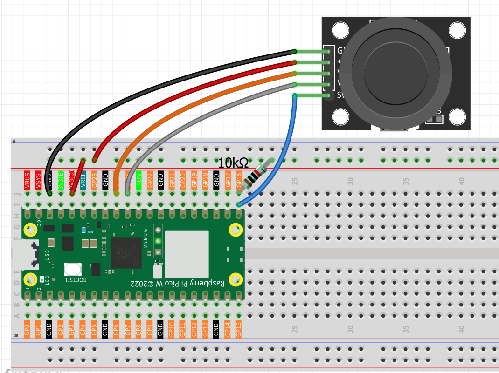
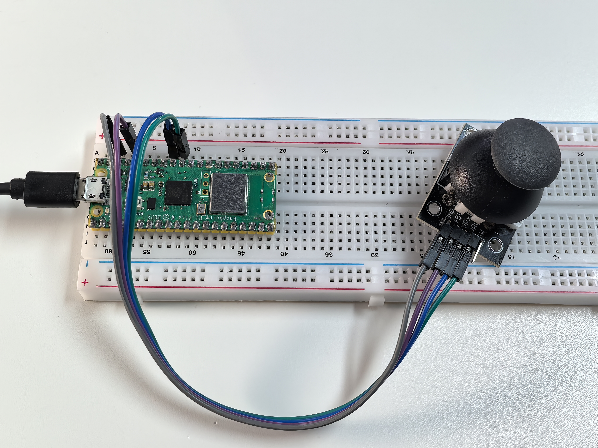

3.1 Joystick
=========================
Welcome to 2D control! A **joystick** is like having a mouse that can move in all directions - perfect for gaming, robot control, camera gimbals, or any project needing **precise directional input**.

**How it works:** Inside the joystick are two potentiometers positioned at 90° to each other. As you move the stick, these potentiometers change resistance, giving us **X and Y coordinates** (0-65535 in each direction). Plus there's a hidden bonus - push down on the stick and it becomes a **button**!

Think of it as a "digital compass" that tells your Pico exactly where you're pointing and whether you're pressing down.

Component List
^^^^^^^^^^^^^^^
- Raspberry Pi Pico W x1
- MicroUSB cable x1
- 830 Tie-Points Breadboard x1
- Joystick Module x1
- Jumper Wire Several
- 10kΩ Resistor x1

Component knowledge
^^^^^^^^^^^^^^^^^^^^
:ref:`Joystick Module <cpn_joystick>`
""""""""""""""""""""""""""""""""""""""

Connect
^^^^^^^^^

Code
^^^^^^^
.. note::

    * Open the ``3.1_joystick.py`` file under the path of ``Ultimate-Starter-Kit-for-Pico-W\Python\1.Project`` or copy this code into Thonny, then click "Run Current Script" or simply press F5 to run it.

    * Don't forget to click on the "MicroPython (Raspberry Pi Pico)" interpreter in the bottom right corner. 

.. 3.1.png

After running the code, move the joystick around and watch the live coordinate tracking! The serial monitor shows real-time X/Y values (0-65535) and button state (0/1). The Y-axis is inverted for intuitive control - up = higher values, down = lower values. Try moving in circles, pressing the button, or holding positions to see how responsive the readings are!

The following is the program code:

.. code-block:: python

    """
    Analog Joystick Control Project

    This project reads X and Y axis positions from an analog joystick
    and the state of the built-in button. The Y-axis and button values
    are inverted for more intuitive control behavior.

    Hardware Requirements:
    - Raspberry Pi Pico or compatible board
    - Analog joystick module (with X, Y, and SW pins)
    - Serial monitor for output display
    """

    # Import required libraries
    import machine  # For hardware control (ADC, Pin)
    import utime    # For time delays

    # Hardware Configuration Constants
    JOYSTICK_X_PIN = 27             # Joystick X-axis analog pin (VRX)
    JOYSTICK_Y_PIN = 26             # Joystick Y-axis analog pin (VRY) 
    JOYSTICK_BUTTON_PIN = 16        # Joystick button digital pin (SW)

    # Analog Reading Constants
    ANALOG_MIN_VALUE = 0            # Minimum analog reading value
    ANALOG_MAX_VALUE = 65535        # Maximum analog reading value (16-bit ADC)
    READING_DELAY_MS = 100          # Delay between readings (milliseconds)

    # Button States
    BUTTON_PRESSED = 0              # Active button state (pulled down when pressed)
    BUTTON_RELEASED = 1             # Inactive button state (pulled up when released)

    # Initialize joystick components
    x_joystick = machine.ADC(JOYSTICK_X_PIN)
    y_joystick = machine.ADC(JOYSTICK_Y_PIN)
    joystick_button = machine.Pin(JOYSTICK_BUTTON_PIN, machine.Pin.IN, machine.Pin.PULL_UP)

    def read_x_axis():
        """
        Read X-Axis Value
        
        Reads the X-axis analog value without any inversion.
        
        Returns:
            Raw X-axis value (0-65535)
        """
        return x_joystick.read_u16()

    def read_y_axis_inverted():
        """
        Read Y-Axis Value (Inverted)
        
        Reads the Y-axis analog value and inverts it for more
        intuitive control (up = higher value, down = lower value).
        
        Returns:
            Inverted Y-axis value (0-65535)
        """
        raw_value = y_joystick.read_u16()
        # Invert the Y-axis: 65535 - raw_value
        return ANALOG_MAX_VALUE - raw_value

    def read_button_inverted():
        """
        Read Button State (Inverted)
        
        Reads the button state and inverts it for logical output
        (1 = pressed, 0 = released instead of hardware LOW/HIGH).
        
        Returns:
            Inverted button state (1 = pressed, 0 = released)
        """
        raw_button_state = joystick_button.value()
        # Invert the button: pressed (LOW/0) becomes 1, released (HIGH/1) becomes 0
        return 1 if raw_button_state == BUTTON_PRESSED else 0

    def display_joystick_values():
        """
        Display Joystick Values
        
        Reads all joystick inputs and displays them with appropriate
        inversions for Y-axis and button state.
        """
        # Read raw joystick values
        x_value = read_x_axis()
        y_value = read_y_axis_inverted()
        button_state = read_button_inverted()
        
        # Display formatted output
        print(f"X: {x_value} | Y: {y_value} | Button: {button_state}")

    def setup_joystick():
        """
        Initialize the joystick control system
        
        Sets up joystick pins and displays startup information.
        """
        print("=== Joystick Controller Initialized ===")
        print("Format: X: value | Y: value | Button: state")
        print("Y-axis inverted, Button inverted for intuitive control")
        print(f"X-axis pin: {JOYSTICK_X_PIN}")
        print(f"Y-axis pin: {JOYSTICK_Y_PIN}")
        print(f"Button pin: {JOYSTICK_BUTTON_PIN}")
        print("======================================")

    def main():
        """
        Main function that runs the joystick monitoring
        """
        # Setup the joystick system
        setup_joystick()
        
        try:
            print("Starting joystick monitoring...")
            print("Press Ctrl+C to stop")
            print()
            
            # Continuous joystick monitoring loop
            while True:
                # Read and display joystick values
                display_joystick_values()
                
                # Wait before next reading
                utime.sleep_ms(READING_DELAY_MS)
                
        except KeyboardInterrupt:
            print("\nJoystick monitoring stopped by user")
            print("Joystick controller deactivated")

    # Run the program
    if __name__ == "__main__":
        main()

Phenomenon
^^^^^^^^^^^
