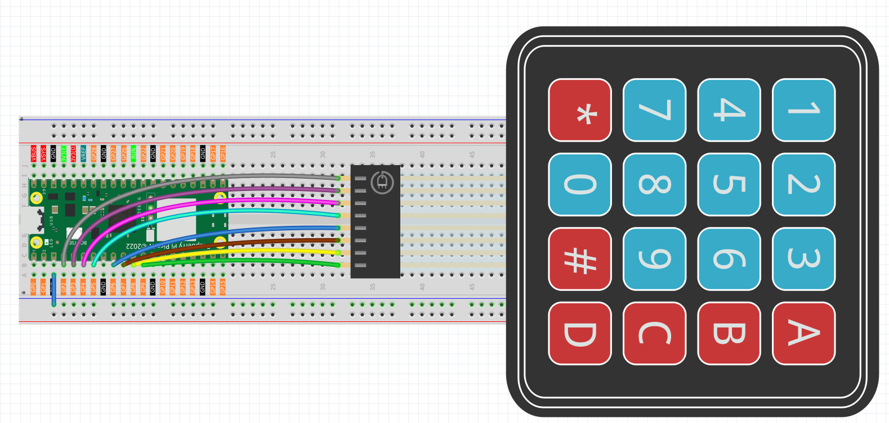
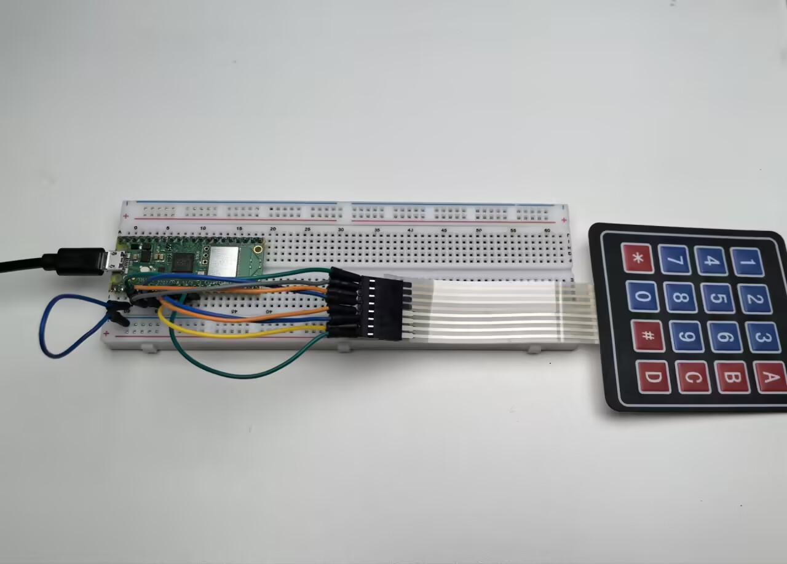

3.2 4x4 Keypad
=========================
Time to add a **full keyboard interface** to your projects! A 4x4 matrix keypad gives you 16 buttons in a compact package - perfect for security codes, menu navigation, calculators, or game controllers.

**Why "matrix" design?** Instead of needing 16 separate wires, this clever grid design uses only **8 wires** (4 rows + 4 columns) to detect all 16 buttons. It's like playing digital battleship - by scanning rows and columns, we can pinpoint exactly which button was pressed!

Our keypad includes: **numbers 0-9**, **letters A-D**, and **symbols * #** - everything you need for most user interfaces.

Component List
^^^^^^^^^^^^^^^
- Raspberry Pi Pico W x1
- MicroUSB cable x1
- 830 Tie-Points Breadboard x1
- Resistor 10KΩ x4
- 4x4 Keypad x1
- Jumper Wire Several

Component knowledge
^^^^^^^^^^^^^^^^^^^^
:ref:`4x4 Keypad <cpn_keypad>`
"""""""""""""""""""""""""""""""""""

How matrix scanning works:

**Scanning Logic:**
- **Rows (GP2-GP5)**: Set to HIGH one at a time
- **Columns (GP6-GP9)**: Read for HIGH signals
- **Key detection**: When a button connects a HIGH row to a column, we detect the intersection!

**Example:** Pressing button "1" connects Row 1 (GP2) to Column 1 (GP6). When GP2 is HIGH and we detect GP6 as HIGH, we know button "1" was pressed.

**Pull-down resistors** keep columns LOW when no buttons are pressed, preventing false readings.

Connect
^^^^^^^^^

To make the wiring easier, in the above diagram, the column row of the matrix keyboard and the 10K resistors are inserted into the holes where G6 ~ G9 are located at the same time.

Code
^^^^^^^
.. note::

    * Open the ``3.2_4x4_keypad.py`` file under the path of ``Ultimate-Starter-Kit-for-Pico-W\Python\1.Project`` or copy this code into Thonny, then click "Run Current Script" or simply press F5 to run it.

    * Don't forget to click on the "MicroPython (Raspberry Pi Pico)" interpreter in the bottom right corner. 

.. 3.2.png

After running the code, start pressing keys on the keypad! The serial monitor shows both **PRESSED** and **RELEASED** events for every key. Try typing sequences, holding buttons down, or pressing multiple keys to see the real-time detection. Perfect for building security keypads or interactive control panels!

The following is the program code:

.. code-block:: python

    """
    4x4 Matrix Keypad Input Project

    This project demonstrates reading input from a 4x4 matrix keypad
    using GPIO pins. The keypad provides 16 buttons including numbers (0-9), 
    letters (A-D), and symbols (* #).

    Hardware Requirements:
    - Raspberry Pi Pico or compatible board
    - 4x4 matrix keypad
    - 8 digital pins for keypad connections
    - Serial monitor for output display
    """

    # Import required libraries
    import machine  # For hardware control (Pin)
    import utime    # For time delays

    # Keypad Configuration Constants
    KEYPAD_ROWS = 4                 # Number of rows in the keypad matrix
    KEYPAD_COLS = 4                 # Number of columns in the keypad matrix

    # Communication Constants
    KEYPAD_SCAN_DELAY_MS = 10       # Delay between keypad scans (milliseconds)
    DEBOUNCE_DELAY_MS = 50          # Debounce delay to prevent false readings

    # Hardware Pin Configuration Constants
    ROW_PIN_1 = 2                   # First row pin connection
    ROW_PIN_2 = 3                   # Second row pin connection
    ROW_PIN_3 = 4                   # Third row pin connection
    ROW_PIN_4 = 5                   # Fourth row pin connection

    COL_PIN_1 = 6                   # First column pin connection
    COL_PIN_2 = 7                   # Second column pin connection
    COL_PIN_3 = 8                   # Third column pin connection
    COL_PIN_4 = 9                   # Fourth column pin connection

    # Keypad layout mapping - defines what character each button represents
    KEYPAD_LAYOUT = [
        ['1', '2', '3', 'A'],       # First row: numbers and letter A
        ['4', '5', '6', 'B'],       # Second row: numbers and letter B
        ['7', '8', '9', 'C'],       # Third row: numbers and letter C
        ['*', '0', '#', 'D']        # Fourth row: symbols and letter D
    ]

    # Pin mapping arrays for keypad connections
    ROW_PINS = [ROW_PIN_1, ROW_PIN_2, ROW_PIN_3, ROW_PIN_4]
    COL_PINS = [COL_PIN_1, COL_PIN_2, COL_PIN_3, COL_PIN_4]

    # Initialize hardware components
    row_pins = []
    col_pins = []

    # Global variables for key state tracking
    last_pressed_keys = []
    last_scan_time = 0

    def setup_keypad():
        """
        Initialize the matrix keypad hardware
        
        Sets up row pins as outputs and column pins as inputs with pull-down resistors.
        This function runs once when the program starts.
        """
        global row_pins, col_pins
        
        print("=== 4x4 Matrix Keypad Controller ===")
        print("Setting up keypad hardware...")
        
        # Initialize row pins as outputs (drive high/low)
        for i in range(KEYPAD_ROWS):
            pin = machine.Pin(ROW_PINS[i], machine.Pin.OUT)
            pin.low()  # Start with all rows low
            row_pins.append(pin)
            print(f"Row {i+1} initialized on pin {ROW_PINS[i]}")
        
        # Initialize column pins as inputs with pull-down resistors
        for i in range(KEYPAD_COLS):
            pin = machine.Pin(COL_PINS[i], machine.Pin.IN, machine.Pin.PULL_DOWN)
            col_pins.append(pin)
            print(f"Column {i+1} initialized on pin {COL_PINS[i]}")
        
        print("Press any key on the keypad...")
        print("Available keys: 0-9, A-D, *, #")
        print("===================================")

    def scan_keypad():
        """
        Scan Keypad for Pressed Keys
        
        Systematically checks each row-column combination to detect
        which keys are currently being pressed.
        
        Returns:
            List of currently pressed key characters, or empty list if none
        """
        pressed_keys = []
        
        # Scan each row
        for row_index in range(KEYPAD_ROWS):
            # Set current row high, others low
            for i in range(KEYPAD_ROWS):
                if i == row_index:
                    row_pins[i].high()
                else:
                    row_pins[i].low()
            
            # Small delay to allow signal to stabilize
            utime.sleep_us(10)
            
            # Check each column in the current row
            for col_index in range(KEYPAD_COLS):
                if col_pins[col_index].value() == 1:
                    # Key is pressed at this row-column intersection
                    key_char = KEYPAD_LAYOUT[row_index][col_index]
                    pressed_keys.append(key_char)
        
        # Turn off all rows after scanning
        for row_pin in row_pins:
            row_pin.low()
        
        return pressed_keys

    def process_keypad_events():
        """
        Process Keypad Events
        
        Compares current key states with previous states to detect
        key press and release events. Implements debouncing for stable readings.
        """
        global last_pressed_keys, last_scan_time
        
        current_time = utime.ticks_ms()
        
        # Check if enough time has passed for debouncing
        if utime.ticks_diff(current_time, last_scan_time) < DEBOUNCE_DELAY_MS:
            return
        
        # Scan for currently pressed keys
        current_pressed_keys = scan_keypad()
        
        # Detect newly pressed keys
        newly_pressed = []
        for key in current_pressed_keys:
            if key not in last_pressed_keys:
                newly_pressed.append(key)
        
        # Detect newly released keys
        newly_released = []
        for key in last_pressed_keys:
            if key not in current_pressed_keys:
                newly_released.append(key)
        
        # Display key press events
        for key in newly_pressed:
            print(f"Key '{key}' PRESSED")
        
        # Display key release events
        for key in newly_released:
            print(f"Key '{key}' RELEASED")
        
        # Update state tracking variables
        last_pressed_keys = current_pressed_keys.copy()
        last_scan_time = current_time

    def display_key_info(key):
        """
        Display Key Information
        
        Shows detailed information about a pressed key including
        its position and character value.
        
        Args:
            key: The character of the pressed key
        """
        # Find the position of the key in the layout
        for row_idx in range(KEYPAD_ROWS):
            for col_idx in range(KEYPAD_COLS):
                if KEYPAD_LAYOUT[row_idx][col_idx] == key:
                    print(f"Key '{key}' at position [Row {row_idx+1}, Col {col_idx+1}]")
                    return
        
        print(f"Key '{key}' pressed")

    def main():
        """
        Main function that runs the keypad monitoring system
        """
        # Initialize the keypad hardware
        setup_keypad()
        
        try:
            print("\nStarting keypad monitoring...")
            print("Press keys to see events, Ctrl+C to stop")
            print()
            
            # Continuous keypad monitoring loop
            while True:
                # Scan keypad for any state changes
                process_keypad_events()
                
                # Small delay to prevent excessive CPU usage
                utime.sleep_ms(KEYPAD_SCAN_DELAY_MS)
                
        except KeyboardInterrupt:
            print("\nKeypad monitoring stopped by user")
            print("Keypad controller deactivated")
            
            # Clean up - turn off all row pins
            for row_pin in row_pins:
                row_pin.low()

    # Run the program
    if __name__ == "__main__":
        main()

Phenomenon
^^^^^^^^^^^
